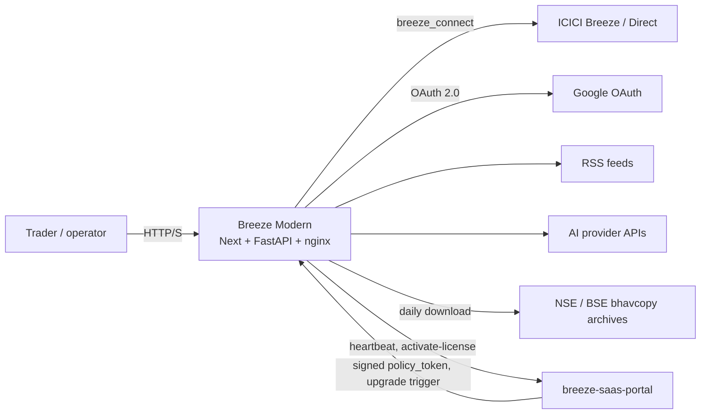
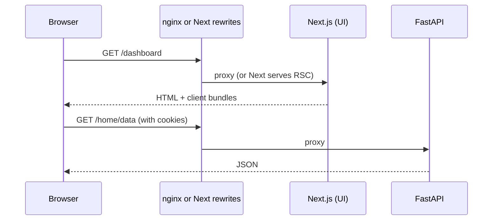
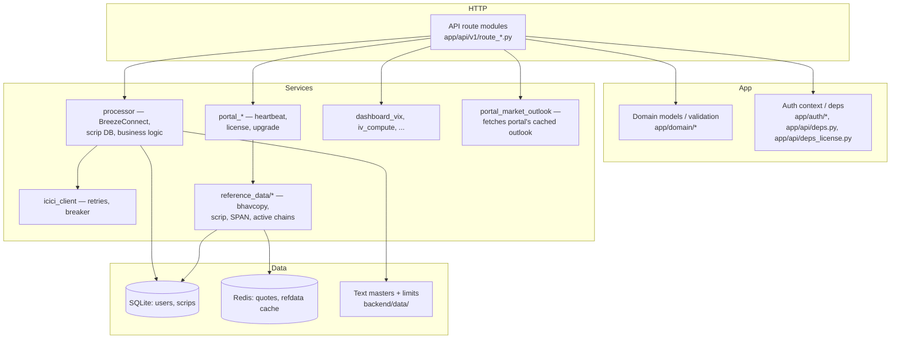

# Technical architecture

This document describes how Breeze Modern is structured: runtimes, networking, the backend package layout, persistence, and external dependencies.

---

## High-level system context

This instance is one deployment unit provisioned by **breeze-saas-portal** onto a customer's own AWS account (see [AWS deployment](./aws-deployment.md)). The portal issues the license this instance phones home with and can remotely approve version upgrades; it does not proxy trading traffic or hold ICICI credentials — those stay local to this instance.

---

## Runtime topologies

### A. Local development (`./dev.sh`)

Three processes:

| Process | Port | Role |
|---------|------|------|
| **uvicorn** | 8000 | FastAPI application (WS subscribe, API, reference-data bootstrap, portal heartbeat loop — all run inside its lifespan) |
| **chain-builder** | — | OS worker: raw tick cache → canonical option chains in Redis, scoped to actively-subscribed chains |
| **next dev** | 3000 | Next.js dev server |

Redis is used for cross-process quote/reference-data caching. If Redis is unreachable and `REDIS_REQUIRE_CONNECTED` is not set, the app falls back to an in-process, TTL-aware `_MemoryStore` (`app/db/redis_client.py`) rather than failing startup — see [Reference data pipeline](#reference-data-pipeline) and [design decision #20](./design-decisions.md#20-redis-is-optional-not-required).

Tradeable strikes are filtered from ICICI scrip master using `MarginPercentage > 0`.

`frontend/next.config.js` **rewrites** browser paths such as `/auth/*`, `/api/*`, `/home/data`, `/book/*`, `/deployment/license-status`, and `/strategy-builder/*` to `BACKEND_UPSTREAM_URL` (default `http://localhost:8000`). The user should open **only** the Next origin (3000) so cookies and redirects stay consistent.

### B. Docker Compose (repo root `docker-compose.yml`)

Three containers:

| Service | Role |
|---------|------|
| **backend** | FastAPI on 8000 (internal) |
| **frontend** | Next production server on 3000 (internal) |
| **proxy** | nginx listening on **3000** (host-mapped) |

`nginx.conf` forwards **specific path prefixes** to the backend and everything else to the frontend. This yields a **single external port** (3000) for the browser.

### C. Single production image (root `Dockerfile`)

One container runs **supervisord** with:

- **nginx** on **3000** (public listen)
- **uvicorn** on **8000** (loopback)
- **chain-builder** worker (`python -m icici_breeze_backend.workers.chain_builder`)
- **Next standalone** `server.js` on **3001** (loopback)

`deploy/nginx.all-in-one.conf` mirrors the same path-based split as compose's nginx, but upstreams point to `127.0.0.1`.

This is the image customers actually run. It ships with the portal's DRM public key baked in (`/etc/breeze/portal_heartbeat_public.pem`, `/etc/breeze/portal_allowed_hosts.txt`) and is deployed onto a customer's EC2 instance by **breeze-saas-portal's CloudFormation stack**, not by any workflow in this repo — see [AWS deployment](./aws-deployment.md) for the full split between that active path and the dormant legacy GitHub Actions path. On that instance, Redis runs as a **sibling Docker container** (`breeze-redis`, image `redis:7-alpine`, on a dedicated `breeze-core-net` bridge network, `maxmemory` capped via `REDIS_MAXMEMORY_MB`, default 384MB) rather than a managed cloud service — the app container and its upgrade helper both know how to (re)create this sidecar if it's missing or misconfigured (`app/services/deployment_container_upgrade.py`).

---

## Request path (browser → code)

**Important**: Many JSON endpoints are **not** under `/api/`; nginx and Next explicitly list paths like `/home/data`, `/portfolio/data`, `/order/data`, `/book/data`, `/dashboard/vix`, `/deployment/license-status`, etc. This avoids accidentally routing UI paths to the API.

---

## Frontend architecture

| Area | Detail |
|------|--------|
| Framework | Next.js 16 (App Router), React 19, TypeScript |
| Styling | Tailwind CSS 4 |
| Data fetching | TanStack React Query |
| Charts | Chart.js + react-chartjs-2 |
| Build | `output: "standalone"` for Docker; large upload body support for SPAN files via `experimental.proxyClientMaxBodySize` |

Client-side API base: production Docker build intentionally avoids hardcoding `NEXT_PUBLIC_BACKEND_URL` so the browser uses **`window.location.origin`** for same-origin API calls through nginx.

**License enforcement in the UI**: `frontend/src/components/license/` provides `LicenseRestrictionProvider.tsx` (context + `guardTradingAction`), `LicenseStatusBanner.tsx` (status banners), and `RevokedTradingPageGuard.tsx` (blocks clicks on trading pages when read-only). `frontend/src/lib/use-deployment-license.ts` polls `GET /deployment/license-status`; `frontend/src/lib/deployment-license.ts` holds the status types and `isTradingReadOnly()`. See [Portal integration](#portal-integration-license-heartbeat-and-upgrades).

**Chain loading UI**: `components/strategy-builder/ChainBuildStatus.tsx` and `SectionGate.tsx`, backed by `lib/strategy-builder/chain-loading.ts` / `chain-query.ts`, show a loading state while a newly-subscribed option chain warms up — see [Active chains, chain readiness, and the WS tick pipeline](#active-chains-chain-readiness-and-the-ws-tick-pipeline).

---

## Backend architecture

### Framework and entry

- **FastAPI** app factory in `backend/src/icici_breeze_backend/main.py` (`start_application()`).
- **Uvicorn** ASGI server loads `icici_breeze_backend.main:app`.
- The app's `lifespan` context manager (not just middleware) now does real startup/shutdown work: on startup it optionally sends the first portal heartbeat and starts the periodic heartbeat loop, calls `require_redis_connected()` (a no-op unless `REDIS_REQUIRE_CONNECTED=true`), resets the active-chains registry, and bootstraps the reference-data cache/scheduler; on shutdown it cancels the heartbeat task and shuts down the WS manager.

### Middleware chain (order matters)

1. **CORSMiddleware** — Origins from `CORS_ORIGINS` or `ALLOWED_ORIGINS`.
2. **RateLimitMiddleware** — Basic protection.
3. **CorrelationIdMiddleware** — Request correlation for logs and error JSON.
4. **RequestLoggerMiddleware** — Structured request logging.

### Routing

- `app/api/router.py` includes `app/api/v1/router.py` with **no global `/api/v1` prefix** on the root router.
- Individual modules set their own prefixes: `/portfolio`, `/order`, `/book`, `/uncovered-shorts`, `/vertical-spread`, `/dashboard`, `/performance`, `/admin`, `/strategy-builder`, plus prefix-less modules that own legacy-shaped paths directly — `auth`, `home` (`/home/data`, `/icici-return`, ...), `route_register` (`/api/register/*`), `route_settings` (`/api/settings/*`), `route_outlook`, `route_hedge`, `route_deployment` (`GET /deployment/license-status`), `route_terms`, `route_market_data`, `route_login_disclosure`, `route_dev_mock`.
- `route_audit` exists as a module (`audit/`) but is **not** mounted in `v1_router` — still true today, not a regression.
- `require_trading_not_revoked` (from `app/api/deps_license.py`) gates mutation routes in `route_order.py`, `route_book.py`, `route_hedge.py`, and `route_strategy_builder.py`, returning HTTP 403 with a read-only-mode message when the cached license status is `revoked`, `unlicensed`, `pending_activation`, or `trial_denied`. See [Portal integration](#portal-integration-license-heartbeat-and-upgrades).

### Layering (conceptual)

### ICICI integration

- **`breeze_connect.BreezeConnect`** is the official SDK-style client.
- **`app/services/processor.py`** centralises most broker calls, scrip master usage, and option chain handling.
- **`core/icici_client.py`** adds retries, timeouts, metrics, and a circuit breaker for selected call paths.
- **`processor().update_ICICImaster()`** refreshes the ICICI security master and is **not deprecated** — it's called from three places: the legacy manual-refresh UI action (`app/api/v1/home.py`, `app/api/v1/route_settings.py`), and now also from the scheduled reference-data orchestrator (`app/services/reference_data/orchestrator.py`, called with `publish_scrip_index=False` since the orchestrator publishes the scrip index itself as part of the broader daily refresh). It's a plain unauthenticated `requests.get()` against ICICI's public `SecurityMaster.zip` (no `BreezeConnect` session, API key, or static IP involved) and **always runs regardless of `ICICI_BROKER_MODE`** — only genuinely authenticated calls (trading, portfolio, WS ticks) are gated by broker mode. `QuantityLimit` in `scrip_master` is seeded from **static local files checked into the repo** (`backend/data/NSEFreezeLimits.txt`, `backend/data/BSEFreezeLimits.txt`) — never part of ICICI's downloaded zip — via `load_qty_limits()`, and that seed is **one-time only**: once `raw_limits_data` has any rows, subsequent `update_ICICImaster()` runs skip reloading it entirely, because users can edit quantities afterward via the Settings page (`POST /quantity-limits`, `route_settings.py`) and a reload would silently wipe those edits out.

### Patches and TLS

- **`requests` patch** (`app/core/requests_patch.py`): ICICI's client historically uses GET with a body; the patch aligns behaviour.
- **`ICICI_BREEZE_INSECURE_SSL`**: Optional disablement of TLS verification for environments where `breeze_connect` import-time downloads fail (corporate MITM, etc.).

---

## Portal integration (license, heartbeat, and upgrades)

Every deployed instance is tied to a license issued by **breeze-saas-portal** and periodically phones home to it. breeze-saas-portal is the authoritative source for the portal-side contract (issuance, trial ledger, CloudFormation) — see **[breeze-saas-portal/docs/license-management.md](../../breeze-saas-portal/docs/license-management.md)**. This section describes only what this repo does with what it sends and receives.

**Startup and periodic heartbeat** (`app/services/portal_deployment_heartbeat.py`): when `PORTAL_API_BASE_URL` is set and a public IP can be derived from `PUBLIC_FRONTEND_ORIGIN`, the app sends a startup heartbeat before serving traffic, then runs a background loop. Each heartbeat POSTs `{public_ip, version, license_key?}` to `POST {PORTAL_API_BASE_URL}/api/public/heartbeat`; `version` is read from `APP_VERSION`/`IMAGE_TAG`/`DEPLOYMENT_VERSION` env vars (in that order) or a baked `/etc/breeze_app_version` file, falling back to `"unknown"`. The loop interval is clamped to **300–3600s**, driven by the portal's `heartbeat_interval_sec` response field.

**Policy verification** (`app/services/portal_policy_token.py`): the portal's response includes a `policy_token` — an ES256 JWT signed with a private key the portal alone holds. This app verifies it using a public key baked into the image at build time (`/etc/breeze/portal_heartbeat_public.pem`), checks issuer/audience (`breeze-portal` / `breeze-core-engine`), and confirms the token's `public_ip` claim matches this instance's own IP. `PORTAL_API_BASE_URL`'s hostname is also checked against an allowlist baked into the image (`/etc/breeze/portal_allowed_hosts.txt`) before any request is sent, as an SSRF guard.

**License status cache** (`app/services/deployment_license_status.py`): verified policy responses update an in-memory cache of `deployment_license_status` (`active`, `expired`, `revoked`, `pending_activation`, `trial_denied`, or `unlicensed`). If no policy has verified successfully for longer than **2× the current heartbeat interval**, the effective status degrades to `unlicensed` regardless of the last known-good value — a fail-closed rule, since a network partition from the portal should not leave trading enabled indefinitely. `GET /deployment/license-status` exposes this cache to the UI (also embedded in `/home/data`'s response for compatibility).

**License activation on ICICI login** (`app/services/portal_license_activation.py`): after a successful ICICI Direct login, the app fires a (best-effort, fail-open on network errors) `POST /api/public/activate-license` with the license key, this instance's public IP, and the ICICI user ID, so the portal can start the trial clock or bind the license to that broker account. A verified `403`/`trial_denied` response blocks the login; a network error does not.

**In-place self-upgrade** (`app/services/deployment_container_upgrade.py`): when a heartbeat response carries `trigger_upgrade: true` and a `target_tag`, and either the portal says `upgrade_allowed_now` or (as a local fallback) the current time is outside 09:00–16:00 IST, the app pulls the new image via the Docker SDK and hands off the stop+recreate to a **sibling `docker:cli` helper container** — the running app container cannot stop itself without killing the upgrade in progress. The helper preserves the host's `.env` file, data bind mount, and published port, and also verifies/recreates the `breeze-redis` sidecar if needed. No CloudFormation stack update or EIP change is involved.

**Trading enforcement**: `app/api/deps_license.py`'s `require_trading_not_revoked` dependency blocks order/book/hedge/strategy-builder mutation routes with HTTP 403 ("Read-only mode — you cannot define strategies or execute trades...") whenever the cached status is `revoked`, `unlicensed`, `pending_activation`, or `trial_denied`. When `PORTAL_API_BASE_URL` is unset entirely (e.g. local dev), this enforcement is off and trading is unrestricted.

---

## Reference data pipeline

Options-chain trading depends on daily reference data — the ICICI scrip/security master, NSE/BSE derivatives bhavcopy files, and SPAN margin baselines — that used to be refreshed only on manual admin action. `app/services/reference_data/` now owns a scheduled pipeline for this:

- **`scheduler.py`** — `bootstrap_reference_data_on_startup()` runs once at app startup: it starts a daily-refresh background thread (`configure_reference_data_schedule`, default **18:00 IST**, configurable via `REFERENCE_DATA_REFRESH_HOUR_IST`/`REFERENCE_DATA_REFRESH_MINUTE_IST` and persisted in SQLite so the schedule survives restarts), warms the Redis/in-memory cache from whatever is already on disk (`cache_bootstrap.ensure_all_reference_data_cached`), and only kicks off a full network reload if the cache isn't already complete — avoiding a redundant download on every quick restart. The scheduler thread itself just polls once every 30s for a matching IST hour/minute, guarded against firing twice in one day.
- **`orchestrator.py`** — coordinates a full load: NSE/BSE derivatives bhavcopy (`bhavcopy_nse.py`, `bhavcopy_bse.py`, `bhavcopy_common.py`, `bhavcopy_store.py`; URLs templated via `NSE_FO_BHAVCOPY_URL_TEMPLATE`/`BSE_FO_BHAVCOPY_URL_TEMPLATE`, lookback window via `REFERENCE_DATA_LOOKBACK_DAYS`, default 10 days), the ICICI scrip master (`processor().update_ICICImaster(publish_scrip_index=False)`, then `scrip_index.py`/`scrip_master_sql.py` publish the index), and SPAN baselines (`span_baseline_store.py`). Progress and results are persisted via `state.py`.
- **`state.py`** — three new SQLite tables in `users.sqlite3`: `reference_data_schedule` (singleton row: enabled/hour/minute), `reference_data_load_state` (singleton JSON blob tracking in-progress/percent/message per source: NSE F&O, BSE F&O, scrip, SPAN), and `reference_data_ingest_history` (append log of each load attempt — kind, display name, source file date, row count, success flag, notes; capped at the most recent 80 entries when read). `admin_status.py` exposes this progress for the admin surface.
- **Redis key scheme** (`reference_data/keys.py`): reference data is versioned — all keys live under `refdata:v{N}:...` (underlyings per exchange, strikes, exchange-code map, scrip contracts, scrip→WS-token map, bhavcopy meta/index, SPAN baseline meta/sheets), with `refdata:current_version` as a pointer that flips only once the new version is fully built, so readers never see a half-loaded version. Live quotes use a separate, unversioned namespace: `quotes:ws:{exchange}:{symbol}:{expiry}:{strike}:{right}` (per-contract), `quotes:ws:raw:{segment}:{token}` (raw ticks by WS token), and `quotes:chain:{exchange}:{stock}:{expiry}` (canonical assembled chains).
- A separate `user_exchange_calendar` table (own migration, `app/db/user_exchange_calendar_migrate.py`) holds per-user holiday-calendar preferences — related to trading-day logic, not part of the reference-data load pipeline itself.

---

## Active chains, chain readiness, and the WS tick pipeline

Refreshing every possible option chain on every tick is wasteful on the modest EC2 instance sizes this app typically runs on. The pipeline instead tracks which chains are actually in use:

- **`reference_data/active_chains.py`** — a registry of `(exchange, stock, expiry)` chains with a live WS subscriber; `reset_active_chains_registry()` clears it at startup. The `chain_builder` worker (`workers/chain_builder.py`) subscribes to the `ws:tick:dirty` Redis pub/sub channel (`WS_TICK_DIRTY_CHANNEL` in `keys.py`) and polls `refresh_active_chains()` (in `app/services/chain_build_service.py`, using `app/services/options_chain_assembler.py` to assemble rows) at `CHAIN_BUILDER_POLL_MS` (default 250ms) — but only for chains present in the active registry, not the whole universe.
- **`reference_data/ws_token_index.py`** — maps ICICI WS subscription tokens to scrip codes so incoming ticks can be routed to the right chain cell without a full scrip-master scan per tick.
- **`chain_readiness.py`** — `wait_for_canonical_chain()` is called synchronously from request paths that need a complete chain (e.g. strategy-builder): it registers the chain as active, polls `refresh_active_chains()` plus the cached canonical payload (bounded by `CHAIN_WS_WAIT_TIMEOUT_MS`, default 8000ms, polling every `CHAIN_WS_WAIT_POLL_MS`, default 100ms), and only returns once every tradeable strike has a real quote (`is_chain_complete()` — non-zero LTP, or non-zero bid/offer for BFO, or non-zero total buy/sell quantity). The frontend surfaces this wait as a loading state via `components/strategy-builder/ChainBuildStatus.tsx` and `SectionGate.tsx`.
- **Redis availability**: `app/db/redis_client.py` provides a thread-safe, TTL-aware `_MemoryStore` fallback used automatically when Redis is unreachable (unless `REDIS_REQUIRE_CONNECTED=true`, in which case startup fails fast instead). On the customer EC2 deployment, Redis is a sibling `breeze-redis` Docker container capped at `REDIS_MAXMEMORY_MB` (default 384MB, `allkeys-lru` eviction) — not a managed cloud service.

---

## Other additions since the last major doc pass

- **Breeze API Playground** (`/settings/breeze-api-playground` in the UI, `app/domain/breeze_api_tester_catalog.py` on the backend) — lets a user interactively invoke raw ICICI Breeze API methods, including WS subscribe, against their own connected session. Useful for diagnosing broker-side issues without leaving the app.
- **`/health`** now reports `redis_connected`, `redis_memory_fallback`, and `redis_used_memory_human` alongside the existing liveness fields.
- **`/metrics/runtime`** (new, alongside the existing `/metrics`) exposes WS tick pipeline throughput, active-chains counts, and Redis stats for operational monitoring.

---

## Persistence

| Store | File / path | Purpose |
|-------|-------------|---------|
| Users DB | `backend/data/users.sqlite3` | Accounts, encrypted credential metadata; migrations for `user_account`, parked orders, user exchange calendar, and the reference-data schedule/progress/history tables above. (Market outlook has no per-user table anymore — it's fetched from breeze-saas-portal, cached in-process; see [Portal integration](#portal-integration-license-heartbeat-and-upgrades).) |
| Scrips DB | `backend/data/scrips.sqlite3` | Scrip master cache for lookups and validation. |
| Templates | `backend/db-templates/` | Seed copies of empty DBs and limit files; survives bind mounts over `data/`. |
| Masters | `FONSEScripMaster.txt`, BSE counterparts, `SecurityMaster` zip content, NSE/BSE derivatives bhavcopy archives | Exchange and ICICI reference data (see [Reference data pipeline](#reference-data-pipeline)). |
| Limits | `NSEFreezeLimits.txt`, `BSEFreezeLimits.txt`, `exchange_holidays.json` | Quantity limit and holiday-calendar reference. |
| Redis | in-process on the app host, or a sibling `breeze-redis` container in the CFN deployment | Versioned reference-data cache, live quote/chain cache, WS tick-dirty pub/sub. Optional — falls back to an in-process `_MemoryStore` when unreachable. |
| Logs | `backend/logs/` | File logging when configured. |

Docker Compose mounts `./backend/data` and `./backend/logs` for durability on the host. On the CFN-deployed EC2 instance, `backend/data`'s equivalent is a **2 GiB gp3 EBS volume** mounted at `/opt/breeze-core-engine/data`; that volume has no CloudFormation `DeletionPolicy` override, so it is deleted along with everything else when the stack is destroyed (there is no built-in retention).

---

## Observability and resilience

- **Correlation ID** returned on API errors for support.
- **Audit logger** (`audit/`) for operator trails where enabled; `route_audit` exists but is not mounted (see Routing above).
- **Idempotency helpers** (`concurrency/`) for sensitive operations.
- **Health endpoint** (`/health`) for load balancers and compose healthchecks, including Redis connectivity/fallback status.
- **Metrics endpoints** (`/metrics` for ICICI client call metrics; `/metrics/runtime` for WS/chain/Redis runtime stats).
- **Portal heartbeat** doubles as an external liveness signal — breeze-saas-portal's Console shows fleet health derived from heartbeat recency, independent of this instance's own `/health`.

---

## CI/CD artifacts

| Workflow | Purpose |
|----------|---------|
| `ghcr-publish-main.yml` | **Active.** On push to `main`, builds **arm64** (`linux/arm64`) image from root `Dockerfile`, bakes the portal's DRM public key and allowed-hosts list into the image (fails the build if they're missing), pushes to **GHCR** as `breeze-core-engine:latest` and a SHA tag. |
| `ghcr-publish-testing.yml` | Identical pipeline (same image name, same DRM baking, same `:latest` + SHA tags), but triggered on push to **`testing`** instead of `main`. A push to `testing` overwrites the same `breeze-core-engine:latest` tag that `main` produces — there's no separate "staging" tag namespace, so treat pushes to `testing` as production-image-affecting. |
| `legacy-aws-deploy-amit.yml` / `legacy-aws-deploy-rakesh.yml` | **Dormant.** Manual-dispatch-only workflows that provision a Ubuntu 24.04 arm64 EC2 instance directly from this repo and run the older, separate `icici-breeze-modern` GHCR image. Not part of the active release path for the current app — this repo has no workflow that deploys `breeze-core-engine` itself; that's owned entirely by breeze-saas-portal's CloudFormation stack. |

See [AWS deployment](./aws-deployment.md) for the full current-vs-legacy picture and operational detail.

---

## Repository layout (non-legacy)

| Path | Role |
|------|------|
| `backend/src/icici_breeze_backend/` | Python package |
| `backend/src/icici_breeze_backend/app/services/reference_data/` | Bhavcopy/scrip/SPAN pipeline, active chains, WS token index, Redis key registry |
| `backend/src/icici_breeze_backend/app/services/portal_*.py`, `deployment_*.py` | Portal heartbeat, license activation/status, container self-upgrade |
| `backend/src/icici_breeze_backend/app/api/deps_license.py` | `require_trading_not_revoked` dependency |
| `backend/src/icici_breeze_backend/app/domain/breeze_api_tester_catalog.py` | Breeze API Playground catalog |
| `frontend/src/app/` | Next.js routes |
| `frontend/src/components/license/` | License status banner and read-only guards |
| `deploy/` | nginx + supervisor configs for all-in-one image |
| `nginx.conf` | Compose proxy only |
| `docs/` | This documentation |

The **`legacy/`** tree is reference-only and not part of deployed artifacts for the modern app.
