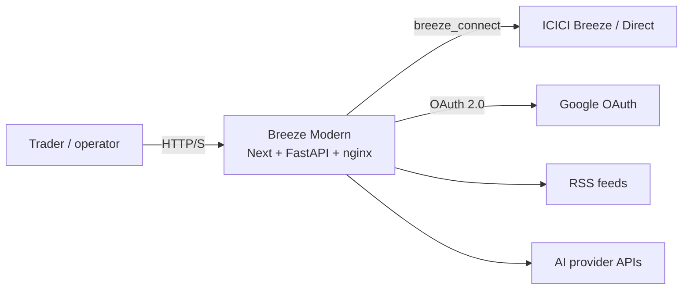
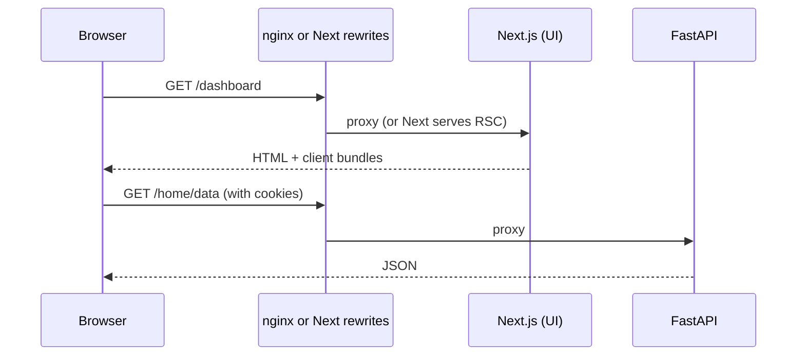
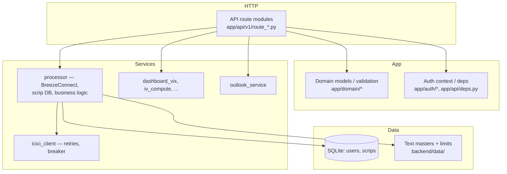

# Technical architecture

This document describes how Breeze Modern is structured: runtimes, networking, the backend package layout, persistence, and external dependencies.

---

## High-level system context

---

## Runtime topologies

### A. Local development (`./dev.sh`)

Three processes:

| Process | Port | Role |
|---------|------|------|
| **uvicorn** | 8000 | FastAPI application (WS subscribe, API) |
| **chain-builder** | — | OS worker: raw tick cache → canonical option chains in Redis |
| **next dev** | 3000 | Next.js dev server |

Redis (`REDIS_URL`) is required for cross-process quote caches: the API process writes **raw** WS ticks; **chain-builder** normalizes them and publishes canonical `quotes:chain:*` payloads that `/strategy-builder/chain` reads during market hours.

Tradeable strikes are filtered from ICICI scrip master using `MarginPercentage > 0`.

`frontend/next.config.js` **rewrites** browser paths such as `/auth/*`, `/api/*`, `/home/data`, `/book/*`, and `/strategy-builder/*` to `BACKEND_UPSTREAM_URL` (default `http://localhost:8000`). The user should open **only** the Next origin (3000) so cookies and redirects stay consistent.

### B. Docker Compose (repo root `docker-compose.yml`)

Three containers:

| Service | Role |
|---------|------|
| **backend** | FastAPI on 8000 (internal) |
| **frontend** | Next production server on 3000 (internal) |
| **proxy** | nginx listening on **3000** (host-mapped) |

`nginx.conf` forwards **specific path prefixes** to the backend and everything else to the frontend. This yields a **single external port** (3000) for the browser.

### C. Single production image (root `Dockerfile`, AWS)

One container runs **supervisord** with:

- **nginx** on **3000** (public listen)
- **uvicorn** on **8000** (loopback)
- **chain-builder** worker (`python -m icici_breeze_backend.workers.chain_builder`)
- **Next standalone** `server.js` on **3001** (loopback)

`deploy/nginx.all-in-one.conf` mirrors the same path-based split as compose’s nginx, but upstreams point to `127.0.0.1`. The AWS workflow maps host **80 → container 3000**.

---

## Request path (browser → code)

**Important**: Many JSON endpoints are **not** under `/api/`; nginx and Next explicitly list paths like `/home/data`, `/portfolio/data`, `/order/data`, `/book/data`, `/dashboard/vix`, etc. This avoids accidentally routing UI paths to the API.

---

## Frontend architecture

| Area | Detail |
|------|--------|
| Framework | Next.js 16 (App Router), React 19, TypeScript |
| Styling | Tailwind CSS 4 |
| Data fetching | TanStack React Query |
| Charts | Chart.js + react-chartjs-2 |
| Build | `output: "standalone"` for Docker; large upload body support for SPAN files via `experimental.proxyClientMaxBodySize` |

Client-side API base: production Docker build intentionally avoids hardcoding `NEXT_PUBLIC_BACKEND_URL` so the browser uses **`window.location.origin`** for same-origin API calls through nginx.

---

## Backend architecture

### Framework and entry

- **FastAPI** app factory in `backend/src/icici_breeze_backend/main.py` (`start_application()`).
- **Uvicorn** ASGI server loads `icici_breeze_backend.main:app`.

### Middleware chain (order matters)

1. **CORSMiddleware** — Origins from `CORS_ORIGINS` or `ALLOWED_ORIGINS`.
2. **RateLimitMiddleware** — Basic protection.
3. **CorrelationIdMiddleware** — Request correlation for logs and error JSON.
4. **RequestLoggerMiddleware** — Structured request logging.

### Routing

- `app/api/router.py` includes `app/api/v1/router.py` with **no global `/api/v1` prefix** on the root router.
- Individual modules set their own prefixes, e.g. `/api/register`, `/api/settings`, `/portfolio`, `/order`, `/book`, `/auth/...`, `/home/data`, `/admin`.

### Layering (conceptual)

### ICICI integration

- **`breeze_connect.BreezeConnect`** is the official SDK-style client.
- **`app/services/processor.py`** centralises most broker calls, scrip master usage, and option chain handling.
- **`core/icici_client.py`** adds retries, timeouts, metrics, and a circuit breaker for selected call paths.
- **Startup**: `processor().update_ICICImaster()` attempts to refresh ICICI security master from the configured HTTPS URL in live mode; this is skipped when `ICICI_BROKER_MODE=mock`.

### Patches and TLS

- **`requests` patch** (`app/core/requests_patch.py`): ICICI’s client historically uses GET with a body; the patch aligns behaviour.
- **`ICICI_BREEZE_INSECURE_SSL`**: Optional disablement of TLS verification for environments where `breeze_connect` import-time downloads fail (corporate MITM, etc.).

---

## Persistence

| Store | File / path | Purpose |
|-------|-------------|---------|
| Users DB | `backend/data/users.sqlite3` | Accounts, encrypted credential metadata, migrations (`user_account_migrate`, AI provider table, outlook preferences, parked orders table). |
| Scrips DB | `backend/data/scrips.sqlite3` | Scrip master cache for lookups and validation. |
| Templates | `backend/db-templates/` | Seed copies of empty DBs and limit files; survives bind mounts over `data/`. |
| Masters | `FONSEScripMaster.txt`, BSE counterparts, `SecurityMaster` zip content | Exchange and ICICI reference data. |
| Limits | `NSEFreezeLimits.txt`, `BSEFreezeLimits.txt` | Quantity limit reference. |
| Logs | `backend/logs/` | File logging when configured. |

Docker Compose mounts `./backend/data` and `./backend/logs` for durability on the host.

---

## Observability and resilience

- **Correlation ID** returned on API errors for support.
- **Audit logger** (`audit/`) for operator trails where enabled.
- **Idempotency helpers** (`concurrency/`) for sensitive operations.
- **Health endpoint** (`/health`) for load balancers and compose healthchecks.
- **Metrics endpoint** (`/metrics`) exposing ICICI client metrics for monitoring.

---

## CI/CD artifacts

| Workflow | Purpose |
|----------|---------|
| `ghcr-publish.yml` | On push to `main`, builds **arm64** (`linux/arm64`) image from root `Dockerfile`, pushes to **GHCR** as `latest` and SHA tags. |
| `aws-deploy-amit.yml` / `aws-deploy-rakesh.yml` | Manual dispatch workflows: provision **EC2 (Ubuntu 24.04 arm64)**, install Docker, pull GHCR image, run container with env file and optional EBS mount, then configure weekday start/stop schedules. |

See [AWS deployment](./aws-deployment.md) for operational detail.

---

## Repository layout (non-legacy)

| Path | Role |
|------|------|
| `backend/src/icici_breeze_backend/` | Python package |
| `frontend/src/app/` | Next.js routes |
| `deploy/` | nginx + supervisor configs for all-in-one image |
| `nginx.conf` | Compose proxy only |
| `docs/` | This documentation |

The **`legacy/`** tree is reference-only and not part of deployed artifacts for the modern app.
