# User and system flows

This document describes major flows with diagrams. It complements [Functionality](./functionality.md) (what exists) and [Architecture](./architecture.md) (how components fit).

Legend for diagrams:

- **Solid lines**: typical happy path.
- **Dashed or notes**: alternatives (API-only mode, failures).

---

## 1. Local startup: Docker Compose

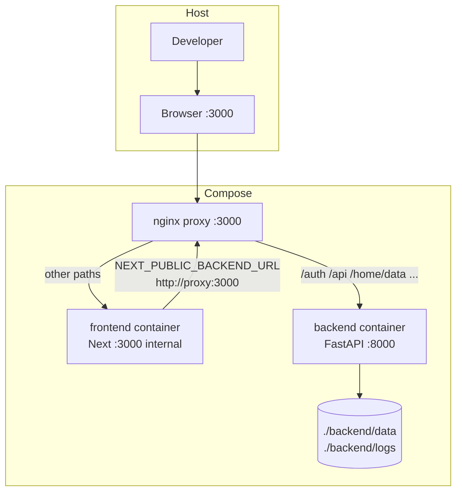

**Reading the loop**: The frontend server may call “itself” via the proxy URL so server-side rendering and internal fetches see the same path routing as the browser.

---

## 2. Local startup: `dev.sh` (no Docker)

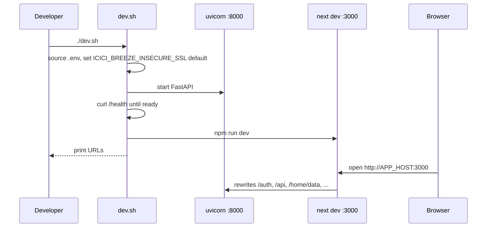

Environment wiring:

- `NEXT_PUBLIC_BACKEND_URL=http://${APP_HOST}:${FRONTEND_PORT}` — browser uses same host for relative API base where applicable.
- `BACKEND_UPSTREAM_URL=http://${APP_HOST}:${BACKEND_PORT}` — Next rewrites target the API directly.

---

## 3. Single-container production image (supervisord)

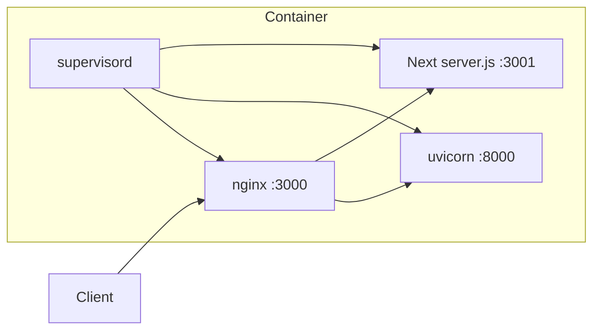

Same path rules as compose nginx (`deploy/nginx.all-in-one.conf`).

---

## 4. Direct app login (browser on Next origin)

**Preconditions**: User account already created via direct registration and app password.

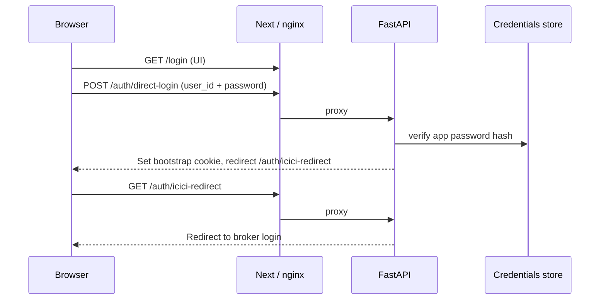

**Failure mode**: Browser origin mismatch (`localhost` vs `127.0.0.1`) can break cookie handoff between direct login and ICICI redirect.

---

## 5. ICICI broker login and `/icici-return`

**Preconditions**: User’s ICICI API app redirect URL registered as `{PUBLIC_FRONTEND_ORIGIN}/icici-return` (same scheme/host/port as the browser).

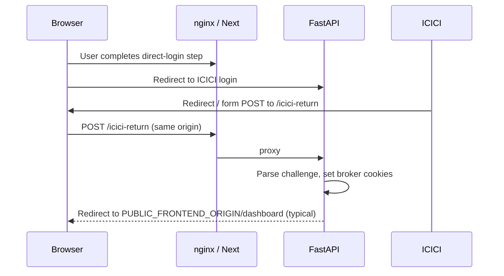

**Why same origin matters**: The browser must send cookies set for the **visible** host; splitting 8000 vs 3000 without proxy alignment breaks the flow.

---

## 6. Authenticated JSON request (dashboard data)

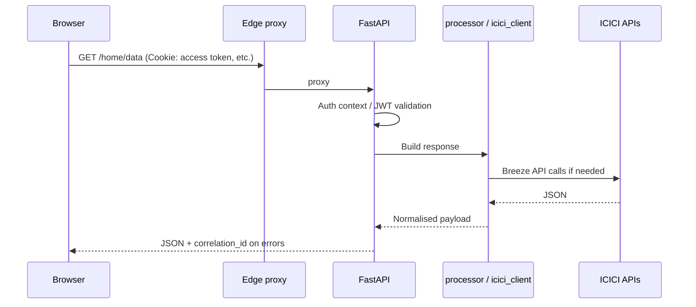

Parallel pattern for `/portfolio/data`, `/order/data`, `/dashboard/vix/options`, etc.

---

## 7. New user registration (`/register`)

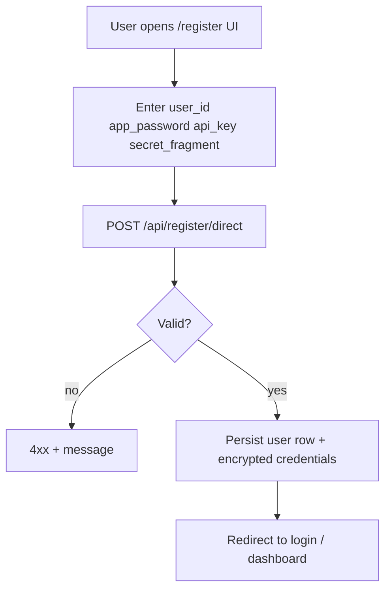

Correction and delete flows use `/api/register/correct-direct` and `/api/register/delete`; password recovery uses `/api/register/recover/start` and `/api/register/recover/complete`.

---

## 8. Settings: credentials update

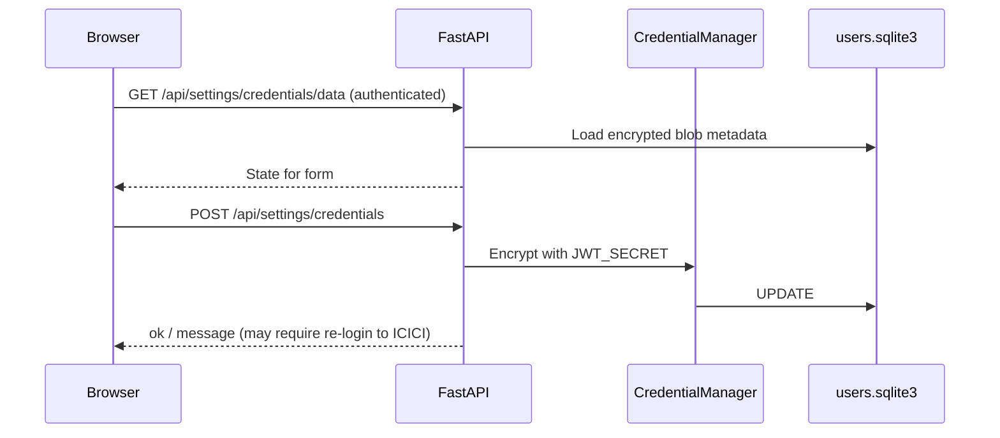

---

## 9. Settings: margin source and SPAN baseline upload

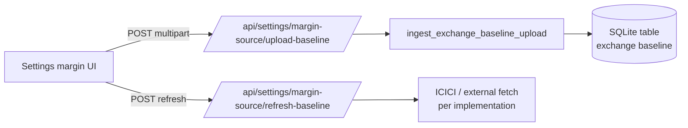

Large uploads are why Next enables an increased **proxy body size** in `next.config.js`.

---

## 10. Strategy builder: chain → margin → execute

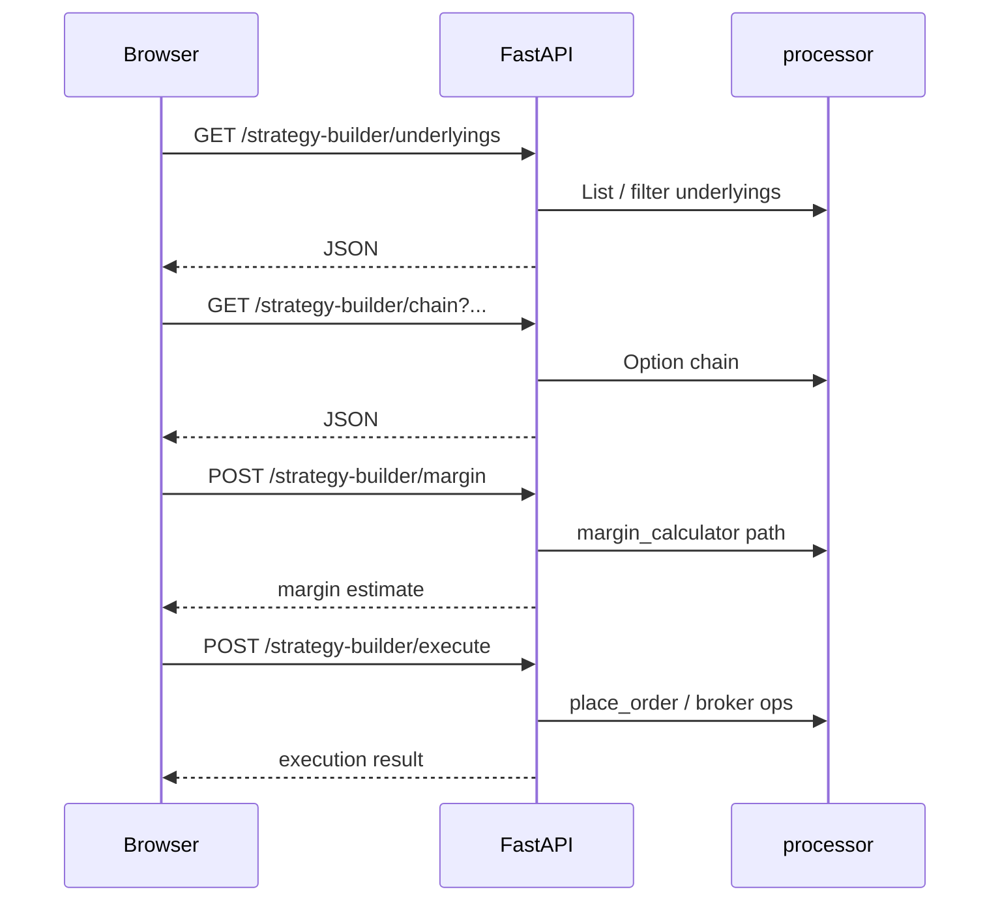

---

## 11. Uncovered / covered shorts scan

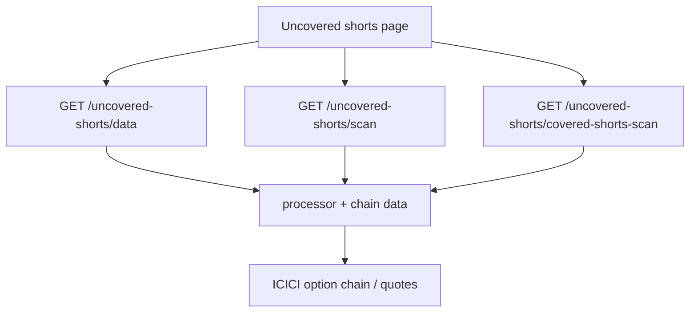

Strategy builder reuses covered-shorts scan logic where applicable.

---

## 12. Market outlook (RSS + optional AI)

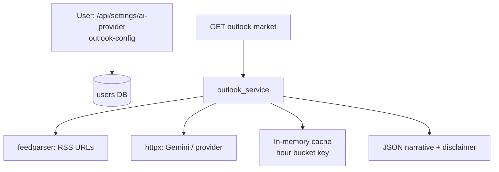

---

## 13. Logout

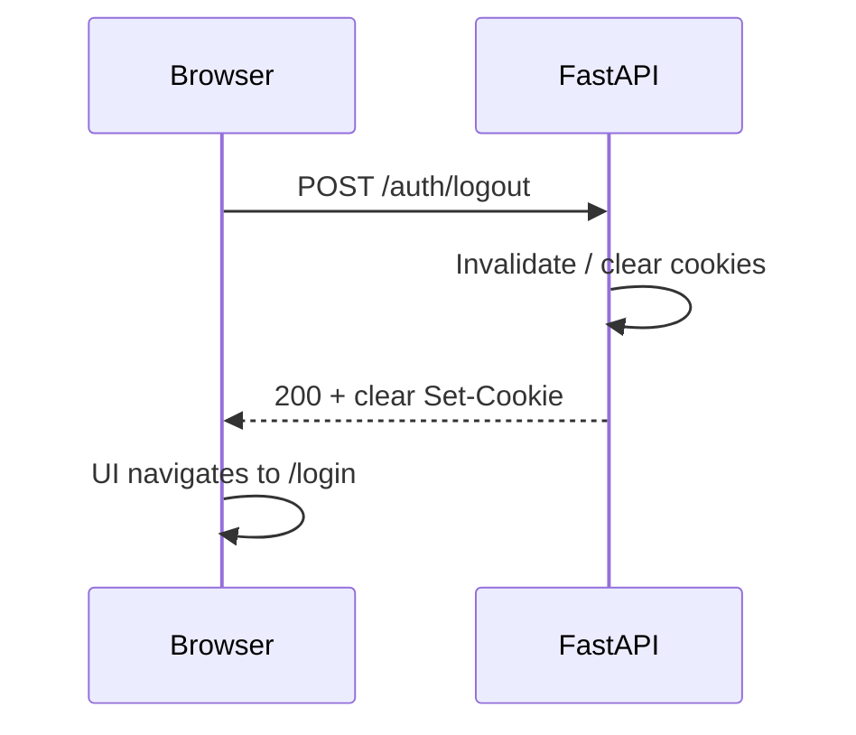

---

## 14. Admin test runner (operator)

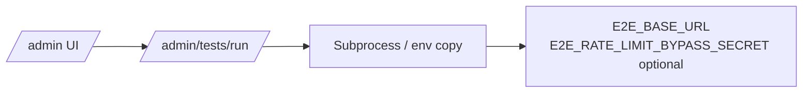

Used for integration checks; see `route_admin.py` for exact behaviour and guards.

---

## 15. CI: publish image to GHCR

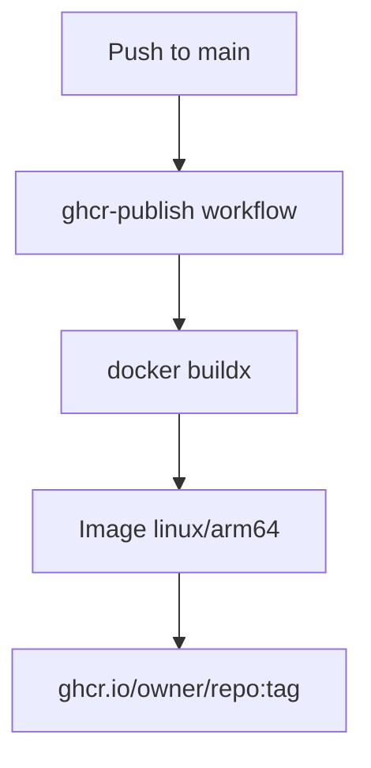

---

## 16. CD: manual AWS deploy (summary)

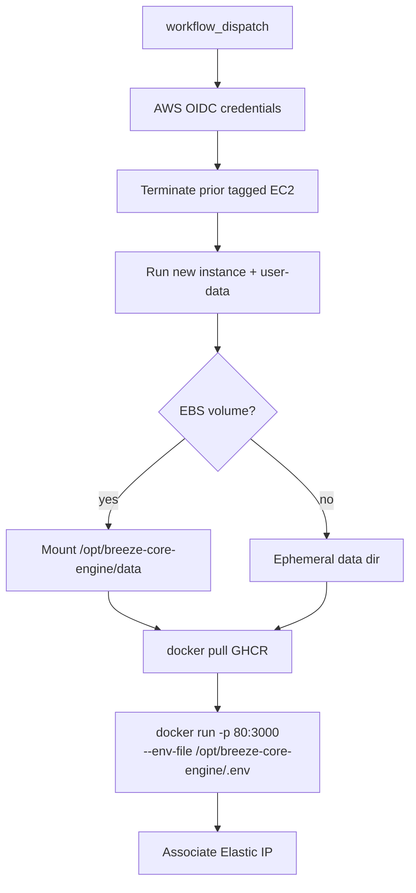

Full checklist: [AWS deployment](./aws-deployment.md).

---

## 17. Error handling path

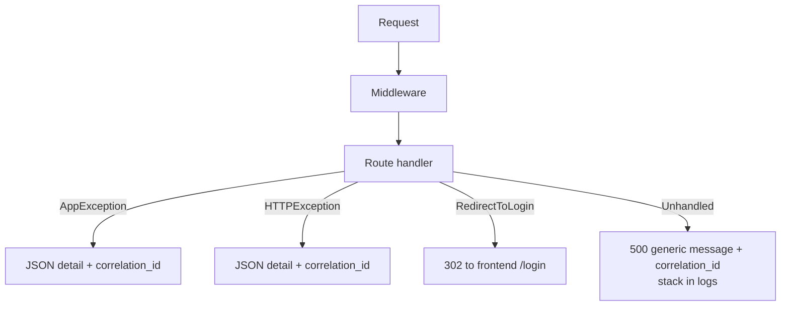

---

## 18. Edge case: API-only browser host (port 8000)

If users open **`http://localhost:8000`** only:

- Leave **`GOOGLE_OAUTH_REDIRECT_BASE_URL` unset** so Google callback is registered on 8000.
- Register **`http://localhost:8000/auth/google/callback`** in Google Cloud.
- ICICI redirect becomes **`http://localhost:8000/icici-return`**.
- This mode is **not** the recommended daily driver when using the modern Next UI.
