# User and system flows

This document describes major flows with diagrams. It complements [Functionality](./functionality.md) (what exists) and [Architecture](./architecture.md) (how components fit).

Legend for diagrams:

- **Solid lines**: typical happy path.
- **Dashed or notes**: alternatives (API-only mode, failures).

---

## 1. Local startup: Docker Compose

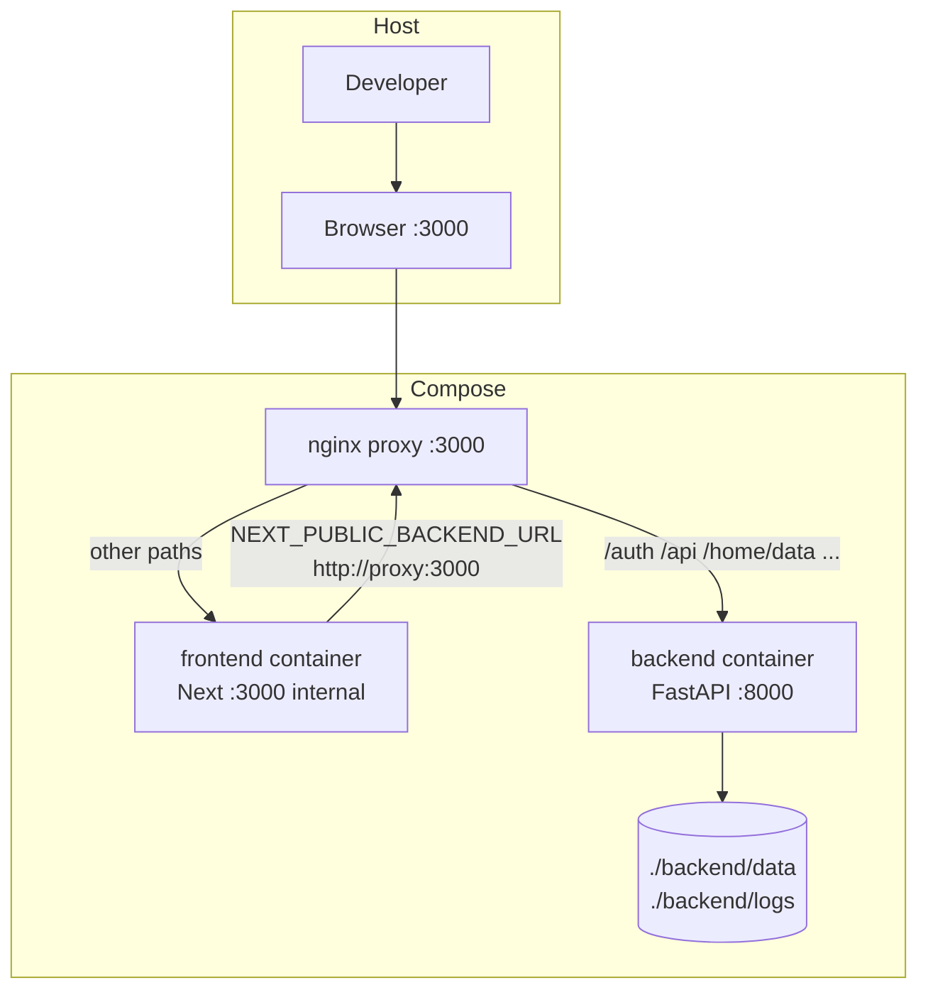

**Reading the loop**: The frontend server may call “itself” via the proxy URL so server-side rendering and internal fetches see the same path routing as the browser.

---

## 2. Local startup: `dev.sh` (no Docker)

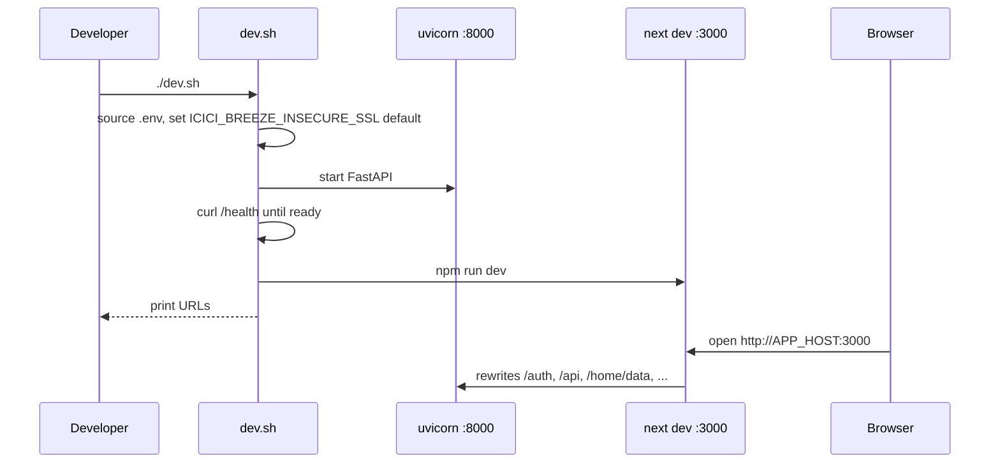

Environment wiring:

- `NEXT_PUBLIC_BACKEND_URL=http://${APP_HOST}:${FRONTEND_PORT}` — browser uses same host for relative API base where applicable.
- `BACKEND_UPSTREAM_URL=http://${APP_HOST}:${BACKEND_PORT}` — Next rewrites target the API directly.

---

## 3. Single-container production image (supervisord)

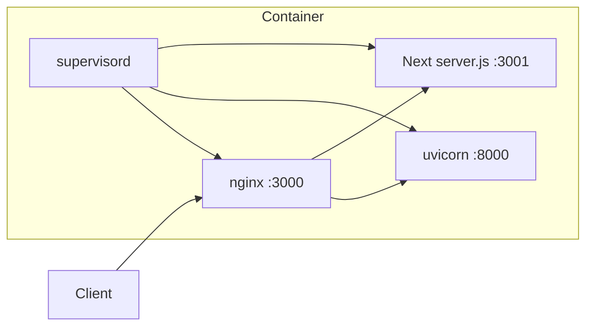

Same path rules as compose nginx (`deploy/nginx.all-in-one.conf`).

---

## 4. Direct app login (browser on Next origin)

**Preconditions**: User account already created via direct registration and app password.

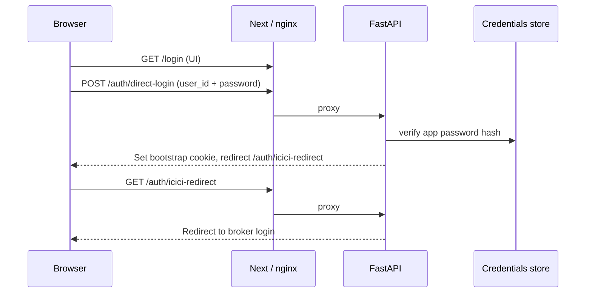

**Failure mode**: Browser origin mismatch (`localhost` vs `127.0.0.1`) can break cookie handoff between direct login and ICICI redirect.

---

## 5. ICICI broker login and `/icici-return`

**Preconditions**: User’s ICICI API app redirect URL registered as `{PUBLIC_FRONTEND_ORIGIN}/icici-return` (same scheme/host/port as the browser).

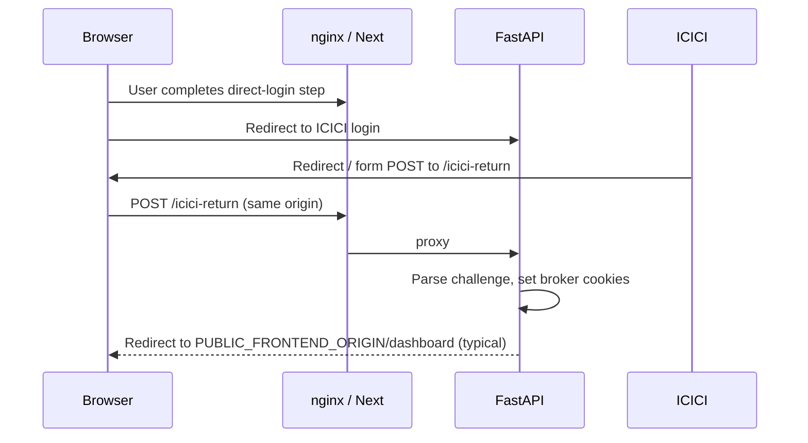

**Why same origin matters**: The browser must send cookies set for the **visible** host; splitting 8000 vs 3000 without proxy alignment breaks the flow.

---

## 6. Authenticated JSON request (dashboard data)

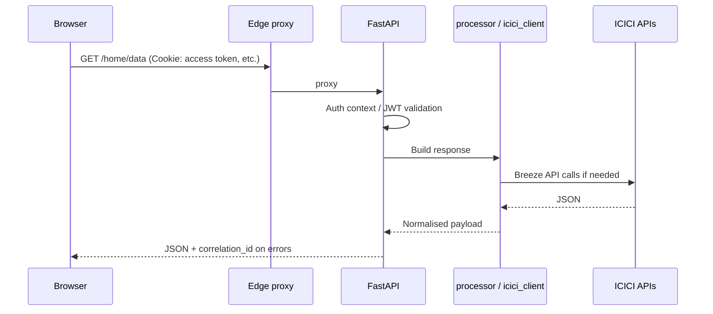

Parallel pattern for `/portfolio/data`, `/order/data`, `/dashboard/vix/options`, etc.

---

## 7. New user registration (`/register`)

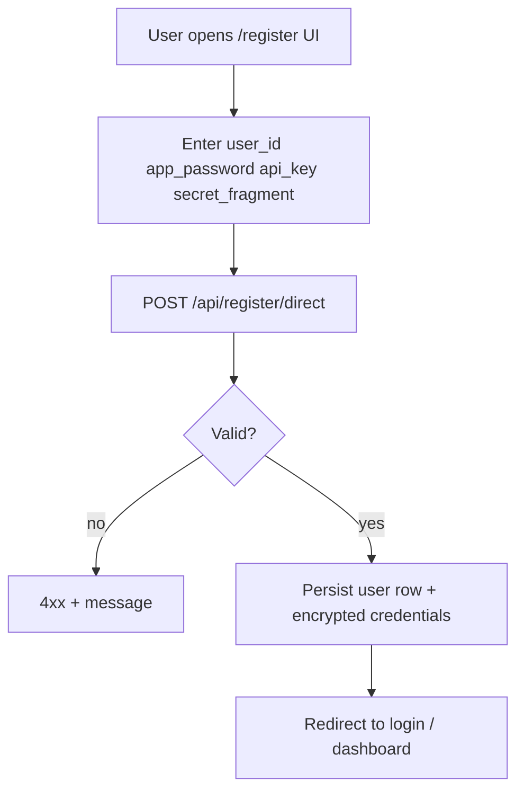

Correction and delete flows use `/api/register/correct-direct` and `/api/register/delete`; password recovery uses `/api/register/recover/start` and `/api/register/recover/complete`.

---

## 8. Settings: credentials update

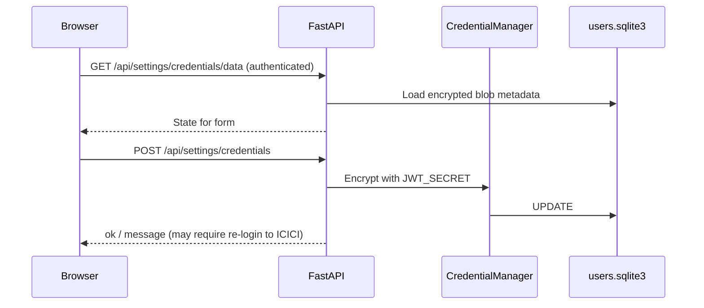

---

## 9. Settings: margin source and SPAN baseline upload

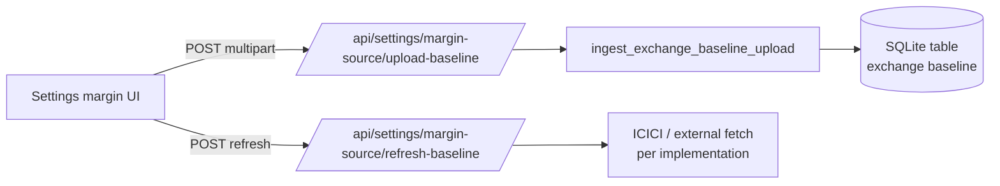

Large uploads are why Next enables an increased **proxy body size** in `next.config.js`.

---

## 10. Strategy builder: chain → margin → execute

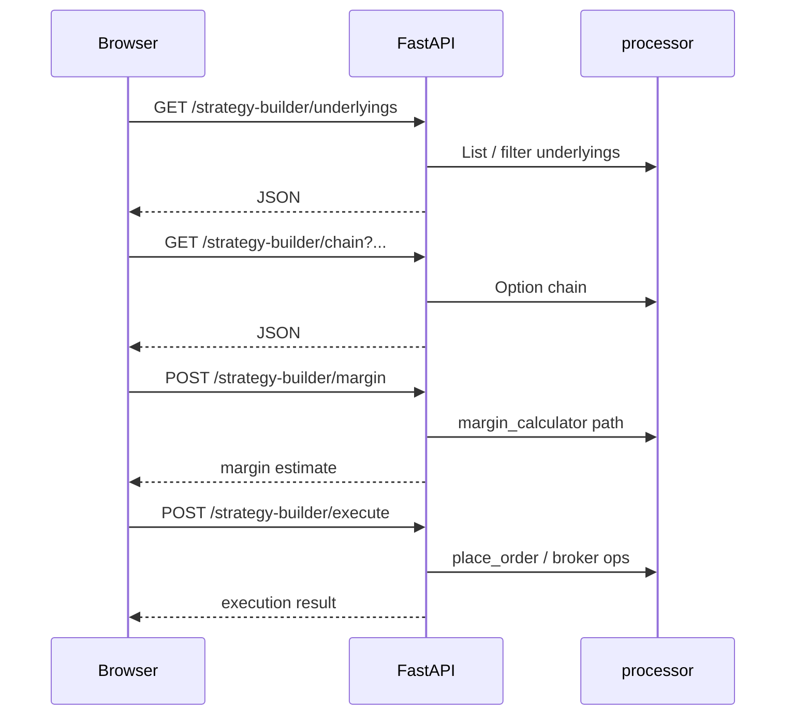

---

## 11. Uncovered / covered shorts scan

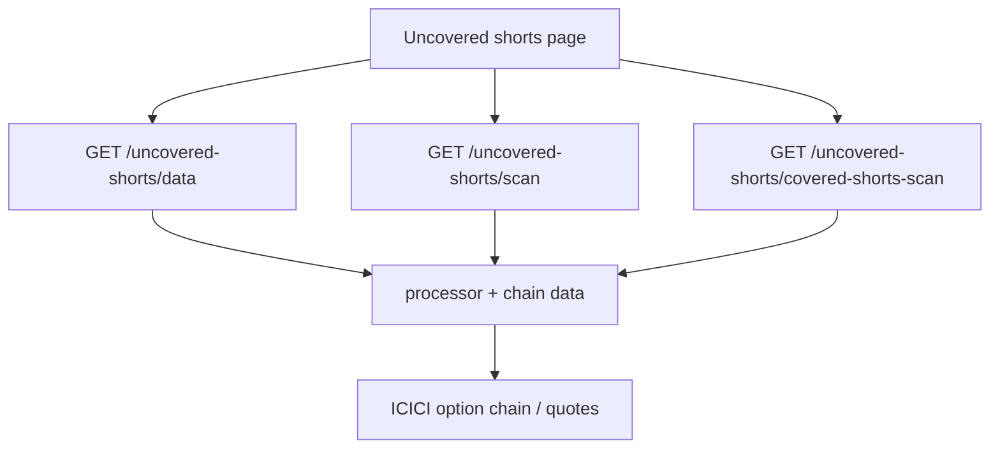

Strategy builder reuses covered-shorts scan logic where applicable.

---

## 12. Market outlook (portal-generated, fetched by this app)

Generation (RSS + AI) now happens centrally on breeze-saas-portal, on an admin-configured schedule, producing one global result for the whole fleet. This app just polls the portal's cached result:

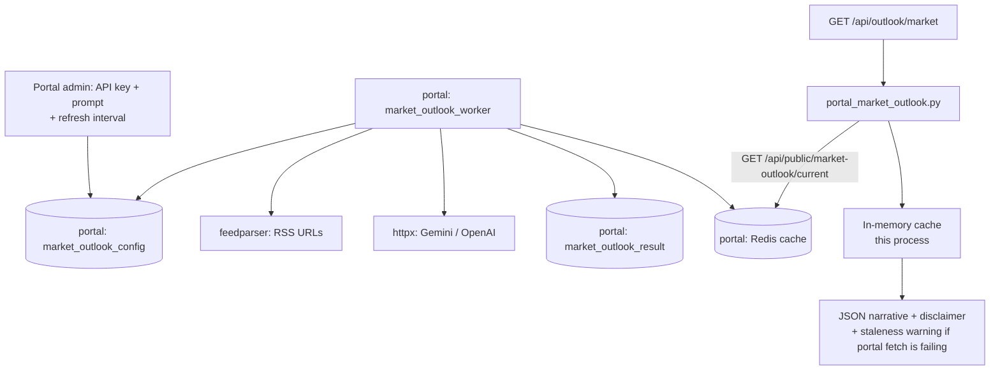

---

## 13. Logout

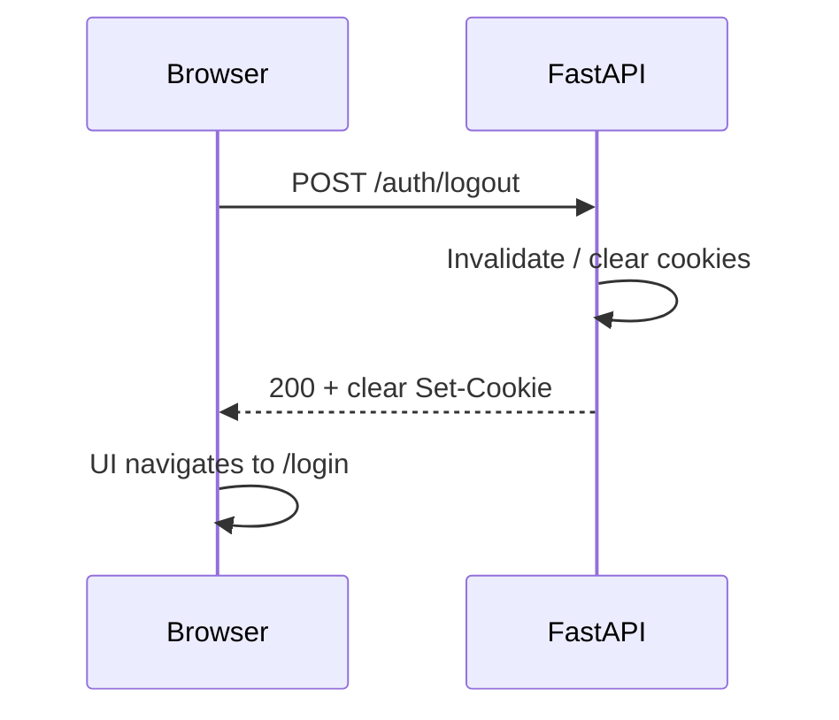

---

## 14. Admin test runner (operator)

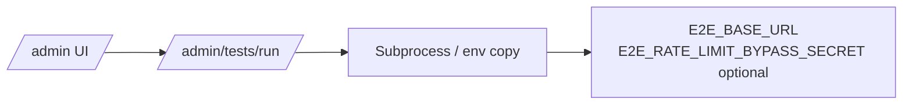

Used for integration checks; see `route_admin.py` for exact behaviour and guards.

---

## 15. CI: publish image to GHCR

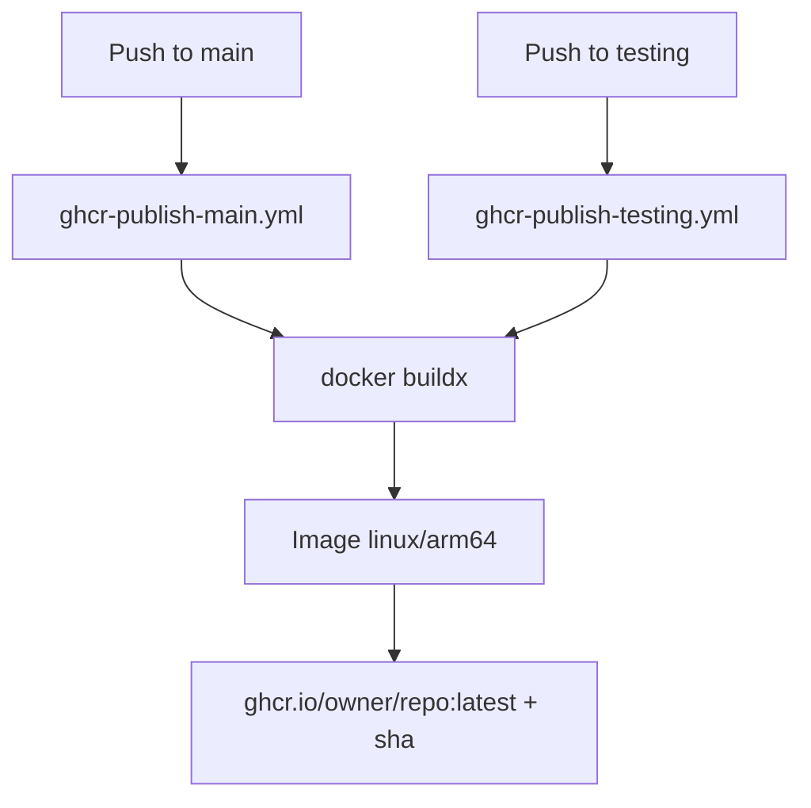

Both workflows are identical (same DRM key baking, same build) and push to the **same** `ghcr.io/owner/repo:latest` tag — a push to `testing` overwrites the same image tag a push to `main` would. There is no separate staging tag namespace.

---

## 16. CD: legacy manual AWS deploy (dormant path, `icici-breeze-modern` only)

This is the **legacy**, `workflow_dispatch`-only path for the older `icici-breeze-modern` image — it does not deploy the current `breeze-core-engine` app. Current-app deployment goes through breeze-saas-portal's CloudFormation stack (flow 19 below).

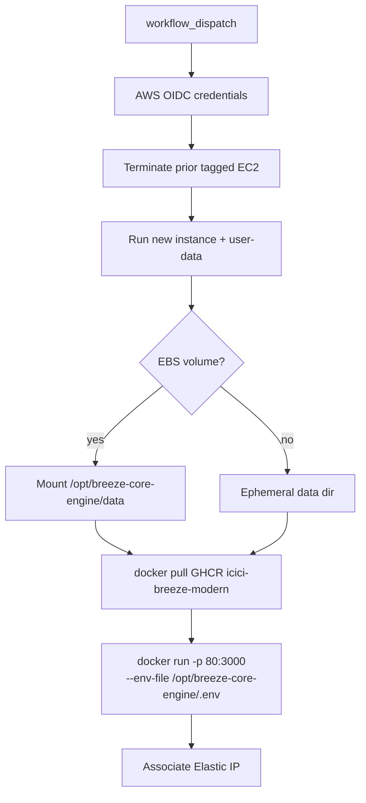

Full checklist: [AWS deployment](./aws-deployment.md).

---

## 17. Error handling path

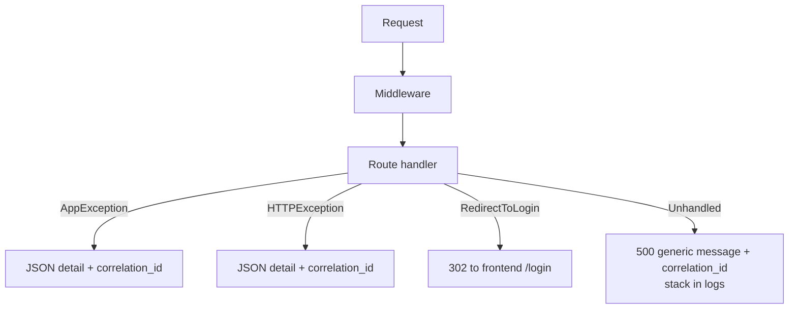

---

## 18. Edge case: API-only browser host (port 8000)

If users open **`http://localhost:8000`** only:

- Leave **`GOOGLE_OAUTH_REDIRECT_BASE_URL` unset** so Google callback is registered on 8000.
- Register **`http://localhost:8000/auth/google/callback`** in Google Cloud.
- ICICI redirect becomes **`http://localhost:8000/icici-return`**.
- This mode is **not** the recommended daily driver when using the modern Next UI.

---

## 19. CD: current deploy path — breeze-saas-portal CloudFormation

This is what actually deploys `breeze-core-engine` in production; this repo's own CI (`ghcr-publish-main.yml`) only builds and publishes the image. Full detail is authoritative in breeze-saas-portal's docs (`docs/aws-deployment.md`, `docs/license-management.md`); this is a summary from this repo's side.

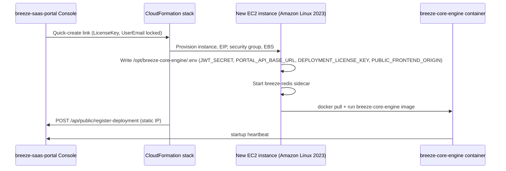

## 20. Portal heartbeat, license status, and self-upgrade

```mermaid
sequenceDiagram
  participant App as This instance
  participant Portal as breeze-saas-portal

  App->>Portal: POST /api/public/heartbeat {public_ip, version, license_key}
  Portal-->>App: policy_token (ES256 JWT, ~600s TTL)
  App->>App: Verify signature, issuer/audience, public_ip claim
  App->>App: Cache deployment_license_status; degrade to unlicensed if stale > 2x interval
  loop every heartbeat_interval_sec (300-3600s)
    App->>Portal: POST /api/public/heartbeat
    Portal-->>App: policy_token (optional trigger_upgrade + target_tag)
    alt trigger_upgrade and upgrade window open
      App->>App: docker pull target image
      App->>App: hand off stop+recreate to sibling docker:cli helper
    end
  end
```

Trading-mutation routes consult the cached status via `require_trading_not_revoked`; a `revoked`/`unlicensed`/`pending_activation`/`trial_denied` status returns HTTP 403 with a read-only message rather than executing the request.

## 21. License activation on ICICI login

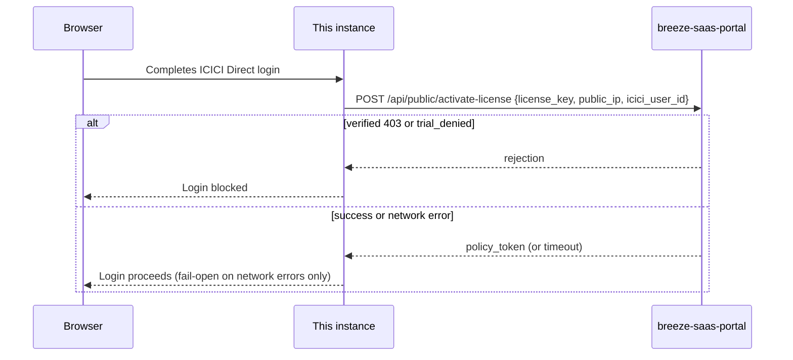

## 22. Reference data bootstrap and daily refresh

```mermaid
flowchart TB
  START[App startup] --> BOOT[bootstrap_reference_data_on_startup]
  BOOT --> SCHED[Start daily IST scheduler thread]
  BOOT --> WARM[Warm Redis/memory cache from SQLite]
  WARM --> COMPLETE{Cache already complete?}
  COMPLETE -->|yes| SKIP[Skip network load]
  COMPLETE -->|no| LOAD[run_reference_data_load trigger_mode=startup]
  SCHED -->|daily at configured IST hour:minute| LOAD2[run_reference_data_load trigger_mode=scheduled]
  LOAD --> ORCH[orchestrator: NSE/BSE bhavcopy + scrip master + SPAN baseline]
  LOAD2 --> ORCH
  ORCH --> VER[Build new refdata:v_N_ keys]
  VER --> FLIP[Flip refdata:current_version pointer]
```
