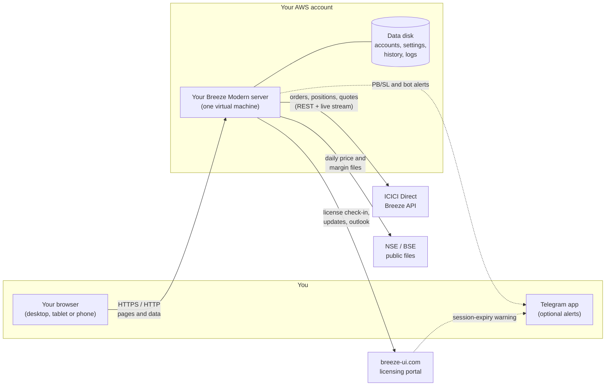
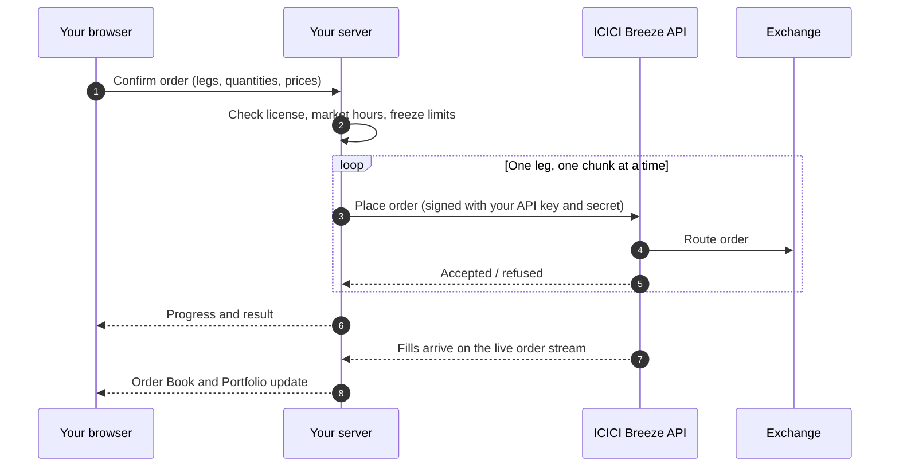
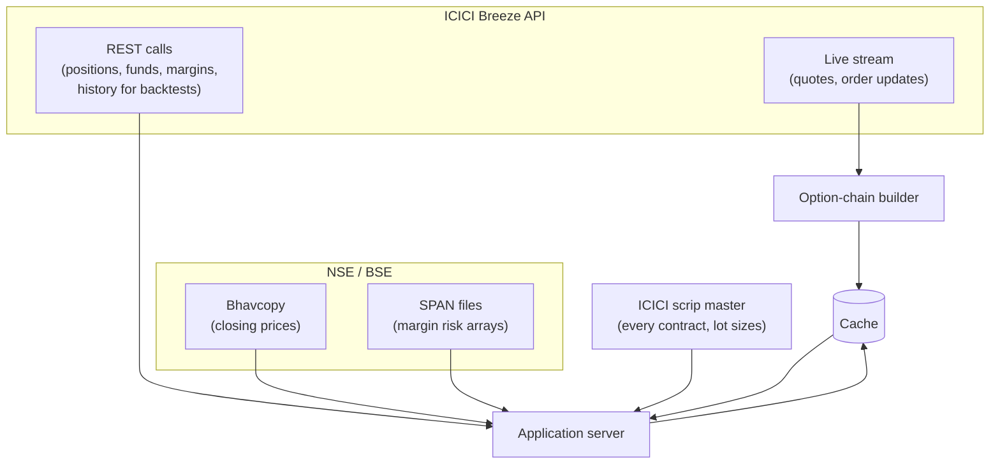

# Breeze Modern: technical overview

*For traders and their IT advisers who want to know how Breeze Modern is built, what runs where, and what information leaves your server. It describes version 2.10 of the app (September 2026).*

Breeze Modern is a web application that runs on **your own server** in **your own AWS account**. You use it from a browser. It talks to ICICI Direct through ICICI's official **Breeze API**, and to our licensing service at **breeze-ui.com** for its license and software updates. It does not depend on any other service to trade.

## 1. The big picture

- **You** open the app in a browser. Everything you see is served by your server.
- **Your server** does all the work: it signs in to ICICI on your behalf, places orders, streams prices, calculates margins and P&L, and runs automated exits and bots.
- **ICICI Direct** executes your orders and supplies your positions, funds and live prices, exactly as for ICICI's own apps.
- **The exchanges** (NSE and BSE) publish closing prices and margin (SPAN) files that your server downloads directly.
- **breeze-ui.com** issues your license, tells your server when an approved update is available, supplies the daily market commentary, and warns you on Telegram if armed rules are about to stop at midnight. It never sees your ICICI credentials, orders, positions or P&L (see section 5).

## 2. What runs on your server

Your server is a single AWS virtual machine created from our template when you set up your deployment. It runs the app as a small set of Docker containers:

| Part | What it does |
|---|---|
| **Web front end** | Serves the pages you see and the in-app user guide. |
| **Application server** | The core of the app: accounts, ICICI connection, orders, margins, P&L, Profit Booking / Stop Loss, bots, backtests. |
| **Option-chain builder** | A background worker that keeps the option chains you are looking at up to date from the live price stream. |
| **Cache** | Holds live prices and daily reference data in memory so pages load quickly. |
| **Data disk** | A dedicated disk holding your accounts, encrypted ICICI credentials, settings, parked orders, bot records, backtest history and logs. |

A single gateway on the server receives every browser request and passes it to the right part. Only that gateway is reachable from the internet.

The server is sized for one trader (occasionally two or three). It is not a shared, multi-customer system.

## 3. How an order reaches ICICI

- **Orders are sent one at a time, never in parallel.** This keeps within ICICI's per-minute limit and makes retries safe: with only one order in flight, a refusal from ICICI definitely means that order was not placed, so retrying it can never fill it twice.
- **Large orders are split** into chunks at the exchange's freeze limit.
- **Every call is signed** with your API key and secret, as ICICI requires. The app waits and retries automatically if ICICI asks it to slow down.
- **ICICI allows about 5,000 API calls a day** per account. The last 500 are reserved for placing and cancelling orders, so less essential work (refreshes, backtest downloads) stops first.

## 4. Where prices and reference data come from

- **During market hours**, prices stream from ICICI over a live connection. The option-chain builder keeps only the chains you are actually looking at (plus NIFTY and SENSEX) up to date, to keep the server's load modest. Streaming does not count against ICICI's daily call limit.
- **After the close**, prices come from the exchanges' official closing files (bhavcopy), or from the last live prices captured at the close.
- **Margins** come either from ICICI's margin calculator or from the exchanges' SPAN files plus ICICI's add-on rates, calculated on your server. You choose which in Settings.
- **Reference data** (closing files, SPAN files, ICICI's contract list) downloads automatically every day. A new day's data is only switched in once it has fully loaded, so pages never see a half-loaded set.

## 5. What leaves your server, and what does not

| Goes to | What is sent | Why |
|---|---|---|
| **ICICI Direct** | Your API key, signed requests, orders, and requests for positions, funds, quotes and history. | This is how the app trades for you. It is the same information ICICI's own apps exchange. |
| **NSE / BSE** | Ordinary downloads of public files. Nothing about you. | Closing prices and margin files. |
| **breeze-ui.com**: license check-in (every 5 to 60 minutes) | Your license key, your server's public IP address and the app version. For each user with armed Profit Booking / Stop Loss rules and Telegram alerts switched on: their ICICI user id, Telegram chat id and the time their ICICI session expires. | To confirm the license, and so the portal can warn you on Telegram if monitoring is about to stop at midnight. |
| **breeze-ui.com**: license activation (first sign-in) | License key, public IP and your ICICI user id. | Free trials are limited to one per ICICI account. |
| **breeze-ui.com**: registration and sign-in notices | Your server's public IP. | Deployment status in your license console. |
| **Telegram** (only if you link it) | Sent by your server: alert messages when a rule fires, and bot proposals awaiting your approval. Sent by breeze-ui.com: the warning that monitoring stops when your ICICI session expires. | The alerts you asked for. |

**Never sent to breeze-ui.com or anyone else:** your ICICI password or OTP, your API secret, your Breeze Modern password, your orders, positions, holdings, funds or P&L, your bot settings or backtest results.

**Received from breeze-ui.com:** a digitally signed license status, which your server verifies against a key built into the app so that it cannot be forged; the ICICI margin add-on rates; approval to install a new version; the market commentary shown on the Dashboard; the current terms and risk disclosure text.

## 6. Your credentials and data

- **Your ICICI password and OTP** are typed only on ICICI's own website. Breeze Modern never sees them.
- **Your API secret is split.** Most of it is stored on your server, encrypted with a key unique to your deployment. The last few characters you type at each sign-in. While you are signed in that day, the server keeps the joined secret, encrypted, so that automated exits and bots can still sign orders when your browser is closed. It is deleted when ICICI's session ends at midnight.
- **Your Breeze Modern password** is stored only as a one-way hash.
- **Everything else** (settings, parked orders, bot records, backtest history, logs) is on your server's data disk. You can see what occupies it and delete old data from **Settings → Storage**. Logs can be downloaded from **Settings → Application Logs**; they contain account identifiers and IP addresses, so treat them as sensitive.
- **Deleting your deployment** in breeze-ui.com deletes the server and its data disk with it.

## 7. Automation

Profit Booking / Stop Loss rules and bots run **on your server**, not at ICICI:

- The server reprices every open position every few seconds from the live price stream and checks it against your rules. That uses no ICICI calls.
- When a rule fires, the server places the exit orders through the same one-at-a-time route as your own orders.
- Automation therefore only works while your server is running, streaming prices, signed in to ICICI for the day and licensed. Closing your browser does not stop it; logging out does, because it ends the day's ICICI session.
- Single-leg **GTT** exits are different: they are held and triggered by ICICI itself, so they work even if your server is off.

## 8. The license and read-only mode

Your server checks in with breeze-ui.com regularly (every 5 minutes by default) and receives a signed license status. If the license is revoked or missing, or if the server cannot confirm it for a while (for example because breeze-ui.com cannot be reached), the app switches to **read-only mode**: you can see your account, but it will not place orders or run strategies. It fails safe on purpose: a server that cannot confirm its license stops trading rather than carrying on. It returns to normal by itself once the license is confirmed.

## 9. Updates

When a new version is released and approved for your deployment in breeze-ui.com, your server downloads the new version and restarts itself on it, usually within a minute or two. A small helper container performs the restart, because the app cannot restart itself from the inside. Your data disk and settings carry over unchanged.

## 10. Technology, for the curious

| Area | Technology |
|---|---|
| Server | AWS EC2 (ARM, Amazon Linux), created from a CloudFormation template by breeze-ui.com |
| Containers | Docker; one application image plus a Redis cache container |
| Web front end | Next.js (React, TypeScript) |
| Application server | Python (FastAPI) |
| ICICI connection | ICICI's official `breeze-connect` library (REST and WebSocket) |
| Storage | SQLite databases on the data disk; Redis for live and reference data |
| Security of stored credentials | Encryption with a per-deployment secret key; one-way password hashing |
| License verification | Signed tokens verified against a public key built into each release |

Questions about anything here: [sales@breeze-ui.com](mailto:sales@breeze-ui.com).
