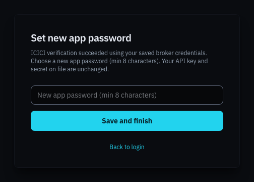
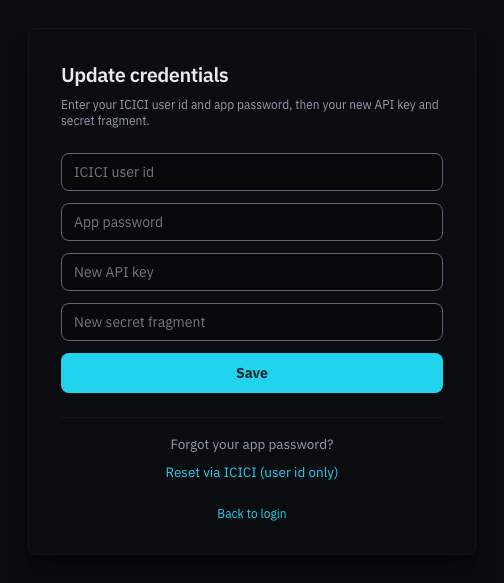

# Passwords and credentials

This section covers three situations: you forgot your Breeze Modern app password, ICICI gave you a new API Key or Secret Key, or you want to remove your account.

## You forgot your app password

Your app password can be reset by proving who you are through ICICI, using the API credentials already stored for you.

1. On the login page, click **Forgot password? Reset via ICICI**.
2. Enter your **ICICI user id** and click **Continue to ICICI verification**.
3. Log in on ICICI's website as usual, including the OTP.
4. On **Complete ICICI login**, type the memorised part of your Secret Key and click **Submit**.
5. Choose a new password in **New app password (min 8 characters)** and click **Save and finish**.

You return to the login page with **App password updated. Please sign in.** Your API Key and Secret stay exactly as they were.

Recovery needs working API credentials on file. If ICICI has since changed your API Key or Secret, recovery fails; contact whoever manages your deployment.

## Your ICICI API key or secret changed

ICICI issues a new Secret Key if you regenerate it on the API portal, and a new API Key if you register a new app. Update Breeze Modern in either of two places.

**Before signing in** (for example because sign-in now fails): on the login page click **Wrong credentials? Update credentials**.

| Field | What to enter |
|---|---|
| **ICICI user id** | Your user id. |
| **App password** | Your current Breeze Modern app password. It proves the account is yours. |
| **New API key** | The API Key from ICICI's API portal. |
| **New secret fragment** | Your new Secret Key **without its last 2 to 4 characters**, exactly as described in [Splitting your Secret Key](registering.md#splitting-your-secret-key). Memorise the characters you left out. |

Click **Save**. You return to the login page with **Credentials updated. Please sign in again.**

**While signed in**: open **Settings → Broker Credentials**. See [Settings: trading setup](settings-trading.md#broker-credentials).

> [!NOTE]
> If you changed your Secret Key, the part you memorise changes too. Use the new characters on the **Complete ICICI login** page from now on.

## Deleting your account

**Settings → Delete Account** removes your Breeze Modern account and the ICICI credentials stored for it. See [Settings: danger zone](settings-danger-zone.md#delete-account) for the full details.

Deleting your account:

- **does not** close or change your ICICI Direct account;
- **does not** stop or delete your server in AWS, or end your license. To release AWS resources, sign in at [breeze-ui.com](https://breeze-ui.com) and follow the instructions in the license console;
- **cannot be undone**. You can register again afterwards, as a new account.
