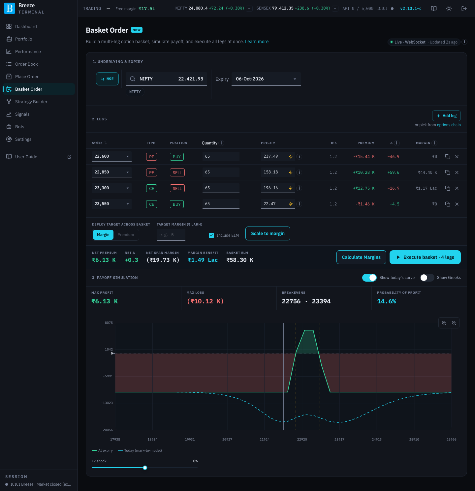
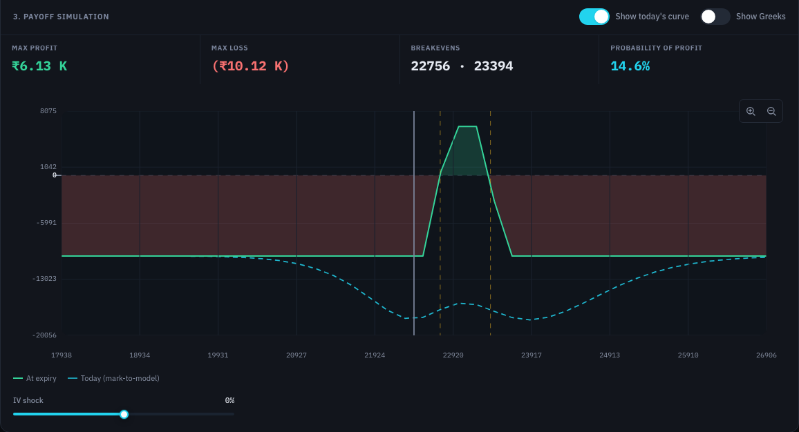

# Basket Order

Basket Order builds a multi-leg option position of your own design (a spread, strangle, iron condor, or anything else) on one underlying and expiry. You see its combined premium, margin and payoff before placing all the legs together.

Use [Strategy Builder](strategy-builder.md) instead if you want the app to propose strategies for you.

The page works top to bottom in three numbered sections. Each unlocks once the one above is complete.

## 1. Underlying & Expiry

| Control | What it does |
|---|---|
| **NSE** / **BSE** | The exchange. Changing it clears the basket. |
| **Select underlying** | Search for the underlying. Recently traded ones are offered as quick picks. |
| **Expiry** | The expiry for every leg. Changing it clears the basket. |

A badge at the top right of the page shows where the option prices come from (see [Where prices come from](finding-your-way.md#where-prices-come-from)). Click it to reload the chain.

## 2. Legs

| Control | What it does |
|---|---|
| **Add leg** | Adds an empty leg you can fill in. |
| **or pick from options chain** | Opens the option chain for the expiry. Each strike shows open interest (**OI (L)**, in lakh), the change in OI and the **LTP** for calls on the left and puts on the right, with the **ATM** strike marked. Click **B** or **S** next to a price to add a buy or sell leg at that strike. A leg you have already added is marked. |

Each leg is a row in the table:

| Column | What it does |
|---|---|
| **Strike** | The strike price. Click the header to sort the legs by strike. |
| **Type** | CE or PE. |
| **Position** | Buy or sell. |
| **Quantity** | The quantity in units. It is rounded to a whole number of lots automatically (the **i** icon explains). A leg with zero quantity stays in the table but is left out of the order. A **⚠** beside it is a [liquidity warning](place-order.md#liquidity-warnings): the live order book is too thin to fill this quantity near the LTP. Legs selling (or buying) the same strike are checked together. |
| **Price ₹** | The limit price, filled in from the market. The **lightning bolt** makes the leg an [aggressive order](place-order.md#aggressive-orders). |
| **B:S** | Buy-to-sell ratio of the quantity waiting in the whole order book for this contract. It counts orders far from the current price too, so the ⚠ beside **Quantity** is the better guide to whether your size will fill. |
| **Premium** | Premium received (+) or paid (−) for the leg. **No quote** means the contract has no market price yet: type a price, or pick another strike. |
| **Δ** | The leg's [delta](glossary.md#delta) in units of the underlying: option delta × quantity, negative when sold. Blank until the leg has a strike and a quantity. Hover a value for its breakdown. |
| **Margin** | The leg's margin on its own, once calculated. The **i** icon explains that it is approximate. |
| Copy and delete icons | Duplicate the leg, or remove it. |

Beneath the table:

| Item | What it shows or does |
|---|---|
| **Net premium** | Premium across all legs: received (+) or paid (−). A leg showing **No quote** is left out, and a note beside the total says how many legs were. The payoff figures below leave it out too, with the same note, and **Execute** stays disabled until the leg has a price (or is made aggressive). |
| **Net Δ** | The legs' deltas added up: the units of the underlying the whole basket behaves like. |
| **Net SPAN margin** | Margin for the whole basket calculated as one position. |
| **Margin benefit** | How much less the basket needs than the legs would separately: the saving from hedging. |
| **Basket ELM** | The extreme loss margin buffer on top. For stock options it is an estimate at a flat 5% (5.25% if deep out of the money); the **i** icon explains. |
| **Calculate Margins** | Works out the margins above for the current legs. Recalculate after changing legs or lots. |
| **Execute basket · N legs** | Opens the order confirmation for every leg with a quantity above zero. See [Confirming an order](place-order.md#confirming-an-order). |

Where the margins come from, the SPAN file or ICICI's margin calculator, is set in **Settings → Reference Data Loads**. See [Margins](margins.md).

When any leg is aggressive, an **Aggressive style** control appears to set the style and tolerance for all aggressive legs.

### Deploy target across basket

Scales the lots of every leg up or down together, keeping the basket's shape, to hit a target:

| Control | What it does |
|---|---|
| **Margin** / **Premium** | Scale to a margin budget, or to a premium budget. Use **Margin** for a basket that collects premium (it has short legs) and **Premium** for one that only pays premium. The app tells you if you pick the one that does not apply. |
| **Target margin (₹ lakh)** or **Target premium debit (₹)** | Your budget. |
| **Include ELM** | Counts the ELM buffer against the margin budget. |
| **Scale to margin** / **Scale to premium** | Sets the lots. |

Margin does not grow in a straight line with quantity, so the app checks the scaled basket against real margin figures rather than simply multiplying. If some legs have no fixed price (aggressive legs), the premium is estimated from the last known mid-price and the actual fill may differ.

## 3. Payoff simulation

| Item | What it shows or does |
|---|---|
| Chart | The basket's P&L **At expiry** across underlying prices, and optionally **Today (mark-to-model)**. |
| **Show today's curve** | Adds today's curve: P&L if the underlying moved there right now. |
| **Show Greeks** | Shows the basket's **Delta**, **Gamma**, **Vega** and **Theta / day**. They follow the **IV shock**; at zero shock, **Delta** equals **Net Δ** under the legs. |
| **IV shock** | Raises or lowers implied volatility, to see how today's curve reacts to a volatility change. |
| **Max profit**, **Max loss**, **Breakevens**, **Probability of profit** | Summary of the payoff. See [PoP in the glossary](glossary.md#pop-probability-of-profit). |

Until you add legs, the panel reads **Payoff chart idle**.
