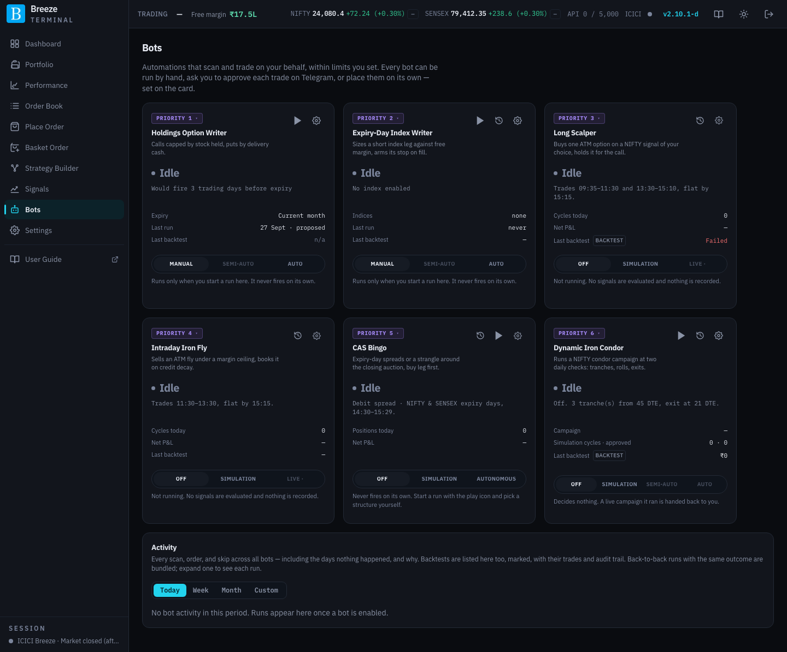
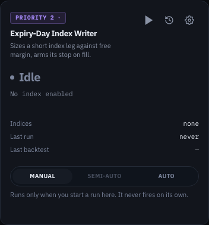
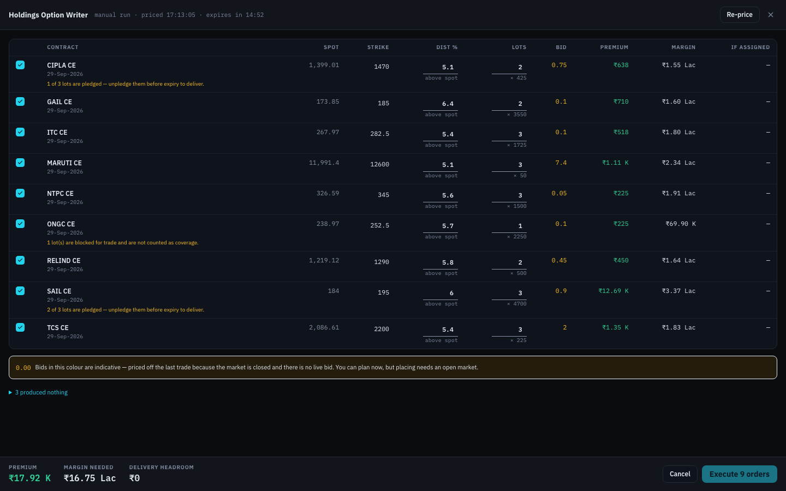
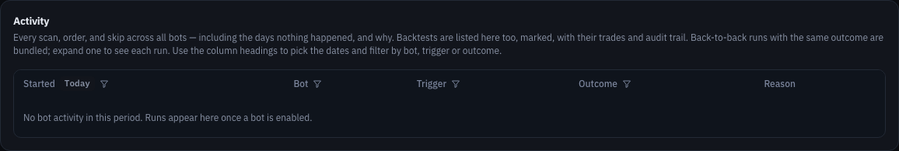
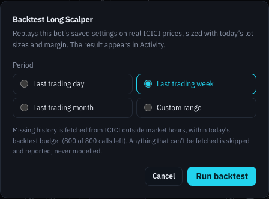

# Bots

Bots are automated strategies that scan, size and place trades on your behalf, within limits you set. There are six. Each can ask your approval or trade on its own, each can also be run by hand, and every decision it makes, including every decision not to trade, is logged.

| Bot | In one line |
|---|---|
| **Holdings Option Writer** | Writes covered calls against shares you own, and optionally cash-backed puts, once a month. |
| **Expiry-Day Index Writer** | On NIFTY/SENSEX expiry mornings, sells an out-of-the-money option, strangle or (with a wing bought beyond) spread or iron condor sized to your margin, with a stop armed automatically. |
| **Long Scalper** | Buys one at-the-money NIFTY option when a signal fires, and manages it with a tight stop and a trailing ladder. |
| **Intraday Iron Fly** | Sells a hedged at-the-money NIFTY iron fly during a quiet part of the day, and books it as premium decays. |
| **CAS Bingo** | On expiry days, trades spreads or a strangle around the exchange's closing auction. |
| **Dynamic Iron Condor** | Runs a NIFTY [iron condor campaign](iron-condors.md) on its own: tranches, rolls and exits at two checks a day. |

The Long Scalper, CAS Bingo's spreads and (optionally) the Iron Fly read a [signal](signals.md). The two writers never look at direction.

> [!IMPORTANT]
> Bots place real orders in your account when set to trade on their own. Start every bot in its manual, approval or simulation mode, check its Activity log and its backtest, and only then let it trade unattended. Nothing here is investment advice.

## The bot card

| Part | What it shows or does |
|---|---|
| **Priority N** | The bot's place in the queue. Lower runs first and sizes against your margin before the others, so two bots never commit the same margin. Click it to pick a slot; taking a slot that another bot holds swaps the two. |
| Play icon | **Start a run** now, by hand (Holdings Writer, Expiry Writer, CAS Bingo). Opens the run sheet. On the Dynamic Iron Condor it opens [Basket Order](basket-order.md#managing-it-as-a-dynamic-iron-condor-campaign) with a first tranche filled in, to start a campaign of your own. |
| History icon | **Backtest** this bot. See [Backtesting a bot](#backtesting-a-bot). |
| Gear icon | Opens the bot's settings. |
| Status | **Idle** (not armed), **Armed**, or **Closing** (switched off with a real position still open, which it manages to its exit). A pill reads **Asks first** or **Simulation** when the bot is armed but cannot reach the exchange on its own. |
| What next | When it will act next, for example **Would fire 3 trading days before expiry** or **Trades 09:35–11:30 and 13:30–15:10, flat by 15:15**. |
| Figures | **Last run**, **Cycles today** or **Positions today**, **Net P&L** today, and **Last backtest** (clearly marked as a backtest, never as money made). The Dynamic Iron Condor shows its own figures instead (see [Dynamic Iron Condor](#dynamic-iron-condor)). |
| Warning triangle | Long Scalper, Iron Fly and CAS Bingo: a triangle beside **Cycles today** or **Positions today** when today's session has something you should read. **Amber**: working but not ready, for example the NIFTY futures feed still warming up, or **Won't trade today** on a futures rollover day when the bot's signal (or the Iron Fly's entry filter) is Volume expansion, because that reading uses open interest, which moves for mechanical reasons around futures expiry (see [Signals](signals.md)). **Red**: it will not fix itself, for example the futures feed quiet or not subscribed, an order rejected, or no ICICI login. Hover it for the sentence; click it to open [Activity](#activity) on that bot's runs for today, where the full line sits on the session's row. No triangle means nothing needs you. |
| Mode switch | How the bot runs (below). The line under it says in plain words what the mode does. |

### Modes

| Bots | Modes | What they mean |
|---|---|---|
| Holdings Writer, Expiry Writer | **Manual** · **Semi-auto** · **Auto** | **Manual**: runs only when you start a run. **Semi-auto**: sizes the trade on its schedule and asks you on Telegram; nothing is placed until you approve. **Auto**: sizes and places the trade on its schedule without asking. Semi-auto needs a linked Telegram chat ([Telegram Alerts](settings-automation.md#telegram-alerts)). |
| Long Scalper, Iron Fly | **Off** · **Simulation** · **Live** | **Off**: nothing is evaluated or recorded. **Simulation**: runs on live prices but places no orders; fills are simulated at the quoted price, with slippage and charges. **Live**: places real orders, unattended. |
| CAS Bingo | **Off** · **Simulation** · **Autonomous** | **Off**: never fires on its own; you start runs yourself. **Simulation**: runs the full logic on expiry days, places no orders. **Autonomous**: places real orders on expiry days when its trigger fires. |
| Dynamic Iron Condor | **Off** · **Simulation** · **Semi-auto** · **Auto** | **Off**: decides nothing. **Simulation**: acts at every check at live prices, places no orders. **Semi-auto**: asks you on Telegram before each action. **Auto**: places each action itself. Semi-auto and Auto unlock in turn; see [Dynamic Iron Condor](#dynamic-iron-condor). |

Switching a scalper to **Live** opens **Enable live trading?**, which shows its daily loss cap (and the combined cap if the other scalper is live too), its simulation record on these exact settings, and its last backtest. A scalper can only go live after at least **one completed Simulation day on the exact settings** it will trade with; change a setting that affects money and that evidence no longer counts. **Enable Autonomous?** does the same job for CAS Bingo, and shows the backtest of its exact settings too. If that backtest **lost money**, either dialog shows the loss and asks you to type it (in rupees, for example 43301) before its button works. Nothing is refused: it only makes sure you have seen the number.

In semi-auto, Telegram approval works like this: the bot sends the priced trade with **Approve** and **Reject** buttons (the Expiry Writer, offering a naked and a hedged trade, sends **Place naked** and **Place hedged** instead of **Approve**; one tap places one, never both). **Silence never trades.** An unanswered proposal is re-priced and re-sent until the day's cut-off.

## Safety rails every bot shares

- **A stopped ICICI feed pauses the bots that need it.** Every bot opens, sizes and judges its exits only on prices from ICICI's live feed. When the feed for a strike, the index or the NIFTY futures stops, the bots that use it pause and try again once live prices return. They never open or judge a trade on a snapshot, the previous close or a one-off price lookup. The one exception is **closing**: when a bot has decided to close a position and the feed has no live price for a leg, it asks ICICI for one quote to price that exit, rather than wait for a feed that has stopped. If ICICI cannot give one either, nothing is sent for that leg and the bot tries again shortly. With Telegram linked, you get **ICICI feed stopped — bots paused** naming the paused bots. If the stopped feed is one an open bot position is watched on, the message also says those positions are **unmonitored**: watch them yourself. **ICICI feed back** follows once the feed has worked for 5 minutes in a row. A new stop after that is always reported straight away. Holdings Writer positions have no automatic exit at any time, and Expiry Writer positions are covered by the Profit Booking / Stop Loss alerts instead.
- **Your ICICI login must be live.** ICICI sessions end every night. When a bot needs a session and there is none, it sends Telegram reminders and waits, up to a cut-off. It never trades on stale credentials.
- **Read-only mode stops new trades, never exits.** If your license is not active, bots do not open positions, but a bot still closes a position it already holds, and you can still switch a bot off.
- **One order at a time.** Orders go to ICICI strictly one after another, never in parallel, so a refused order can be retried without any risk of a double fill.
- **An order the bot cannot account for is never guessed at.** This applies to the Long Scalper, the Intraday Iron Fly and CAS Bingo. An entry can be interrupted (the app restarts mid-order, ICICI's answer is lost, or an order cannot be cancelled). When that happens, the bot checks ICICI's order book before doing anything else, and it places no order for that entry until the question is settled:
  - If the whole entry filled, the bot manages it as normal, and Telegram says **interrupted entry recovered**.
  - If only part of a multi-leg entry filled, it closes those legs, short legs first, and Telegram says **interrupted entry is being closed**.
  - If nothing filled, the entry is dropped and nothing is counted as a loss.
  - If the order book cannot answer, you get **needs checking**. The bot opens nothing new and checks again after 30 seconds, then 1, 2 and 5 minutes. If it still cannot tell, it switches itself off, says so, and keeps checking every 5 minutes.
- **Never partly funded.** If even one lot does not fit the budget or margin, the bot skips with a logged reason rather than trading a smaller version of the idea.
- **Sized to the order book.** Before entering, every bot walks each leg's live order book, the same check as the [liquidity warnings](place-order.md#liquidity-warnings). If the book cannot fill the planned size near the LTP, the bot trades the largest number of lots it can, with every leg at the same strikes. If that is less than one lot (for the Intraday Iron Fly, less than its **minimum lots**), or a leg's LTP cannot be trusted, it skips the entry with the reason **liquidity_thin** and tries again later. Either way the run in **Activity** says so, and Telegram sends one **thin order book** message per contract per day. Simulation mode is sized the same way. Exits are never held back by this check, and backtests cannot apply it, because ICICI's price history carries no order book.
- **Limit orders, not market orders.** Entries and exits use limit prices a small band beyond the quote. A fill is recorded at the average price ICICI reports for the order, not at the limit sent.
- **Orders above the freeze quantity are split.** The Long Scalper, the Intraday Iron Fly and CAS Bingo send a large leg as several orders, each under the exchange's freeze quantity, one after another. If one does not fill, the rest are not sent.
- **Protection is armed as soon as the trade exists.** If a stop cannot be armed, the run is marked **Partial**, not failed, and the card tells you to set one by hand (see [Profit Booking / Stop Loss](portfolio.md#profit-booking--stop-loss)).
- **Costs are real.** Every rupee figure a bot shows is after brokerage, taxes, exchange fees and an allowance for the bid-ask spread, from [Trading Costs](settings-trading.md#trading-costs).
- **Live bots always ask ICICI for margin**, whatever the SPAN-file settings say.
- **Signals must prove themselves first.** A bot cannot use a signal until that signal has passed the [30-day gate](signals.md#the-30-day-gate).

## Settings

The gear icon opens a settings panel with tabs. Changes apply to the next run. The footer shows **Unsaved changes** or **All changes saved**, with **Discard** and **Save**.

Each tab opens with a short explanation of what it controls, and every setting has a line saying what it does. Where settings work together (a stop ladder, a profit target and stop, a tranche schedule), an example at the bottom of the tab shows what your current numbers would do; examples that need an index level or a premium use round illustrative figures, not today's market. A setting that conflicts with another (for example a spread whose outer leg is not beyond its inner leg) says why in red, and **Save** stays off until it is fixed.

### Holdings Option Writer

Earns premium on stock you already hold, without ever selling naked calls. It writes the current or next month's stock options on your demat holdings that have NSE options.

| Tab | Settings |
|---|---|
| **Scrips** | One row per holding: **CE lots** and **PE lots** to write (blank means every covered lot for calls, none for puts), **CE %** and **PE %** distance from spot (blank means the defaults; a % set here always wins), and **Priority** (who is funded first when margin or cash runs short; lower goes first). The panel shows each holding's **Free**, **Pledged** and **Blocked** lots, and calls already written against it. |
| **Schedule** | **Days before expiry** (trading days before this month's expiry; default 3), **Expiry** (**Current month** or **Next month**: which month's options it writes on that day), **Start (IST)** and **Until (IST)** for the day's window, and **Remind every (min)** if you are not logged in. |
| **Limits** | **Distance by** (**Implied move** or **% of spot**); by implied move, **Default call × implied move** and **Default put × implied move** (default 1 each); **Default call distance %** above spot and **Default put distance %** below spot (default 5% each), **Delivery-cash budget (₹)** (the most every written put would cost if all were assigned), and **Proposal validity (minutes)**. |

How it decides:

- **Calls are always covered.** Call lots can never exceed the shares you can deliver, minus calls already open on that stock. If your open positions cannot be read from ICICI, the bot proposes nothing that run, because it cannot tell how many calls are already written. **Pledged** shares count but are flagged (you would need to unpledge them to deliver); **blocked** shares do not count.
- **Puts are opt-in** and limited by the delivery-cash budget.
- **By implied move**, each stock's strikes sit a multiple of the move its own at-the-money options price to expiry, so a volatile stock's strike sits further out than a quiet one's at the same setting (1 is roughly a 16-delta call). Without a live price on those options the strike is placed from their last-traded prices and marked indicative, like any indicative price: the unattended run skips it, and approving it re-prices it live first. A stock with its own **CE %** or **PE %** keeps that %. Bots made before this setting existed keep **% of spot**.
- Strikes are rounded **further** from spot, never closer. Premium is quoted at the **bid**, and margin is netted against your existing positions.
- Stocks are funded in your priority order; one that does not fit is skipped and the rest still get written.
- A proposal is re-priced at approval and not placed if the bid has moved materially.
- It needs a **live spot** for each stock. If the stock has not ticked for over a minute, that stock is skipped with the reason ("No live spot price"), rather than placing strikes against an old price.
- It arms **no automatic exit**: these are monthly positions you manage yourself.

### Expiry-Day Index Writer

Collects the rapid time decay of NIFTY and SENSEX options on their expiry day. It runs only on expiry days, read from the exchange's own expiry list.

| Tab | Settings |
|---|---|
| **Indices** | For each of NIFTY and SENSEX: whether to trade it, the **Strategies** shortlist (naked: **Naked CE**, **Naked PE**, **Short strangle**; hedged: **Bear call spread**, **Bull put spread**, **Iron condor**), **Distance by** (**Implied move** or **% of spot**), then either **CE × implied move** and **PE × implied move** (default 2.5) or **CE distance %** and **PE distance %** from spot (default 2%), **Wing × implied move** when a hedged shape is picked (default 1), **Margin cap %** (share of free margin; default 30%) and **Priority** if both expire on the same day. |
| **Premium** | **Only sell when premium is rich** and **Sell at or above (× the forecast move)** (default 1.00). See [The premium gate](#the-premium-gate). |
| **Schedule** | **Entry (IST)** (default 09:30), **Remind from (IST)**, **Until (IST)** (default 12:00; no session by then and it skips the day) and **Remind every (min)**. |
| **Exits** | **Book at % of premium** (default 50%: buy back when the option has halved; 100% lets it expire with only the stop live) and **Stop at N × premium** (default 1: exit when the loss equals the premium collected). |

**Distance by implied move** places each strike a multiple of the move the expiring options themselves price to the close (one standard deviation, read from the at-the-money call and put). 2.5 sits about where 2% does on an ordinary expiry morning, but further out on a wild morning and closer on a calm one, where a fixed % would be a different trade each time. If that move cannot be read, the bot does not sell. **% of spot** is a fixed share of the index. A bot made before this setting existed keeps **% of spot** until you change it.

**Hedged shapes** sell the same strikes as the naked ones and also buy a **wing** further out on each side: a bear call spread buys a call above its short call, a bull put spread a put below its short put, and an iron condor does both. The wing sits **Wing × implied move** beyond its short (at least one listed strike out) and caps the loss at the gap between the two strikes. It needs the implied move even when the strikes are set by %, so if that move cannot be read the hedged shapes drop out and the naked ones are still priced. The wing is bought first and must fill completely before anything is sold, so no short is ever naked. If a wing does not fill, nothing is sold and the Activity log names any wing bought, which you can close or keep.

With more than one strategy shortlisted, each is sized to the margin cap, and the bot keeps the one that collects the most **premium in total at that size** (premium per lot × the lots that fit), pricing every leg's margin as one position. A strangle collects both premiums but fits fewer lots; a spread collects less a lot but, because its wing cuts the margin, fits more. Premium on a hedged shape is **net**: what the shorts collect less what the wings cost. With naked and hedged shapes both shortlisted, the best of each is kept: **Semi-auto** sends both in one Telegram message, with a **Place naked** and a **Place hedged** button (and **Reject**), and places only the one you tap; **Auto** places whichever collects more. The same **Stop at N × premium** guards either, on the net premium; on a hedged shape the profit target reads the sold legs only. Size is confirmed with ICICI's margin calculator before any order goes out; if the full size is over the cap, each smaller size is confirmed with ICICI too. The stop and target are armed the moment the fills are confirmed and show in your positions. The stop covers exactly the legs held at that moment: if you later add legs on the same index and expiry, it **Resets** with an alert, as a stop you armed yourself would, and does not quietly cover your new legs. Once the options expire, the stop is marked **Completed** the next day. On a strangle, profit is booked only when **both** legs have decayed. It needs a **live index level** to place strikes; without one it skips that pass and says so in the Activity log.

### Long Scalper

Catches short bursts of NIFTY movement by buying one at-the-money option on the nearest weekly expiry: a call on a bullish signal, a put on a bearish one (or the reverse when fading).

| Tab | Settings |
|---|---|
| **Schedule** | Trading windows (**Add window** / **Remove**; defaults 09:35–11:30 and 13:30–15:10), **Flat by (square-off)** (default 15:15) and **Trade on expiry day** (off by default). |
| **Signal** | **Signal** (Volume expansion, Momentum v3, Momentum v2 or Momentum v1), **Duration** (1, 5 or 15 min) and **Direction** (follow, or trade against the signal). A new bot starts on Momentum v3 at 1 minute, followed; a bot saved before v3 existed keeps its own choice. It says if the chosen signal is not yet available to bots. **Premium outlay** (₹): capital per trade; lots = outlay ÷ option price. |
| **Premium** | **Only buy when premium is cheap** and **Buy at or below (× the forecast move)** (default 1.00). See [The premium gate](#the-premium-gate). |
| **Exits** | The trailing ladder, in option points, in the order the stop climbs it: **Initial stop**, **Level 1 trigger** / **Level 1 locks**, **Level 2 trigger** / **Level 2 locks**, **Runner trigger** (starts the trailing runner rather than taking profit) and **Runner trails by**. The example walks an option bought at ₹100 up the ladder. |
| **Risk** | **Daily loss cap** (₹; hitting it closes the position and disables the bot until you re-enable it), **Consecutive losses** before a pause, **Cooldown** (min), and **Broker calls held back** (reserved so scalping can never starve your manual trading). |

How it trades:

- **One position at a time**, and **one trade per signal**: after trading a signal it waits for that signal to switch off and fire afresh.
- With the premium gate on, a fresh call opens a trade only while the option is cheap. If it is not, the bot keeps looking for as long as the call stands.
- It buys with a limit slightly above the ask and **abandons** the entry rather than chasing if it does not fill quickly.
- Every exit level is priced off the **bid**. The stop moves up the ladder as the option rises and never moves back:

| Stage | Default | Action |
|---|---|---|
| Initial stop | Option falls 6 pts | Exit |
| Level 1 | Option rises 5 pts | Stop moves to entry + 1.2 pts |
| Level 2 | Option rises 8 pts | Stop moves to entry + 5 pts |
| Runner | Option rises past 10 pts | Stop trails 3 pts behind the highest price |
| Opposite call | The signal calls the other way | Exit |
| Square-off | 15:15 | Exit |

- **A call simply ending does not close the trade.** Only the stops, an opposite call, or the square-off do.
- It trades only on **live prices**: the option's quote from the live feed and NIFTY from a live index tick. If either lapses, it opens nothing and holds any open position without moving its stop until prices return. The Activity log records these passes as "No live quote" or "No live NIFTY index tick". If the option it holds has had no tick for a minute, even while other options are still ticking, it closes the position, pricing the exit from one ICICI quote.
- A round trip on one NIFTY lot costs roughly ₹100, so costs matter a great deal to a scalper; every report shows them.

### Intraday Iron Fly

Earns premium from a calm midday NIFTY market with a strictly limited worst case: it sells the at-the-money call and put and buys protective wings.

| Tab | Settings |
|---|---|
| **Schedule** | Trading windows (default 11:30–13:30), square-off time, and **Trade on expiry day**. |
| **Structure** | **Wing width** (pts; default 150, always rounded outward), **Margin ceiling** (₹; default ₹25,000: the largest whole-lot fly that ICICI confirms fits, checked on all four legs), and **Widen above VIX** / **Widened wing width** (0 switches the rule off). |
| **Exits** | **Book at credit decay of** % (default 15%), **Stop at credit loss of** % (default 20%), **Spot drift stop** % (default 0.35%; checked first, because once spot moves away from the short strikes losses accelerate), and **Hard stop** (₹; 0 switches it off). |
| **Re-entry** | **Cooldown** (min; default 15) and **Range window** / **Spot must stay within** (default 10 minutes within 0.15%). Both must clear before another fly. |
| **Entry filter** | **Filter**: **None — the re-entry gate only**, **India VIX not rising** (with **Look back** and **Skip if VIX rose more than**), or **Only while a signal is quiet** (the fly opens only while the chosen signal has no live call either way; a new bot's choice is Momentum v3 at 5 minutes). Both filters fail closed: if VIX or the signal cannot be read, the fly waits. |
| **Premium** | **Only sell when premium is rich** and **Sell at or above (× the forecast move)** (default 1.00), checked every pass beside the entry filter. See [The premium gate](#the-premium-gate). |
| **Risk** | Daily loss cap, consecutive losses, cooldown and broker calls held back, as for the Long Scalper. |

It places the **wings first**, then the short legs; if a wing will not fill, anything filled is unwound. Profit and loss are measured at what it would actually cost to close (shorts at the ask, wings at the bid). On exit it buys back the shorts first, then sells the wings. If a short leg has had no tick for a minute, even while other options are still ticking, it closes the fly.

Like the Long Scalper, it needs **live prices** on all four legs and a live NIFTY index tick to open a fly, and it centres the fly on that live NIFTY level. A fly is never worth more than its widest wing, so a price that says otherwise is treated as bad data: it is ignored rather than counted towards the stops or the daily loss cap.

### CAS Bingo

Trades the exchange's **closing auction session (CAS)** on expiry days. Continuous trading stops at 15:15, auction orders are collected 15:20–15:30 and matched by 15:35, and **expiry settles on the auction price**, which can move sharply.

| Tab | Settings |
|---|---|
| **Schedule** | The indices it trades (NIFTY, SENSEX; expiry days only) and two entry windows: pre-CAS (default 14:30–15:15) and CAS (default 15:15–15:29). At most one entry per index per day. |
| **Strategy** | What Simulation and Autonomous deploy: **Credit spread**, **Debit spread** or **Long strangle**, plus the signal choice for the spreads. Momentum v3 does not run on SENSEX: with SENSEX on, the settings warn and the bot cannot be switched on with it. |
| **Credit** | **Margin to deploy** (lakh), **Move from open that arms it** %, **Inner (sold) leg from open** % and **Outer (bought) leg from open** %, **Gap beyond the indicative index** % and **Minimum credit** (% of width) for the in-auction version, **Profit target** and **Stop-loss** (% of credit). |
| **Debit** | **Net premium to pay** (₹), **Sustained for** (min: how long the signal call must hold), **Inner (bought) leg from spot** % and **Outer (sold) leg from spot** %, **Profit target** and **Stop-loss** (% of debit). |
| **Strangle** | **Premium to pay** (₹), **Entry time**, **CE distance from spot** % and **PE distance from spot** %, **Profit target** and **Stop-loss** (% of debit). |
| **Liquidation** | Whether it may buy back your own short options on the same index and expiry to free margin, only those with at least **Minimum premium captured** %, most captured first, with a **Safety buffer** %. |

The strategies:

- **Debit spread**: on a signal call that holds for the set time, buys a bull call spread (bullish) or bear put spread (bearish).
- **Credit spread, before the auction**: after the index moves from the open, and the signal then calls against that move, it sells the side that bets on a return towards the open.
- **Credit spread, inside the auction** (from 15:20): no signal; it sells beyond the indicative index while the spread still pays a minimum credit.
- **Long strangle**: at a set time, buys a call and a put out of the money.

Every structure needs a **live index level**; without one it plans nothing that pass. It buys the long leg first and sells only once that has filled; if the sell leg fails, the buy leg is unwound. If neither the target nor the stop fires, the position settles at expiry. It will not enter an index and expiry where a Profit Booking / Stop Loss rule is already armed.

> [!WARNING]
> ICICI may square off your positions at an extreme loss if mark-to-market or margin requirements spike during the closing auction.

### Dynamic Iron Condor

Runs an [Iron Condor campaign](iron-condors.md) for you. It uses the same rules, checks and executor as a campaign you manage by hand; the difference is that it acts on each check's suggestion instead of waiting for you. Its card has four modes. **Simulation** is open from the start, like every bot's; **Semi-auto** and **Auto** each unlock only once the mode before them has earned it:

| Mode | What it does | Unlocks when |
|---|---|---|
| **Off** | Decides nothing. A live campaign it was running is handed back to you, legs open, and its card on Portfolio becomes yours. | Always |
| **Simulation** | Acts at every check on a **Simulation campaign**, filling at the live bid or ask plus the simulation slippage, with charges. Nothing is placed. Follow the campaign in [Activity](#activity). | Always. A backtest is not required, but run one (the history icon) before trusting the settings. |
| **Semi-auto** | Sends each action to Telegram with **Approve all** / **Reject**. A tap places it, wings first; nothing is placed if you do not answer within the approval window. Needs a linked Telegram chat ([Telegram Alerts](settings-automation.md#telegram-alerts)). | One Simulation cycle has finished on these settings. |
| **Auto** | Places each action itself, wings first. | A Simulation cycle has finished **and** at least one ticket approved in Semi-auto has executed, both on these settings. |

**What counts as evidence.** A Simulation cycle or an approval counts only for the exact settings and exit action it was earned on, **under the rules of the app version that earned it**. Changing back to settings you used before brings their old evidence back, however long ago it was earned. But a release that changes how the rules behave starts every bot over in Simulation; its release notes will say so.

The line under its status says which campaign it is running and when it checks next; when it is armed but has no campaign yet, it says when it will open one, or **Waiting:** and why, for example when another campaign already manages the expiry it would use (see [Several campaigns](iron-condors.md#several-campaigns)). Its card shows **Simulation cycles · approved** (the evidence behind the modes) and **Backtest of these settings**: the net P&L of the newest completed backtest that replayed exactly the saved settings and exit action, a compared combination included (see [Comparing settings](iron-condors.md#comparing-settings)). It shows a dash until one exists. The play icon starts a campaign of your own instead (see [Starting a campaign](iron-condors.md#starting-a-campaign)); the bot never acts on it unless you [hand it to the bot](iron-condors.md#handing-a-campaign-to-the-bot) later.

**Its campaign is a row in [Activity](#activity)**, with the trigger **Campaign**. The row opens when the bot takes a campaign on and stays **Running** for as long as the campaign is open, across days. After every check its **Reason** says when the check ran, what it decided, and what the bot did about it (filled in Simulation, asked you on Telegram, placed it, skipped it and why). When the campaign closes, the row ends with why and its net P&L after charges. If the campaign is handed back to you, the row ends there and the campaign carries on as yours on Portfolio. Expand a running row to see the campaign's card: the same card a live campaign shows on Portfolio, with its P&L, break-evens, ledger and check history. An ended row expands to its ledger and check history.

The settings (gear icon) are the [campaign settings](iron-condors.md#settings) on the **Cycle**, **Strikes**, **Rolls** and **Risk** tabs, plus on the **Bot** tab:

| Setting | What it does |
|---|---|
| **At the exit DTE** | **Time-roll** closes the cycle and opens the next in one ticket; **Close** ends the campaign and the bot starts a new one when the next cycle's tranche is due. |
| **Lots per tranche** | Blank sizes each tranche from today's margin (the ceiling over the number of tranches, divided by one lot's margin). Entries then shrink to what the order book can take, or are skipped. |
| **Approval window** | How long a Semi-auto proposal on Telegram stays valid (default 15 minutes). |

Changing any setting hands the bot's current campaign back to you (a Simulation one simply ends), and Semi-auto and Auto stay locked until the new settings have earned them again. In Semi-auto or Auto a change is therefore refused: switch the bot to Simulation (or Off), save, and let it run a Simulation cycle on the new settings.

**You always win.** If you execute a ticket on the bot's campaign, or stop managing it, the bot **pauses**: it decides nothing until you press **Resume** on its card, so it never undoes your change at its next check. In [read-only mode](read-only-mode.md) it still closes, but opens nothing.

## The premium gate

Option prices carry a forecast of how far the index will move before they expire. The premium gate compares it with the index's own recent movement, and three bots use the comparison:

- The **Expiry-Day Index Writer** and the **Intraday Iron Fly** sell only when premium is **rich**: the options price more movement than the index has been making. That gap is what a seller is paid for.
- The **Long Scalper** buys only when premium is **cheap**: the options price less movement than the index has been making.
- The **Dynamic Iron Condor** enters a tranche only when premium is **rich**, measured to the cycle's own expiry. Rolls, exits and its stop never wait for it (see [Settings](iron-condors.md#settings)).

How the reading is made:

1. **The implied move**: from the at-the-money call and put of the expiry the bot trades, the move their prices imply from now to the expiry close (one standard deviation).
2. **The forecast move**: from the cash index's one-minute prices over the last 20 sessions, with the last 5 counting half. It covers the rest of today, using how much of a typical day's movement is still to come at this time (the open and the close move most), plus each overnight gap and full session until expiry.
3. **The reading** is the first divided by the second. 1.00 means the options price exactly what the index has been doing. The Activity log shows it in each run's reason, for example "premium 1.24x the forecast move (implied ±0.82%, forecast ±0.66% to expiry)".

| Setting | What it does |
|---|---|
| **Only sell when premium is rich** / **Only buy when premium is cheap** | Switches the gate on. Bots made before the gate existed have it off until you switch it on; new bots start with it on. |
| **Sell at or above** / **Buy at or below** (× the forecast move) | The threshold, 0.5 to 3. A seller trades at or above it, the Long Scalper at or below it. |

- **No reading, no trade.** With fewer than 15 sessions of index history, or no live price on the at-the-money call and put, the bot does not trade, and the Activity log says why. The history is downloaded from ICICI the first time it is needed each day: about eight requests per index the first time, one a day after that.
- **The manual run sheet never blocks.** On the Expiry-Day Index Writer's run sheet the reading is shown for each index, and if the gate would have refused it, the note says so. A trade you place by hand is your call. A trade approved on Telegram must still pass the gate at the moment of approval.
- **Backtests compare it.** Each of the three bots' backtests replays the gate off and at 0.90, 1.00 and 1.20 beside your saved setting. History has no bid or ask, so a backtest reads the at-the-money pair at its traded price for that minute.

## Running a bot by hand

The play icon opens the **run sheet**, a priced proposal you can check and place yourself.

- **Holdings Writer and Expiry Writer**: the header shows when the proposal was priced and when it expires, with **Re-price**. Each proposed leg has a checkbox (untick to leave it out), **Contract**, **Spot**, **Strike**, **Dist %** from spot and **Lots** (both editable), **Bid**, **Premium**, **Margin** and, for puts, **If assigned**. Each contract says **SELL** or **BUY**; a hedged shape's wing is a BUY, priced at the ask, its premium shown as a cost, and its distance follows its short. When the Expiry Writer offers both a naked and a hedged trade, both are listed with the bot's own pick ticked; ticking one clears the other, since only one is placed per index. Notes under a contract flag pledged or blocked shares. Bids in amber are indicative: there is no live bid, because the market is closed or the ICICI feed for that strike has stopped. You can plan with them but not place until a live bid is back. **N produced nothing** lists holdings that could not be written, with the reason. The footer totals **Premium**, **Margin needed** and **Delivery headroom**, with **Cancel** and **Execute N orders**. After placing, a **Placement result** shows what went through and whether the exit was armed.
- **CAS Bingo**: all five structures priced side by side for each expiring index, with **Structure**, **Legs (in order)**, **Lots**, **Net premium** and **Margin / cost**, and an **Execute** button on each. It warns you if a Profit Booking / Stop Loss rule is armed on the same expiry.

## Activity

The **Activity** section at the bottom of the page lists every scan, order and skip across all bots, including the days nothing happened and why.

| Control or column | What it does |
|---|---|
| **Started**, **Bot**, **Trigger**, **Outcome**, **Reason** | When the run started, which bot, what started it (schedule, you, Telegram, a backtest, a scalper's **Session**, a Dynamic Iron Condor **Campaign**), what happened, and why. A running session or campaign says what it is doing now, and the table refreshes itself every minute while one runs. |
| **Started** heading | Click it to pick the period: **Today**, **Week** (the last 7 days), **Month** (the last 30) or **Custom** (any **From** and **To** dates up to today, up to 31 days; see [Entering dates](finding-your-way.md#entering-dates)). The period in use is shown beside the heading. A period lists every run that was active in it: one that started in it, is still running, or finished in it. So **Today** shows a Dynamic Iron Condor campaign that started last week and is still running, with its own start date. |
| **Bot**, **Trigger**, **Outcome** headings | Click one to filter that column, as in a spreadsheet: tick **Select all** or any mix of values, then **OK**. Each value shows how many runs it has in the period, given the other columns' filters; values with none are greyed but can still be ticked. A filtered column's funnel icon is filled in. |
| **Clear filters** | Shown above the table while any column is filtered, with how many rows are showing. Filters (and the period) reset each time you open the page, so a filter you forgot can never hide a failed run. |
| Bundles | Back-to-back runs with the same outcome are bundled; expand one to see each run. |
| Expanded run | For the Long Scalper, Intraday Iron Fly and CAS Bingo: each cycle's **Contract**, **Lots**, **Gross** P&L, **Friction** (costs) and **Exit**. A CAS Bingo trade sits under the run that entered it, so a later "already entered today" run expands to nothing. For a Dynamic Iron Condor campaign: its campaign card (see [Dynamic Iron Condor](#dynamic-iron-condor)). |
| Download | **Download full-day audit trail** for a scalper or CAS Bingo run, or **Download backtest results (.zip)** for a backtest. |

Backtests appear in Activity too, marked **Backtest**. While one runs, **Show live progress** displays a progress bar (see [Backtests](backtests.md)), how long it has run, the last update, ICICI calls used and memory, with **Stop backtest**.

## Backtesting a bot

The history icon on a card opens **Backtest**, which replays the bot's **saved** settings on real ICICI prices, sized with today's lot sizes and margin.

1. Choose a **Period**.
2. Click **Run backtest**. **Close — keeps running** lets you carry on while it works.
3. Read the result in **Activity**.

For bots that read a signal, the backtest replays **every signal setting side by side** (for example the Long Scalper twenty-four ways: Volume expansion and Momentum v3, v2 and v1 × three durations × follow or fade). The Expiry-Day Index Writer, the Intraday Iron Fly and the Long Scalper also replay their [premium gate](#the-premium-gate) off and at 0.90, 1.00 and 1.20, each with your other settings unchanged. The results are a table of **Setting**, **Trades**, **Win rate**, **Net P&L**, **Max drawdown** and **Worst day**, with your saved setting marked. Each run also has a trade list (**Download trades CSV**) and a cumulative P&L chart.

A Dynamic Iron Condor backtest lists campaigns rather than trades, and compares 108 combinations of its roll and risk settings and exit action instead of signal settings (see [Comparing settings](iron-condors.md#comparing-settings)). Its dialog also asks for **Prices**: ICICI intraday (from January 2026) or NSE daily closes (from 2020; see [Years of history](iron-condors.md#years-of-history-nse-daily-closes)). The Holdings Option Writer has no backtest yet. See [Backtests](backtests.md) for how history is fetched, what the results mean and what backtests cannot tell you.
