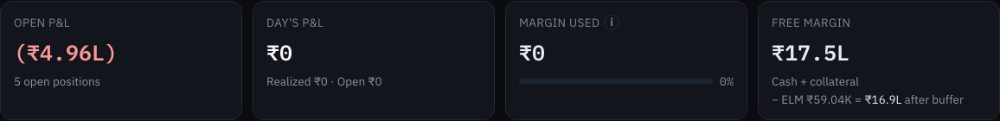
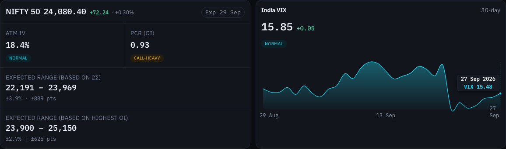
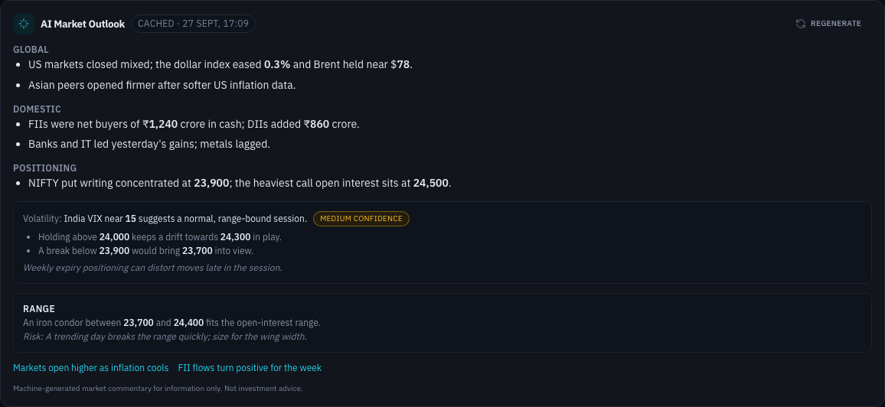

# Dashboard

The Dashboard is the first page you see after signing in. It answers three questions at a glance: how your positions are doing, how much margin you have left, and what the market is doing.

## The page header

| Item | What it shows |
|---|---|
| **Snapshot ·** date and time | When the page last loaded its account and market data from ICICI. |
| **Live** (green) | The **Open P&L** and **Day's P&L** tiles are updating from the streaming quote feed. |
| **Live (delayed)** (amber) | The streaming feed looks stale, so those two tiles may be behind. |
| **Refresh** | Reloads everything on the page from ICICI. Use it sparingly: each refresh spends ICICI API calls. |

If some data could not be loaded, a red box reads **Something went wrong loading some data** with the reason. If it keeps happening, log out and sign in again.

## Account tiles

| Tile | What it shows |
|---|---|
| **Open P&L** | Mark-to-market profit or loss on all your open F&O positions, with the number of open positions underneath. |
| **Day's P&L** | Today's profit or loss: what you **realised** on positions closed today plus the change in value of open positions since yesterday's close. The line underneath splits it into **Realized** and **Open**. It is **gross**: before brokerage and taxes. **partial** means some of today's trades could not be priced. |
| **Margin used** | Margin currently blocked by your positions, with a bar showing it as a share of your total margin. The **i** icon explains why this figure can differ slightly from ICICI's own screens. |
| **Free margin** | Margin available for new trades: cash plus collateral, from ICICI. When you hold short options, the line underneath also shows **− ELM … = … after buffer**: free margin after setting aside the extreme loss margin (ELM) buffer the app adds on top of ICICI's figure. See [Margins](margins.md). |

During market hours Open P&L and Day's P&L update live without spending ICICI API calls. A small **· snapshot** note after a figure means it came from the last page load rather than the live feed.

## NIFTY 50

The NIFTY card shows the index level and the day's change, the nearest expiry (**Exp** …) and four readings from the nearest-expiry option chain:

| Reading | What it tells you |
|---|---|
| **ATM IV** | Implied volatility of the at-the-money options, with a label from **Low** through **Subdued**, **Normal**, **Elevated** and **High** to **Extreme**. Hover the label for what it usually means for option buyers and sellers. |
| **PCR (OI)** | Put-call ratio by open interest. Labelled **Contrarian Bullish** (1.25 or more), **Neutral-Bullish**, **Balanced** (around 1), **Call-Heavy**, or **Contrarian Bearish** (below 0.75). |
| **Expected range (based on 2σ)** | The range NIFTY would stay within by expiry about 95% of the time if implied volatility is right, shown as index levels, as ± percent and as ± points. |
| **Expected range (based on highest OI)** | The span between the strike with the most call open interest and the strike with the most put open interest: the levels option writers are defending. |

## India VIX

The VIX card shows today's India VIX, its change, a label (**Complacent** below 12, **Calm · Low Volatility**, **Normal**, **Elevated**, **High**, and **Extreme** from 28), and a **30-day** chart. Hover the chart to read any day's value.

## AI Market Outlook

A short written view of the market, generated centrally on a schedule and shared by all Breeze Modern deployments. You do not need an AI account or key for it.

| Part | What it shows |
|---|---|
| Status badge | **updated · time** right after a refresh, **cached · time** for the stored outlook, **loading**, or **not connected** when it could not be fetched. |
| **Regenerate** | Fetches the latest outlook now. |
| **Global**, **Domestic**, **Positioning** | Bullet points on world markets, Indian markets and derivatives positioning. |
| **Volatility** and confidence | The outlook's view on volatility, and how confident it is: low, medium or high. |
| Scenarios and caveats | Possible moves and what could change the picture. |
| Strategy ideas | Tagged ideas with the reasoning and a **Risk** note. |
| Sources | Links to the news articles it drew on. Hover a link to see the publisher. |

If the latest refresh failed, an amber note says the outlook shown is from cache and may be out of date.

> [!NOTE]
> The outlook is machine-written commentary, not advice. Treat it as a summary of the day's news, not as a trading signal.

## The Setting up market connection screen

Just after the market opens, or right after you sign in during market hours, the Dashboard may be covered for a few seconds by **Setting up market connection… Warming up live NIFTY & SENSEX data**. It clears by itself once the first live prices arrive.
