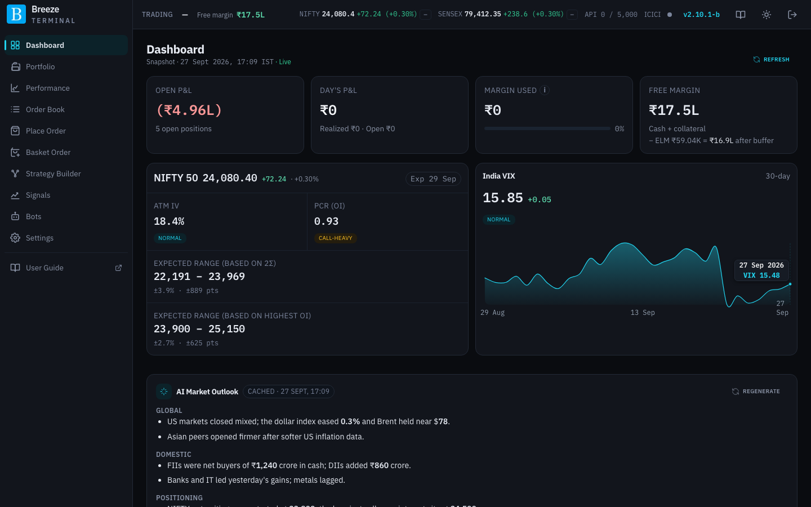
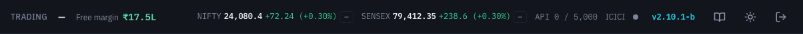
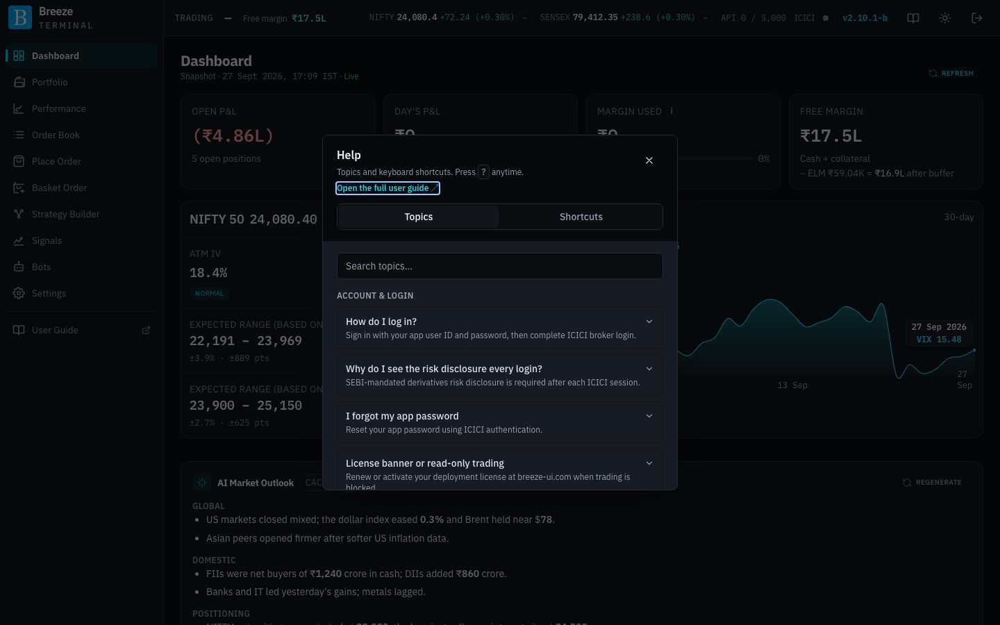
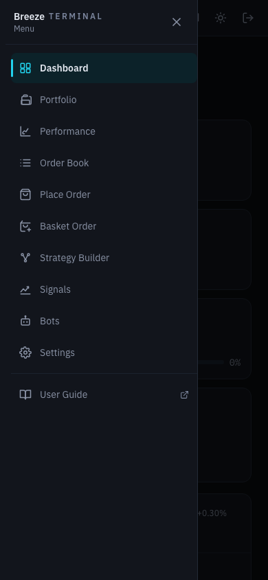

# Finding your way around

Every page of Breeze Modern shares the same frame: a **sidebar** on the left, a **header bar** across the top, and the page itself in the middle. Banners appear under the header when something needs your attention. This section explains all of it once, so the page sections can skip it.

## The sidebar

The sidebar lists the pages of the app, in this order:

| Page | What it is for |
|---|---|
| [Dashboard](dashboard.md) | Your account at a glance. |
| [Portfolio](portfolio.md) | Open F&O positions, their payoff, hedges, square-off and automated exits. |
| [Performance](performance.md) | Realised P&L by week, month and financial year. |
| [Order Book](order-book.md) | Today's orders and trades, parked orders, and your Profit Booking / Stop Loss rules. |
| [Place Order](place-order.md) | A single F&O order. |
| [Basket Order](basket-order.md) | Several legs placed together. |
| [Strategy Builder](strategy-builder.md) | Option strategies proposed for your outlook and margin. |
| [Signals](signals.md) | NIFTY and SENSEX direction readings and their backtests. |
| [Bots](bots.md) | Automated strategies. |
| [Settings](settings-trading.md) | Credentials, limits, costs, data loads, alerts and diagnostics. |
| **User Guide** | Opens this guide in a new tab. |

At the bottom, **Session** shows the state of the live market-data connection to ICICI:

| Dot | Meaning |
|---|---|
| Green, pulsing | **NIFTY & SENSEX chains live**: streaming quotes are arriving. |
| Amber | Some chains are live, others are still catching up. |
| Grey | Nothing to stream yet: **Market closed**, **waiting for first login to start data feed**, or chains **subscribing, waiting for first ticks**. |
| Red | The stream has a problem: **WebSocket disconnected** or a **feed stalled**. The text says which. |

Hover over the text to read it in full.

## The header bar

From left to right:

| Item | What it shows |
|---|---|
| **Your name** | The account holder's name, as ICICI reports it. |
| **Free margin** | Margin available to trade, from ICICI's margin figures (cash plus collateral limits). Green when positive. |
| **NIFTY** and **SENSEX** | Live index level and the day's change. Hover to see when it last updated. |
| Signal chip after each index | The 15-minute **direction signal** you chose on the [Signals](signals.md) page: **▲ BULL**, **▼ BEAR**, **● NEUT** (quiet) or a grey **—** when there is no reading, for example outside 09:15–15:15. Hover for the reason. It is information only; nothing trades on it from here. |
| **API 1,234 / 5,000** | How many ICICI API calls your account has made today, out of ICICI's daily limit of 5,000. It turns amber past 4,000 and red past 4,500. See [ICICI API limits](api-limits.md). |
| **ICICI** and a dot | The same market-data status as the sidebar's **Session** dot. |
| Version number, for example **v2.10.1-b** | Opens the changelog: what changed in each release of the app. |
| Book icon | Opens this guide in a new tab. |
| Sun / moon icon | Switches between the dark and light look. Your choice is remembered in this browser. |
| Log out icon | Signs you out after a confirmation. Read [Signing out](signing-in.md#signing-out) first if you have automated exits armed. |

On narrower screens the index tickers and some labels are hidden to save room.

## Banners

Banners appear across the top of every page, under the header, when something affects the whole app.

| Banner | What it means and what to do |
|---|---|
| **Read-only mode —** … (red) | Your deployment's license is not active, so you cannot place orders or run strategies. See [Read-only mode and your license](read-only-mode.md). |
| **License expired —** … (amber) | Your license has expired. Trading still works for now; extend it at breeze-ui.com. |
| **Complete ICICI Direct login on this instance to start your 14-day trial** (amber) | A new deployment waiting for its first ICICI login. |
| **Trial already used for this ICICI Direct User ID** (red) | A free trial was already used for your ICICI account. Contact sales for a paid license. |
| **You have hit ICICI's daily limit of 5,000 API calls** | Anything that needs ICICI (positions, margin, quotes, orders) stops until midnight IST. See [ICICI API limits](api-limits.md). |
| **Storage is N% full** … **Free up space** | Your server's data disk is past the threshold you set. Backtests that download data are paused. Click **Free up space** to open [Storage](settings-diagnostics.md#storage). |
| **A live exit order on … no longer has a position to close** … **Review** | A Profit Booking / Stop Loss rule stopped, but one of its exit orders is still open at ICICI, and if it fills it would open a **new** position. Click **Review** to go to the Order Book and cancel it. See [Portfolio](portfolio.md#when-a-rule-resets). |

## Pop-ups you may see

| Pop-up | When and why |
|---|---|
| **Daily API usage warning** | Once a day, when your account passes 4,000 of its 5,000 daily ICICI calls. Click **Understood**. |
| **Broker rate limit** with a countdown | ICICI asked the app to slow down. The app waits out the countdown, then carries on by itself. Avoid repeating the action meanwhile. |
| **Setting up market connection…** | The live NIFTY and SENSEX feeds are starting, usually for a few seconds after the market opens or after you sign in. |
| **Get instant Stop-Loss / Profit Booking alerts** | An invitation to link Telegram for alerts. Scan the QR code, or click **Maybe later**. Tick **Do not show this message again** to stop it appearing. See [Telegram Alerts](settings-automation.md#telegram-alerts). |

## Entering dates

Every date field in the app (backtest periods, the Order Book range, the Activity **Started** range, Storage deletes and exchange holidays) works the same way.

- **Type it.** Click into the field and type the date, then press **Enter** or click away. `01-Jan-2020`, `1 jan 2020`, `01/01/2020` and `2020-01-01` all work. Numbers are read day first, so `03/04/2022` is 3 April. A date that does not exist, or one the field does not allow (such as a future date in Activity), turns the field red; clicking away puts the previous date back.
- **Pick it.** Click the calendar icon. To go back months or years, click the month name at the top to see the twelve months, then click the year to see twelve years at a time; the arrows page through them. So January 2020 is three clicks away. Dates the field does not allow are greyed out. **Escape** closes just the calendar.

## Help and keyboard shortcuts

Press **?** anywhere (except while typing in a field) to open **Help**. It has two tabs:

- **Topics**: short answers to common questions, grouped by subject, with a search box. Each topic has a **Read more in the user guide** link to the matching section here.
- **Shortcuts**: the keyboard shortcuts below.

The **Open the full user guide** link at the top of Help opens this guide. Small **Learn more** links next to some controls open the relevant Help topic directly.

| Keys | Action |
|---|---|
| **Alt + 1** to **Alt + 8** | Go to Dashboard, Portfolio, Performance, Order Book, Place Order, Basket Order, Strategy Builder or Settings. |
| **/** | Jump to the scrip search box on trading pages. |
| **?** | Open Help. |
| **Escape** | Close the topmost dialog or menu. |

## Where prices come from

Wherever the app shows option prices, a small badge tells you where they came from:

| Badge | Meaning |
|---|---|
| **Live · WebSocket** | Streaming from ICICI during market hours. Updates while you watch. |
| **Bhavcopy (dd-Mmm-yyyy)** | The exchange's official closing prices for that day, used after the close. Open interest and depth are from that session too. The badge turns **red** once the market has opened since that date, because the prices are then known to be out of date. |
| **Session close (captured)** · Depth as of *time* | The last live prices and order-book depth your server captured from the stream at the end of the session. Used after the close, when it is more complete than the bhavcopy. |
| **ICICI API** | Fetched from ICICI on request, when none of the above is available. |

While a live option chain is still being put together, the badge adds **· building live chain…**. Hover the **i** next to a badge for more detail.

The app decides whether the market is open from your [exchange calendar](settings-automation.md#exchange-calendar). While it is closed, orders cannot be sent to ICICI; they can be **parked** instead and sent later from the Order Book.

## Using the app on a phone or tablet

The layout adapts to smaller screens. On a phone, tap the **menu** icon at the top left to open the sidebar as a drawer. Dense tables such as option chains and multi-leg strategies are easier to work with on a tablet or computer.

