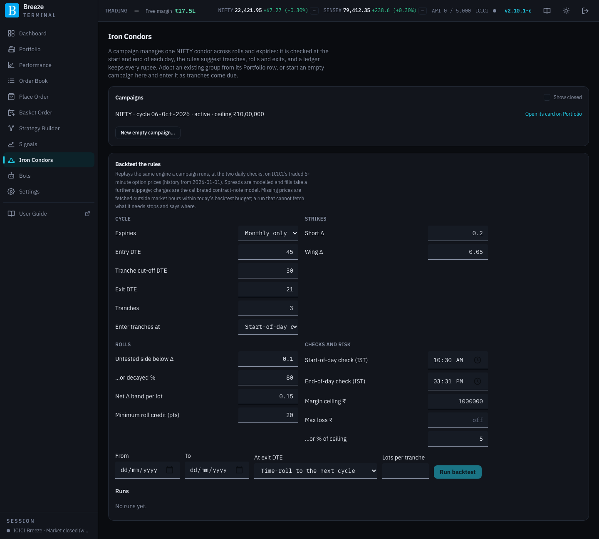

# Iron Condors

A **Dynamic Iron Condor campaign** manages one NIFTY iron condor for you over weeks: it checks the position twice a day, suggests when to add a tranche, roll a side or exit, and keeps a ledger of every rupee in and out across all of it. The **Iron Condors** page lists your campaigns and backtests the rules; each campaign's own card sits on its group in [Portfolio](portfolio.md#iron-condor-campaigns).

Campaigns are **NIFTY only** for now. You act on a suggestion from the campaign's card with **Execute this suggestion…**, or make your own change with **Adjust…** (see [Portfolio](portfolio.md#adjusting-a-campaign)). Nothing is traded without you pressing Execute, unless you hand a campaign to the [Dynamic Iron Condor bot](bots.md#dynamic-iron-condor).

## How a campaign works

An iron condor sells an out-of-the-money call and put and buys further-out wings on both, so the loss on either side is capped. A *dynamic* condor is managed rather than left alone: when the market moves towards one side, the other side is rolled closer to collect more premium and bring the position back towards neutral.

- **Strikes are chosen by delta, not by points.** Shorts go in at the **Short Δ** (0.20 by default) and wings at the **Wing Δ** (0.05), snapped outward so a wing is never closer than set. The same rule works for a weekly or a monthly.
- **Entries come in tranches.** The campaign's size is spread over several entries into the **same expiry**, evenly between the entry DTE and the cut-off. All tranches are managed together as one position.
- **Only the side that is not under attack moves.** When the market rallies the puts are rolled up; when it falls the calls are rolled down. The threatened side is never moved by an adjustment.
- **The roll stops at the straddle.** A roll moves the untested short to the threatened side's delta, but never past the threatened short's strike. At that point the position is an iron fly, and it never inverts.
- **The ledger is the campaign.** Every fill's proceeds minus its cost, net of charges, add up to the **total net credit**. Break-evens and the campaign's P&L include every past roll.

## The checks

The rules run at two fixed times on each trading day, both set in the campaign's settings:

| Check | Default | Why then |
|---|---|---|
| **Start-of-day** | 10:30 IST | Prices are ignored until the morning has settled. This check also catches an overnight gap. |
| **End-of-day** | 15:31 IST | After the closing auction has settled the index, while options still trade until 15:40. |

A few minutes before each check the app loads the expiry's live prices. A check missed because the app was down is skipped, never run late. A scheduled check decides only on **live** prices: if NIFTY's spot or any held leg is on a stand-in price, it says so and decides nothing.

At each check the rules are taken in this order, and the first that applies wins:

| # | When | Suggests |
|---|---|---|
| 1 | A price the rules need is missing, spot is not live, or a feed is down | Nothing: **Could not decide**, with the reason |
| 2 | Campaign P&L is at or past the **max loss** | **Close everything**: shorts bought back first, wings sold last |
| 3 | Days to expiry reach the **exit DTE** | **Exit or time-roll**: close, or close and open the next cycle |
| 4 | At the straddle and NIFTY is beyond a break-even, at the end-of-day check | **Exit or time-roll** |
| 5 | The untested side is below its delta floor or has decayed past its threshold, **or** net delta per lot is outside its band | **Roll the untested side**, if the roll adds at least the minimum credit after charges and is not within the **No rolls within N days of exit** window |
| 6 | A tranche is due at the entry check | **Enter a tranche** |

The max loss is checked **only at the two checks**, not continuously. On a fast day the position can run past it before the next check; the wings cap the worst case, and the card shows that figure as **Worst loss at wings**.

When a check suggests an action, or cannot decide, you get a [Telegram alert](settings-automation.md) if alerts are on. The check only suggests: you act on it from the card.

## Starting a campaign

- **From Portfolio:** expand a NIFTY group and choose **Adopt as a campaign…**. The group's open legs become the campaign's opening fills at the broker's average prices, with charges estimated.
- **From this page:** **New empty campaign…** picks the earliest listed expiry still at or beyond the tranche cut-off. Tranches are then suggested as they fall due.

A NIFTY expiry can have only one campaign. A campaign cannot start on a group with an armed Profit Booking / Stop Loss rule, and once it runs, that rule cannot be armed there: every roll would reset it, and the campaign has its own max loss.

## Settings

| Setting | Default | What it does |
|---|---|---|
| **Expiries** | Monthly only | **Monthly only** uses each month's last expiry; **Any** allows weeklies. |
| **Entry DTE** | 45 | The first tranche goes in at or below this many days to expiry. |
| **Tranche cut-off DTE** | 30 | No new tranche below this. |
| **Exit DTE** | 21 | Exit or time-roll at or below this. |
| **Tranches** | 3 | Entries spread evenly from the entry DTE to just before the cut-off (45, 40 and 35 by default). |
| **Enter tranches at** | Start-of-day check | Which check enters a due tranche. |
| **Short Δ / Wing Δ** | 0.20 / 0.05 | The deltas the shorts and wings are chosen at. |
| **Untested side below Δ** | 0.10 | Roll when the untested short falls below this delta… |
| **…or decayed %** | 80 | …or has lost this share of its premium. |
| **Net Δ band per lot** | 0.15 | Roll when the position's net delta per lot is outside ± this. |
| **Minimum roll credit (pts)** | 20 | A roll adding less than this per unit, after charges, is skipped and the card says so. |
| **No rolls within N days of exit** | 0 (off) | A roll due within this many days of the exit DTE is reported but not done: the new short would be held only a day or two, so the roll mostly pays the spread. Backtest it at 0 and at 3 to see which suits you. |
| **Start-of-day / End-of-day check** | 10:30 / 15:31 | The two check times, IST. |
| **Margin ceiling ₹** | — | The campaign's margin. Keep the rest of your capital free as a buffer. |
| **Max loss ₹ / …or % of ceiling** | off / 5% | Close everything past this. If both are set, the tighter one applies. One of them must be set. |

The defaults are starting points, not findings. Backtest them before trusting them.

## Backtest the rules

**Backtest the rules** replays the same rules a campaign runs, at the same two checks, on ICICI's traded **5-minute** option prices from January 2026. Choose the settings, the period, what happens at the exit DTE (**time-roll** into the next cycle, or **close** and start fresh by schedule), and the lots per tranche. On the live instance, leave lots blank to size from today's margin; a mock instance has no margin calculator, so you must enter them.

Like every backtest, missing prices are fetched outside market hours within today's call budget (see [Backtests](backtests.md)). Only the contracts the rules actually need are fetched, plus a fixed set of strikes every 500 points to read volatility from. A run that cannot get what it needs stops at that check and is marked **partial**, saying where and why. Run it again to carry on.

Each run lists its campaigns with their cycles, tranches, rolls and how each ended, the worst P&L seen at a check, cash P&L, the largest drawdown, charges, and every action it took.

What it cannot model: bid and ask (spreads are modelled from your own observed samples), order-book depth, intraday moves between the two checks, and margin, which is sized once at today's levels. History starts in January 2026, which is only about eight monthly cycles: enough to see how the rules behave and how large the losing months are, not enough to prove an edge.
