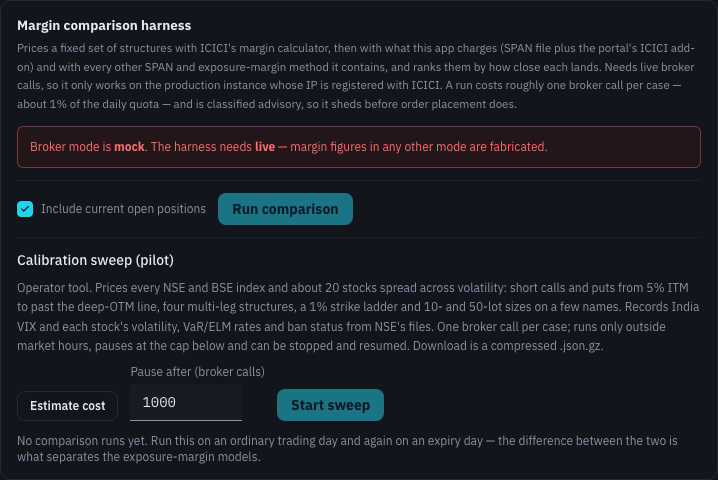

# Margins

Margin figures appear all over Breeze Modern: in the header bar, on the Dashboard and Portfolio, in every order form and in Strategy Builder. This section explains where they come from, why two figures for the same position can differ, and what the switches in Settings change.

## The three kinds of figure

| Figure | What it is | Where you see it |
|---|---|---|
| **Account margin** | ICICI's own record of your funds: how much margin is used and how much is free. The app shows it as ICICI reports it. | Header bar **Free margin**, Dashboard **Margin used** and **Free margin**, Performance **Margins**. |
| **Calculated margin** | What a position, or a position you are about to open, needs. It comes from either the exchange **SPAN file** or ICICI's **margin calculator** (see below). | Portfolio **Span + ELM**, Place Order **Margin / lot**, Basket Order and Strategy Builder margins, the order confirmation's **Total margin required (SPAN)**. |
| **ELM overlay** | The app's own estimate of **extreme loss margin**, added on top of the calculated figure as a buffer. It is always labelled separately and never taken out of your free margin. | Portfolio **Span + ELM** (the lower number), Dashboard **Free margin** "after buffer", Basket and Strategy Builder **Basket ELM**, Strategy Builder **Provision for ELM**. |

## SPAN file or ICICI's calculator

For calculated margins the app can use either of two sources:

- **ICICI's margin calculator**: ICICI works out the figure. It is the closest match to what ICICI will actually block, but every calculation spends one of your ICICI API calls and takes a moment.
- **The exchange SPAN file plus ICICI's add-on**: your server works out the figure itself from the exchanges' published SPAN risk files, then adds **ICICI's add-on**, the extra ICICI charges on top of SPAN as a percentage of each short leg's value. It is instant and spends no API calls.

Three switches under **Settings → Reference Data Loads → Use SPAN files for margin calculation** choose between them: one for **Strategy Builder**, one for **Backtesting** and one for **Everywhere else**. See [Reference Data Loads](settings-automation.md#use-span-files-for-margin-calculation).

A few rules always apply:

- **Contracts missing from the SPAN file** are always priced by ICICI.
- **Live bots always ask ICICI**, because they size real orders and an underestimate would be rejected.
- **The add-on rates come from breeze-ui.com** and must have reached your deployment in the last 24 hours. If they have not, every switch shows **No** and all margins come from ICICI until the rates arrive. Your choice is kept and comes back automatically.
- **The Dashboard's Margin used and Free margin** are ICICI account balances, so the switches do not affect them.
- **A position spanning several expiries** on Portfolio is always priced by ICICI, because the SPAN-file calculation does not net across expiries.

## About ELM

Exchanges charge **extreme loss margin (ELM)** on short options, on top of SPAN, as a buffer against extreme moves. ICICI's margin calculator only includes it on the option's own expiry day. On other days, Breeze Modern adds its own ELM estimate so you do not over-commit: 2% of the short value for index options, and a higher rate for stock options (the exact figure depends on the stock, so the app's estimate may differ from the exchange's).

Because it is an estimate on top of ICICI's figure, the app always shows it separately:

- On **Portfolio**, **Span + ELM** shows the blocked SPAN margin and, beneath it, the ELM buffer.
- On the **Dashboard**, **Free margin** shows your ICICI free margin, then **− ELM … = … after buffer**.
- In **Strategy Builder**, **Provision for ELM** decides whether proposals are sized with the buffer included.

## Why figures can differ from ICICI's screens

- **Timing.** SPAN files are republished during the day and ICICI moves to the next day's file the evening before. The app loads them seven times a day (see [Reference Data Loads](settings-automation.md#daily-schedule)), so just after a new file appears the two can differ.
- **Netting.** Proposed trades are shown as the **extra** margin they need on top of your existing positions in the same underlying. A figure for the position on its own would be higher.
- **Upstreamed margin.** ICICI's margin API does not always report the amount it has passed on to the exchange, so the Dashboard, Portfolio and Performance figures can be slightly lower than ICICI's own. The **i** icon next to those figures says so.
- **Quantity.** Margin does not grow in a straight line with quantity. When Basket Order scales a basket to a margin target, it checks the result against real figures rather than multiplying.

Whatever the app shows, ICICI's risk system has the final word when you place the order.

## Advanced: the margin comparison harness

**Settings → Reference Data Loads** also contains the **Margin comparison harness**. It is a diagnostic tool for checking how closely the app's SPAN-file margins match ICICI's. Most traders never need it.

> [!CAUTION]
> The harness makes **real ICICI API calls** and only works on your production server, in live broker mode, from the IP address registered with ICICI. A comparison costs about one call per case, roughly 1% of your daily allowance. The **calibration sweep** is an operator tool that can spend **hundreds or thousands** of calls: a large share of your 5,000-call daily allowance. Run it only outside market hours, on a day you are not trading, and only if you have been asked to.

### Run comparison

Prices a fixed set of option structures with ICICI's margin calculator, then with what the app charges (SPAN file plus ICICI's add-on) and with every other SPAN and exposure-margin method the app contains, and ranks them by how close each lands.

| Control | What it does |
|---|---|
| **Include current open positions** | Adds your own positions to the set of structures priced. |
| **Run comparison** | Starts a run. It takes a minute or two, because broker calls go one at a time. |

Each run appears in the table with **Started**, **Status**, **Cases** (priced out of total, and any failures), **Calls** used, **App err (mean / median)** (how far the app's figure was from ICICI's, on average; hover a row for the breakdown), and a **Download** of the full results as a compressed JSON file. Running it once on an ordinary day and once on an expiry day shows the difference between exposure-margin models. A line below the table reports an independent cross-check of the app's SPAN engine against a second implementation.

### Calibration sweep (pilot)

Prices every NSE and BSE index and about 20 stocks across a range of strikes, structures and sizes, and records market context (India VIX, each stock's volatility, exposure-margin rates, ban status) alongside. It exists to measure ICICI's add-on rates.

| Control | What it does |
|---|---|
| **Estimate cost** | Shows how many cases and broker calls a sweep would take. |
| **Pause after (broker calls)** | The sweep pauses when it reaches this many calls (up to 4,000). |
| **Start sweep** | Starts it. It only runs outside market hours. |
| **Stop after current case** | Stops a running sweep. A stopped sweep can be **Resume**d from its row. |
