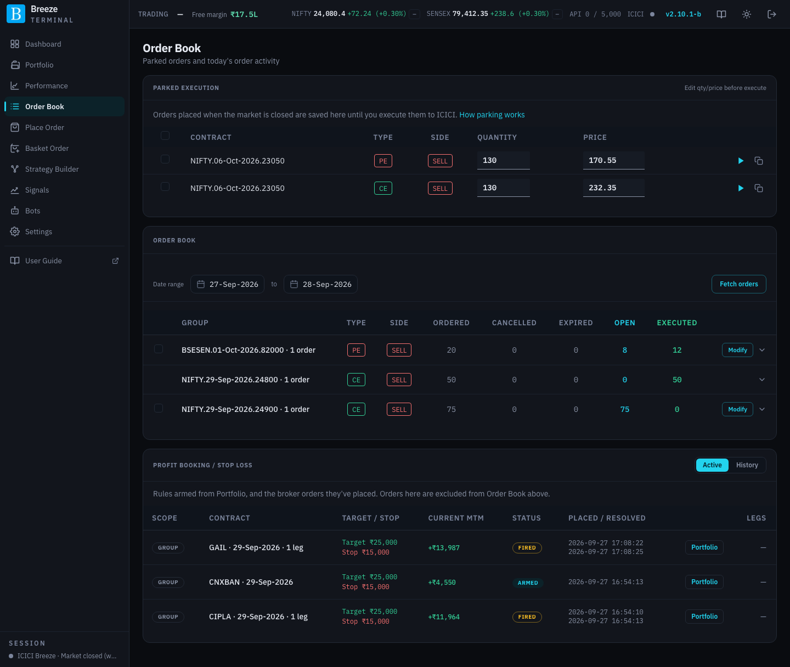
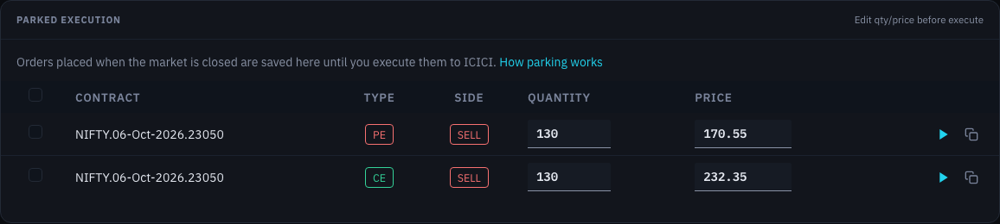
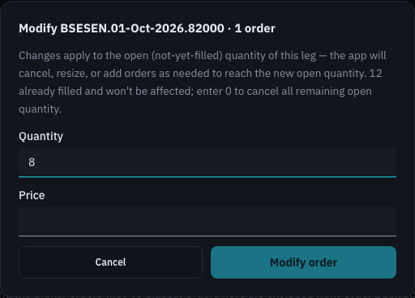
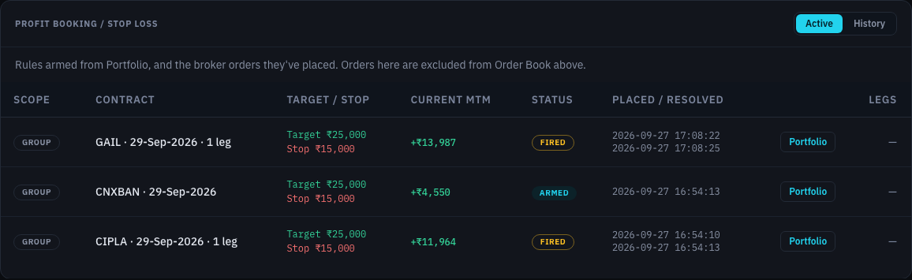

# Order Book

The Order Book has three sections: **Parked execution** (orders saved while the market was closed), the **Order book** itself (your orders at ICICI), and **Profit Booking / Stop Loss** (your automated-exit rules and the orders they placed).

## Parked execution

When the market is closed, Breeze Modern does not send orders to ICICI. Instead, the order confirmation dialog offers to **park** the order: it is saved on your server and listed here until you send it. Orders parked from Place Order, Basket Order, Strategy Builder and Portfolio square-offs all appear here.

| Column or control | What it does |
|---|---|
| Checkbox | Selects the order for **Execute selected** or **Cancel selected**. The box in the header selects them all. |
| **Contract** | The option contract. |
| **Type** / **Side** | Call or put; buy or sell. |
| **Quantity** | Editable. It snaps to a whole number of lots when you leave the field. |
| **Price** | Editable limit price. |
| **Run or clone**: ▶ | Opens the order confirmation dialog for this order, with your edited quantity and price. |
| **Run or clone**: copy icon | Opens the order on [Place Order](place-order.md) with its details filled in, so you can change anything before placing it. |
| **Execute selected** | Opens one confirmation for all selected orders. They must share the same underlying, exchange and expiry. |
| **Cancel selected** | Deletes the selected parked orders. Nothing was ever sent to ICICI, so nothing needs cancelling there. |

Parked orders stay here until you execute or delete them. Once the market opens, review the prices (they were set when the market was closed) and execute.

## Your orders (Order book)

Your orders at ICICI for a date range, grouped by contract and side.

| Control | What it does |
|---|---|
| **Date range** | Choose a start and end date. It opens on today. |
| **Fetch orders** | Loads orders for the chosen range from ICICI. |

Each row is one contract and side (for example all your sell orders for one strike), which is how a large order split into several chunks stays together:

| Column | What it shows |
|---|---|
| Checkbox | Selects every order in the group that can still be cancelled. |
| **Group** | The contract. |
| **Type** / **Side** | Call or put; buy or sell. |
| **Ordered** | Total quantity ordered. |
| **Cancelled** / **Expired** | Quantity cancelled, or expired unfilled at the end of the day. |
| **Open** | Quantity still waiting to fill. |
| **Executed** | Quantity filled. |
| **Modify** | Shown when some quantity is still open. Change the group's open quantity and price in one step (below). |
| Arrow | Expands the group to show its individual orders. |

Expanded, each order shows its ICICI order number, **Qty**, **Open** quantity, the contract's current **LTP**, its **Price ₹**, its **Status**, a **Clone to Place Order** icon, and **Cancel** if it can still be cancelled.

An order marked **May be the GTT exit** matches a live single-leg GTT exit on contract and side. ICICI does not say which order a GTT fired, so the app cannot tell that order from one you placed on ICICI's own app, and it leaves it here rather than hide it. Orders placed from this app are never marked.

Select orders with the checkboxes and a bar appears at the bottom: **Cancel selected** cancels them all after a confirmation.

### Modifying an open order

**Modify** opens a small dialog for the whole group:

| Field | What it does |
|---|---|
| **Quantity** | The new total open quantity. If the order was split into chunks, the app spreads the change across them. Enter 0 to cancel what is left. |
| **Price** | The new limit price for all the open chunks. |
| **Modify order** | Sends the changes to ICICI, one order at a time, with a progress bar. |

### Cancelling

**Cancel** on an order, or **Cancel selected** for several, asks you to confirm with **Cancel order** (or **Keep order** to back out). Cancellations are sent one at a time; a progress bar shows how far it has got.

### Cloning an order

The **Clone to Place Order** icon copies an order's contract, side, quantity and price into [Place Order](place-order.md), where you can adjust them and place a new order. Use it to repeat a trade, or to square off by cloning and switching the side.

### Messages from ICICI

If ICICI returns a message about an order (for example a rejection reason), it is shown above the table. Click **×** to dismiss it.

## Profit Booking / Stop Loss

This section lists your automated-exit rules, and the orders they placed. The orders a group rule placed are listed here and **left out of the Order book above**, so the two never show the same order twice. A **Leg · GTT** row lists no orders: the order its GTT fires stays in the Order book above, marked **May be the GTT exit**.

| Control | What it does |
|---|---|
| **Active** | Rules still watching, or with orders still working. |
| **History** | Rules that have finished: completed, reset or disarmed. By default it follows the Order book's date range. **Show all** lists every finished rule regardless of dates; **Limit to Order Book range** goes back. |

Each row shows:

| Column | What it shows |
|---|---|
| **Scope** | **Group** for a group rule armed from the Portfolio page, or **Leg · GTT** for a single-leg GTT exit. |
| **Contract** | The underlying and expiry, or the leg. |
| **Target / Stop** | The profit target and loss limit, or the GTT's trigger prices. |
| **Current MTM** | The position's P&L now, for active rules. |
| Status | **Armed**, **Fired**, **Completed**, **Reset**, **Disarmed** and so on. |
| **Placed / Resolved** | When the rule was armed, and when it finished. |
| **Portfolio** | Jumps to the position on the Portfolio page. |
| **Legs** | The orders the rule has placed, once it has fired. Click the row to expand them. |

Expand a row to see the orders the rule placed, each with its price, status, a clone icon and **Cancel** while it is still working. You can select several and use **Cancel selected**.

A rule that reset while one of its exit orders was still working shows **Re-arm blocked**: it cannot be armed again until that order fills, expires or is cancelled. See [When a rule resets](portfolio.md#when-a-rule-resets).
