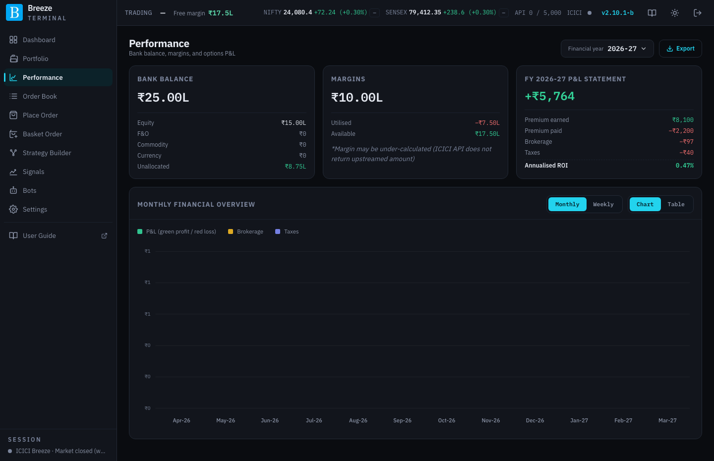

# Performance

The Performance page shows your funds, your margin use and the P&L of your **option trades** over a financial year (1 April to 31 March).

## The page header

| Control | What it does |
|---|---|
| **Financial year** | Chooses the year to report, for example **2026-27**. |
| **Export** | Downloads the year's P&L statement. See [Exporting a statement](#exporting-a-statement). |

## Bank balance

Your total bank balance with ICICI, split by where it is allocated: **Equity**, **F&O**, **Commodity**, **Currency** and **Unallocated**. If ICICI does not return it, the card reads **Funds could not be loaded**.

## Margins

The margin you have **Utilised** and what is still **Available**. A note warns that the utilised figure may be slightly low, because ICICI's margin API does not always report the amount passed on to the exchange. See [Margins](margins.md).

## FY P&L statement

The headline is the year's **net P&L** on option trades, followed by how it is made up:

| Line | What it is |
|---|---|
| **Premium earned** | Premium received on every option you sold during the year, on NSE and BSE. |
| **Premium paid** | Premium paid on every option you bought. |
| **Brokerage** | Brokerage charged by ICICI on those trades. |
| **Taxes** | Statutory charges on those trades. |
| **Annualised ROI** | Net P&L as a return on your total margin (used plus free), scaled to a full year. For the current year, it is scaled by the days elapsed since 1 April. Hover the label for the formula. |

> [!NOTE]
> The statement adds up **premium cash flows**: what you received on sells minus what you paid on buys, less charges. Once a position is closed, that is exactly its realised P&L. While a position is still open, the premium you received or paid is already counted but the cost of closing it is not, so the year's figure runs ahead of (or behind) your true P&L until those positions close or expire. Your open positions' real-time P&L is on the [Portfolio](portfolio.md) page.

## Monthly and weekly overview

A chart of P&L, brokerage and taxes across the year.

| Control | What it does |
|---|---|
| **Monthly** / **Weekly** | Groups the year by month or by week. |
| **Chart** / **Table** | Shows the figures as a bar chart or as a table. |

In the chart, P&L bars are green for a profit and red for a loss. Hover a bar to read its value.

## Exporting a statement

**Export** opens **Export P&L statement** for the selected year, with two choices:

- **PDF · formatted statement**: opens a formatted statement in a new window, ready to print or save as PDF from your browser.
- **CSV · raw transaction data**: downloads a spreadsheet file with the year's summary and a month-by-month table of P&L, brokerage and taxes.
