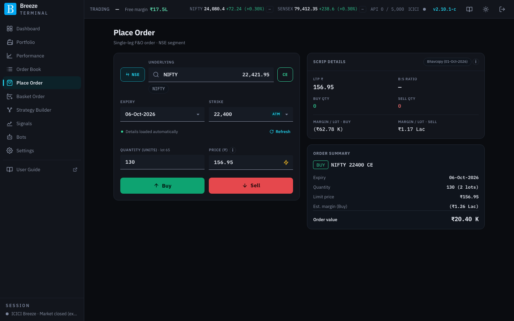
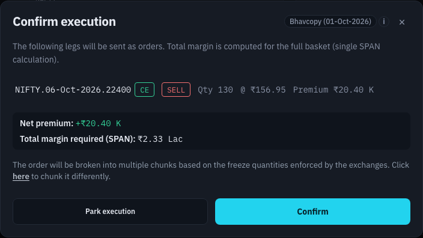

# Place Order

Place Order sends **one option order**: one contract, one side. For several legs at once use [Basket Order](basket-order.md); for a proposed strategy use [Strategy Builder](strategy-builder.md).

This section also explains four things that every order in the app shares: [aggressive orders](#aggressive-orders), [liquidity warnings](#liquidity-warnings), [order chunking](#order-chunking) and the [order confirmation dialog](#confirming-an-order).

## Choosing the contract

| Control | What it does |
|---|---|
| **Exchange** | Switches between **NSE** (NFO) and **BSE** (BFO). Changing it clears the form. |
| **Underlying** | Search by name, for example `NIFTY` or `SBIN`. Press **/** anywhere on the page to jump here. Underlyings you traded recently are offered as quick picks beneath the box. The current spot price appears once one is chosen; a note such as **· last tick 11:28** or **· close 25-Sep** after it means the price is not a live tick. |
| **Type** | Switches between **CE** (call) and **PE** (put). |
| **Expiry** | The expiry dates available for the underlying. |
| **Strike** | The strikes for that expiry. The at-the-money strike is marked **ATM** and chosen by default. |

When you pick an expiry, the app loads its option chain. A progress line shows it being built; after the close this uses the exchange's closing prices. **Details loaded automatically** confirms it is ready, and **Refresh** reloads it.

## Quantity and price

| Control | What it does |
|---|---|
| **Quantity (units)** | The number of units, not lots. The lot size is shown next to the label. When you leave the field, the quantity is rounded to a whole number of lots. A **⚠** beside it means the live order book is too thin to fill this quantity near the last traded price. See [Liquidity warnings](#liquidity-warnings). |
| **Price (₹)** | Your limit price. It fills in with the last traded price when you pick a contract; change it as you like. |
| Lightning bolt | Makes this an **aggressive order** that fills quickly instead of waiting at your price. See [Aggressive orders](#aggressive-orders). |
| **Buy** / **Sell** | Opens the order confirmation dialog for a buy or a sell. They stay disabled until the quantity (and, for a normal limit order, the price) is valid. |

## Scrip details

The right-hand panel shows live figures for the chosen contract, with a badge saying where the prices come from (see [Where prices come from](finding-your-way.md#where-prices-come-from)):

| Figure | What it shows |
|---|---|
| **LTP ₹** | Last traded price. |
| **B:S ratio** | Total quantity bid against total quantity offered in the order book. |
| **Buy qty** / **Sell qty** | Total quantity waiting to buy and to sell. |
| **Margin / lot · Buy** and **· Sell** | Margin needed for one lot, bought or sold. |

## Order summary

Below it, **Order summary** repeats the contract, **Expiry**, **Quantity** and **Limit price**, the **Est. margin** for the side you are about to trade, and the **Order value** (price × quantity).

## Cloned orders

When you arrive from the Order Book's **Clone** icon or a parked order, the contract fields are filled in and locked: **Contract details are fixed based on the order being cloned.** You can still change the quantity, price and side.

## Aggressive orders

An aggressive order fills quickly, like a market order, instead of resting in the order book at a price you typed. Click the **lightning bolt** next to a price to turn it on. (The bolt only appears if aggressive orders are enabled on your deployment.)

There are two styles:

| Style | How it works |
|---|---|
| **Limit + tol** | An ordinary **limit order** priced off the last traded price by a **Tolerance** you choose: a buy is priced that percentage **above** the last price, a sell that percentage **below**. It fills like a market order in normal conditions, but never at a worse price than your tolerance allows. The price is worked out at the moment you confirm. |
| **Market** | A true market order. ICICI has not enabled market orders through the API yet, so these may be rejected; use **Limit + tol** meanwhile. |

On pages with several legs (Basket Order, Strategy Builder, square-off), each leg has its own bolt, and an **Aggressive style** control above the legs sets the style and tolerance for all of them.

> [!NOTE]
> Aggressive orders can still fill partly, stay pending, or be rejected, depending on the market. A wide tolerance on an illiquid option can fill at a poor price.

## Liquidity warnings

A large order on a thinly traded strike can fill well away from the last traded price (LTP), because it uses up the best bids or offers and keeps going into worse ones. While you enter a quantity, Breeze Modern walks the strike's live order book, the best five bids and offers ICICI streams, and works out the average price your whole quantity would fill at.

When that average is too far from the LTP, a **⚠** appears beside the quantity on Place Order, Basket Order and the Strategy Builder. Hover over it (or tap it) to see why, for example:

> Quantity is large enough that the fill could be very different from LTP: selling 1,300 would average about ₹48.20, 12.4% below the LTP of ₹55.05.

The same message appears in red, after a ⚠, under that leg in the [order confirmation dialog](#confirming-an-order).

| You see | What it means |
|---|---|
| **would average about ₹…, N% below/above the LTP** | Filling the whole quantity takes you that far from the LTP. |
| **the visible book holds only N** | Your quantity is bigger than the five price levels ICICI shows. The rest has no visible price, so the fill cannot be estimated. |
| **there is no bid to sell into** / **no offer to buy from** | Nobody is quoting on the side you need. |
| **The LTP (₹…, last traded at 14:02) is outside the current bid/ask** or **is N minutes old** | The LTP itself is not a fair guide: your fill will be near the order book, not the LTP. |
| **(estimate: top of book only)** | Only the best bid and offer were available for this strike, so the estimate looks one level deep. |

A warning is limited to a quantity that is more than **10% and more than 5 ticks** (₹0.25) away from the LTP. Both limits can be changed in [Settings → Liquidity Checks](settings-trading.md#liquidity-checks). Before you choose Buy or Sell on Place Order, both sides are checked and the warning names the side that fails.

The warning never stops you placing the order, and it never holds up a square-off. Nothing is checked while the market is closed. To get a better price on a thin strike, reduce the quantity, or use a limit price rather than an [aggressive order](#aggressive-orders).

The [Strategy Builder](strategy-builder.md#3-proposed-trades) and the [bots](bots.md#safety-rails-every-bot-shares) use the same check to size their trades.

## Order chunking

The exchanges cap the quantity of a single order in each contract (the **freeze limit**). When your quantity is larger, Breeze Modern splits it into several **chunks** and sends them one after another. The confirmation dialog shows the chunk size and lets you change it. The default chunk size comes from [Quantity Limits](settings-trading.md#quantity-limits).

Because chunks are separate orders, it is possible for some to fill while others are rejected. The Order Book groups chunks of the same contract and side together so you can see the total.

## Confirming an order

Every order in the app, whether from Place Order, Basket Order, Strategy Builder, a square-off or a parked order, goes through the same **Confirm execution** dialog.

| Part | What it shows or does |
|---|---|
| Legs | Each leg with its contract, CE/PE, buy/sell, **Qty**, price (or **Aggressive limit @ ₹…**, or **Market**) and **Premium**. A red **⚠** line under a leg is a [liquidity warning](#liquidity-warnings): the order book is too thin to fill that quantity near the LTP. |
| **Net premium** | The premium you receive (green, +) or pay (red, −) across all legs. |
| **Total margin required (SPAN)** | Margin for all the legs together, calculated as one position, so hedges count. |
| **Max per order (chunk)** | The chunk size for splitting large orders. Defaults to the exchange freeze limit for the contract. |
| **Park execution** | Saves the order on your server instead of sending it. Execute it later from the [Order Book](order-book.md#parked-execution). |
| **Confirm** | Sends the orders to ICICI. |

While orders are going out, a progress bar reads, for example, **Placing order — Leg 2 of 4 · chunk 1 of 3**, and each leg gets a tick when placed or a cross if it failed. **Don't close this window** until it finishes. Legs and chunks are sent **one at a time, never in parallel**. This keeps within ICICI's rate limits and makes it safe to retry a refused order without any risk of it filling twice. See [ICICI API limits](api-limits.md).

When the market is closed, **Confirm** is disabled and the dialog says **The market is currently closed** with the reason. You can only park the order.

If your deployment is in [read-only mode](read-only-mode.md), placing orders is blocked and the app tells you why.
