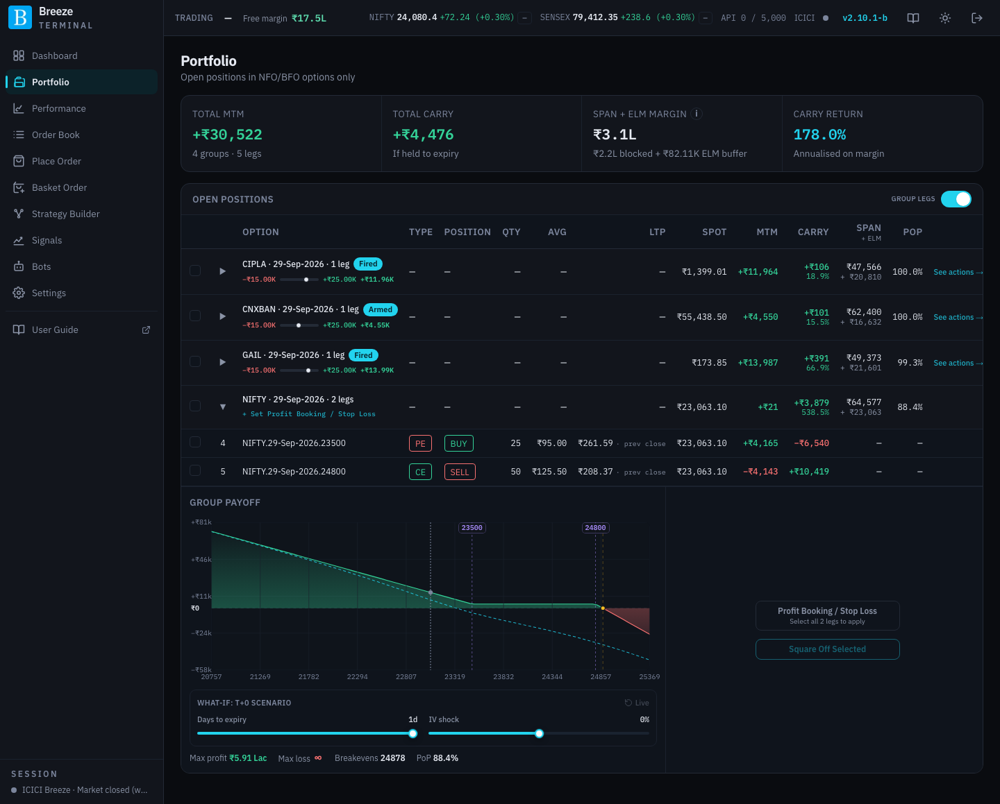
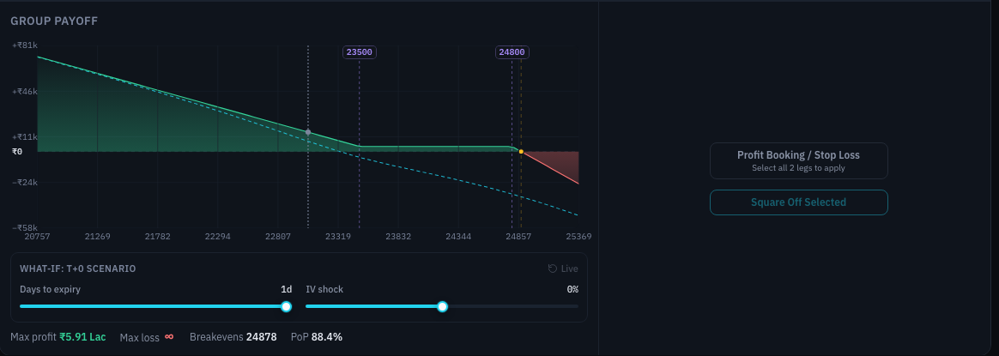
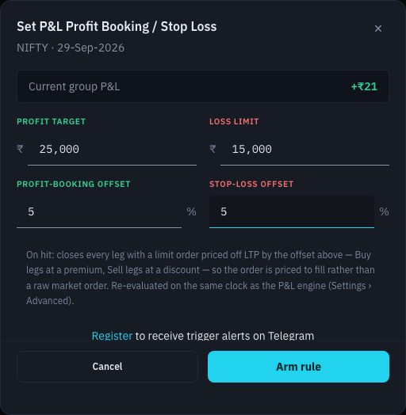
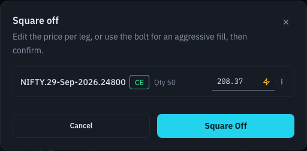
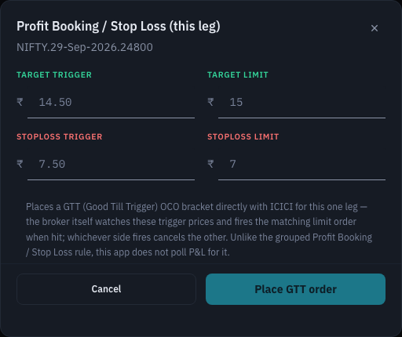

# Portfolio

The Portfolio page lists your **open option positions on NFO and BFO** (NSE and BSE F&O). Legs of the same underlying and expiry are grouped together, so a strangle, spread or iron fly reads as one position with one P&L, one margin figure and one payoff chart. From here you can square off legs and arm automated exits.

## Summary tiles

| Tile | What it shows |
|---|---|
| **Total MTM** | Mark-to-market P&L across all open positions, with the number of groups and legs. |
| **Total carry** | What your positions would make **if held to expiry** and every option you sold expired worthless (and every option you bought were worth nothing). It is the premium still to be earned or lost from here. |
| **Span + ELM margin** | Margin blocked by your positions, split into what ICICI has **blocked** (SPAN) plus the app's **ELM buffer**. The **i** icon explains why it can differ slightly from ICICI's screens. See [Margins](margins.md). |
| **Carry return** | Total carry as an **annualised** return on that margin. |

During market hours **Live quotes · WebSocket** appears in the page header, and the MTM and carry figures update with every tick.

## Open positions

The **Group legs** switch at the top right of the table chooses between two views:

- **On** (the default): one row per **Strategy Group**, meaning all legs of one underlying and expiry. Click a group to expand it.
- **Off**: one row per leg, with no payoff chart.

The app remembers your choice.

### Columns

| Column | What it shows |
|---|---|
| Checkbox | Select legs to square off. Ticking a group's box selects all its legs. |
| **Row** | Row number. |
| **Option** | Underlying, expiry and number of legs for a group; the full contract for a leg (for example `NIFTY.29-Sep-2026.24000`). |
| **Type** | Call or put. |
| **Position** | Buy (long) or sell (short). |
| **Qty** | Quantity in units. |
| **Avg** | Your average price. |
| **LTP** | Last traded price. **· prev close** or **· broker px** after the price means it is not a live tick: the previous session's closing price, or ICICI's own figure. |
| **Spot** | The underlying's current level. |
| **MTM** | Mark-to-market P&L. |
| **Carry** | P&L if held to expiry, with its annualised return on margin underneath (group rows). |
| **Span + ELM** | The group's margin: SPAN on top, the ELM buffer beneath. Shown for groups only, netted across the group's legs. |
| **PoP** | Probability of profit at expiry, from the option chain's implied volatility. For a group that collected premium it is the chance every option you sold expires out of the money, the same convention ICICI uses. See [PoP in the glossary](glossary.md#pop-probability-of-profit). |
| **See actions →** | A reminder that expanding the group shows its actions. |

A green dot next to a group means its prices are streaming live.

### Under each group's name

The second line under a group's name shows its automated-exit status:

- **+ Set Profit Booking / Stop Loss** when no rule is armed. Clicking it expands the group, selects every leg and opens the rule dialog.
- A small gauge when a rule is armed: the stop on the left, the target on the right, and a dot showing where the group's P&L sits between them.
- A short explanation when a rule has **reset** (see [When a rule resets](#when-a-rule-resets)).

A badge next to the name shows the rule's state: **Armed**, **Fired** (exit orders placed, waiting for fills), **Completed** (every exit order filled) or **Reset**.

## Inside an expanded group

### Group payoff

The chart shows the group's P&L across a range of underlying prices:

- **Expiry** (solid line): P&L on expiry day.
- **T+0** (dashed line): P&L today, if the underlying moved there right now.
- The shaded areas show where the group makes or loses money at expiry. The marker on the price axis shows the current spot.
- **+** and **−** zoom the price axis in and out.

Underneath, **Max profit**, **Max loss**, **Breakevens** and **PoP** summarise the payoff. An ∞ sign means unlimited.

**What-if: T+0 scenario** reshapes the dashed line:

| Control | What it does |
|---|---|
| **Days to expiry** | Moves the T+0 curve forward in time. At 0 it lies on the expiry line. |
| **IV shock** | Raises or lowers implied volatility by up to 10 percentage points, to see the effect of a volatility spike or crush. |
| **Live** (reset icon) | Puts both sliders back to today's actual days to expiry and the chain's current volatility. |

### Group actions

| Button | What it does |
|---|---|
| **Profit Booking / Stop Loss** | Opens the automated-exit dialog for the whole group (below). It is enabled only when **every** open leg of the group is ticked, so that what you have selected matches what the rule will close. The line under the label says so: **Select all N legs to apply**, or **Applies to all N legs**. It reads **Edit Profit Booking / Stop Loss** once a rule is armed. |
| **Square Off Selected** | Closes the legs you have ticked. See [Squaring off](#squaring-off). |

## Profit Booking / Stop Loss

A Profit Booking / Stop Loss rule watches a group's total P&L and closes **every leg** of the group when the P&L reaches your profit target or falls to your loss limit.

| Field | What it does |
|---|---|
| **Current group P&L** | The group's P&L right now, for reference. |
| **Profit target** | Close the group when its P&L rises to this many rupees. |
| **Loss limit** | Close the group when its loss reaches this many rupees. Enter it as a positive number. |
| **Profit-booking offset** | How far past the last traded price the exit orders are priced when the target is hit, from 1% to 20%. |
| **Stop-loss offset** | The same, for exits triggered by the loss limit. |
| **Arm rule** | Starts watching. On an armed rule it reads **Update rule** and saves new values. |
| **Disarm** | Stops watching. For a rule that has reset it reads **Dismiss**. |

When the rule fires, every leg is closed with a **limit order** priced off its last traded price by the offset: buy legs above the price, sell legs below it. That makes the order likely to fill quickly without being an unprotected market order. The rule is checked on the same cycle as the app's live P&L (see [Engine Settings](settings-automation.md#engine-settings)).

If you have not linked Telegram, the dialog offers a **Register** link. With Telegram linked you get a message the moment a rule fires. See [Telegram Alerts](settings-automation.md#telegram-alerts).

> [!WARNING]
> **This is best-effort protection, not a guaranteed stop-loss.** Your server does the watching, not ICICI. A rule can only fire while your server is running, connected to the live quote feed, signed in to ICICI for the day and licensed. If any of those is not true at the moment the threshold is crossed, no exit orders are placed. The target and loss limit are **triggers**, not guaranteed exit prices: in a fast market the limit orders may fill partly, at a worse price, or not at all.

Remember that **logging out ends your ICICI session and stops every rule**. Close the browser tab instead; rules keep working without it until midnight IST. See [Signing out](signing-in.md#signing-out).

Armed rules and the orders they place are also listed on the [Order Book](order-book.md#profit-booking--stop-loss) page, under **Profit Booking / Stop Loss**.

### When a rule resets

A rule **resets** (stops watching) when it can no longer act safely: for example you changed the group by adding or closing a leg, or one of its exit orders was rejected. A reset rule shows **Reset** and a short explanation under the group's name. Click the explanation to read it in full.

A reset stops **future** automation, but it does **not** cancel exit orders it already placed. Those can still fill:

- **Reset · N live** (amber): exit orders are still working at ICICI.
- **Reset · action needed** (red): an exit order is still working for a leg that is **already closed**. If it fills it opens a **new position in the opposite direction**. A red banner at the top of every page warns you until it is dealt with.

Open the rule dialog to see the **Still live** orders. **Cancel remaining exit orders** cancels them for you. You cannot dismiss or re-arm the rule while any of its exit orders is still working.

## Squaring off

**Square Off Selected** (group view) or **Square Off** (leg view) opens the **Square off** dialog.

- Each leg is listed with its quantity and an editable **price**. The price starts at the current market price.
- The **lightning bolt** next to a price switches that leg to an [aggressive order](place-order.md#aggressive-orders), which fills faster.
- When more than one leg is listed, untick any leg you want to keep.
- **Square Off** passes the legs to the order confirmation dialog, where you review and send them. See [Confirming an order](place-order.md#confirming-an-order).

When the market is closed the orders can only be **parked** for later. See [Order Book](order-book.md#parked-execution).

## Exits for a single leg (GTT)

With **Group legs** switched off, each leg's actions are **Profit Booking / Stop Loss** and **Square Off**. The Profit Booking / Stop Loss button here works differently from the group rule: it places a **GTT (Good Till Trigger) OCO order directly with ICICI** for that one leg.

| Field | What it does |
|---|---|
| **Target trigger** | When the option's price reaches this level, ICICI sends the target order. |
| **Target limit** | The limit price of the target order. |
| **Stoploss trigger** | When the price reaches this level, ICICI sends the stop-loss order. |
| **Stoploss limit** | The limit price of the stop-loss order. |
| **Place GTT order** | Places the bracket with ICICI. When one side fills, ICICI cancels the other (one-cancels-other). |
| **Cancel GTT order** | Shown when a GTT is already in place; cancels it at ICICI. |

Because ICICI watches a GTT, it keeps working even when your server is off. It looks at one leg's **price**, not a group's P&L.
