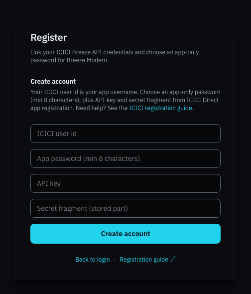

# Registering your account

Registration creates your Breeze Modern login and stores your ICICI API credentials, encrypted, on your server. You do it once.

Open your server's address in the browser and click **New user? Register** on the login page.

## The registration form

| Field | What to enter |
|---|---|
| **ICICI user id** | The user id you use to log in to ICICI Direct. It becomes your Breeze Modern username. |
| **App password (min 8 characters)** | A new password, used **only** for Breeze Modern. It is not your ICICI password, and it should not be the same. At least 8 characters. |
| **API key** | The **API Key** from your ICICI Breeze API app. See [Before you begin](before-you-begin.md). |
| **Secret fragment (stored part)** | Your ICICI **Secret Key without its last few characters**. See below. |

Click **Create account**. If everything is accepted you return to the login page with the message **Registration complete. Continue to sign in.**

## Splitting your Secret Key

Breeze Modern never stores your whole ICICI Secret Key in one place. You split it in two:

1. **The stored part.** Everything except the last **2 to 4 characters**. Type this into **Secret fragment (stored part)** when you register. It is saved encrypted on your server.
2. **The part you memorise.** The last 2 to 4 characters you left out. You type these on the **Complete ICICI login** page every time you sign in.

For example, if your Secret Key were `4a7Hq29Lx81p`, you might register with `4a7Hq29Lx8` and memorise `1p`.

> [!IMPORTANT]
> The two parts must join back into your exact Secret Key, stored part first. If you mistype either part, ICICI rejects the sign-in. Write the memorised part down somewhere safe until you know it by heart.

## If registration fails

| Message | What it means |
|---|---|
| **Password must be at least 8 characters** | Choose a longer app password. |
| **Missing fields** | One of the four fields is empty. |
| **Account already exists** | This ICICI user id is already registered on this server. Sign in instead, or use **Forgot password?** on the login page. |
| **Registration is not available.** | Self-registration has been switched off on this deployment. |

Breeze Modern does not check your API Key and Secret with ICICI at this point. If either is wrong, you find out when you first sign in. [Passwords and credentials](account-recovery.md#your-icici-api-key-or-secret-changed) explains how to correct them.

## Next step

[Sign in](signing-in.md) with your ICICI user id and the app password you just chose.
