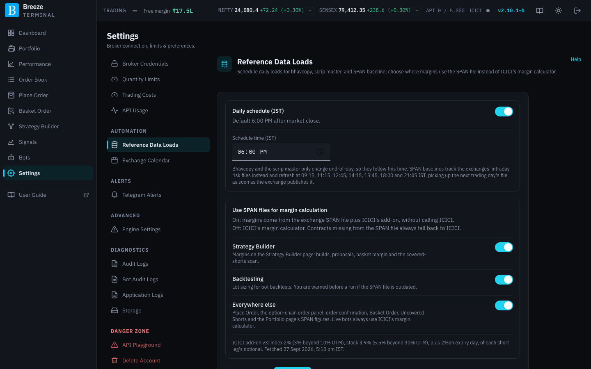
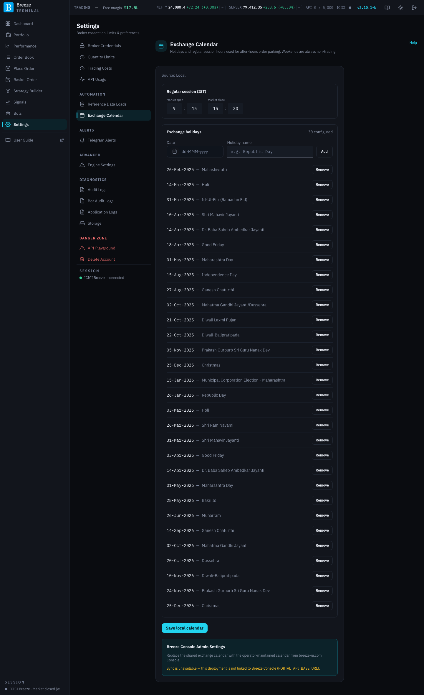
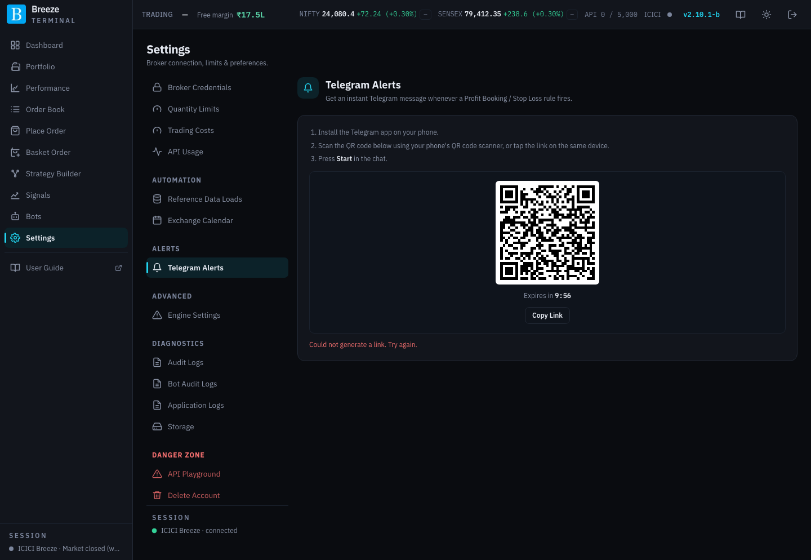

# Settings: automation and alerts

These screens control the data the app loads for itself each day, the trading calendar, Telegram alerts and how often the live P&L engine runs.

## Reference Data Loads

Breeze Modern keeps its own copies of the exchanges' daily files so it can show prices after the close, price margins without calling ICICI, and know every contract that exists:

| File | What it is used for |
|---|---|
| **NSE FO BhavCopy** and **BSE FO BhavCopy** | The exchanges' official closing prices, used for option chains and positions after the close. |
| **ICICI Scrip Master** | Every contract ICICI knows: strikes, expiries, lot sizes. |
| **NSE SPAN Baseline** and **BSE SPAN Baseline** | The exchanges' SPAN risk files, used to calculate margins. |

### Daily schedule

| Control | What it does |
|---|---|
| **Daily schedule (IST)** switch | Turns the automatic daily load on or off. |
| **Schedule time (IST)** | When the bhavcopies and scrip master load each day (default 18:00). They only change at the end of the day. |
| **Save schedule** | Saves the time and switch. **Unsaved schedule changes** reminds you if you have not. |
| **Load now** | Loads everything immediately. Progress bars appear under **Active load**. |

If an exchange has not yet published the day's bhavcopy when the daily load runs, the app keeps the previous session's file and tries again every 30 minutes, through the evening and overnight, until the new file appears. It never retries during market hours. A successful retry appears in the load history like any other load.

SPAN files follow the exchanges' own intraday releases instead, loading automatically at **09:15, 11:15, 12:45, 14:15, 15:45, 18:00 and 21:45 IST**, and picking up the next trading day's file as soon as it is published.

### Use SPAN files for margin calculation

Three switches decide where margins come from. **On** means the exchange SPAN file plus ICICI's add-on, calculated on your server without calling ICICI. **Off** means ICICI's own margin calculator. Contracts missing from the SPAN file always fall back to ICICI.

| Switch | What it covers |
|---|---|
| **Strategy Builder** | Margins on the Strategy Builder page: proposals, legs and scans. |
| **Backtesting** | Lot sizing for bot backtests. You are warned before a run if a SPAN file is out of date. |
| **Everywhere else** | Place Order, order confirmation, Basket Order and the Portfolio page's SPAN figures. |

Live bots always use ICICI's margin calculator, whatever these say.

The SPAN-file figure is only used when your deployment has received **ICICI's add-on rates** within the last 24 hours. Below the switches, a line shows the current rates (for example "index 2% … stock 3.9% … plus 2% on expiry day, of each short leg's notional"). If no rates have arrived, every switch shows **No**, cannot be changed, and falls back to ICICI; your choice comes back once rates arrive. See [Margins](margins.md).

### Source status and ingest history

**Source status** shows the date of the data each file holds, for example **Data date: 26-Sep-2026**. **Ingest history** lists every load: **Source**, **File date**, **Rows**, **Status** (**OK** or **Failed**, with the reason) and **Ingested**. **Show all history** expands it beyond the latest load of each file.

This screen also holds the **Margin comparison harness**, an advanced tool described in [Margins](margins.md#advanced-the-margin-comparison-harness).

## Exchange Calendar

Holidays and session hours. The app uses them to decide whether the market is open, which controls whether orders can be sent or only parked. Weekends are always non-trading days.

| Control | What it does |
|---|---|
| **Source** | **Local** (edited here) or **Breeze Console Admin Settings** (synced). |
| **Regular session (IST)**: **Market open**, **Market close** | Normal trading hours. |
| **Exchange holidays** | A **Date** and **Holiday name** per holiday. Add rows, or **Remove** them. |
| **Save local calendar** | Saves your edits. |
| **Sync from Breeze Console** | Replaces this calendar with the one maintained centrally at breeze-ui.com. It asks **Overwrite local calendar?** first; click **Continue** to confirm. |

The calendar is shared by everyone on this deployment. A wrong calendar causes wrong "market closed" messages, or attempts to trade when the exchange is shut.

## Telegram Alerts

Links a Telegram chat so you get a message the moment a Profit Booking / Stop Loss rule fires, or pauses for lack of prices (see [Profit Booking / Stop Loss](portfolio.md#profit-booking--stop-loss)), and so semi-auto bots can ask for your approval.

**To link Telegram:**

1. Install the Telegram app on your phone.
2. Scan the QR code on this screen with your phone's camera, or tap **Copy Link** and open the link on the same device.
3. Press **Start** in the chat that opens.

The QR code expires after a few minutes; the screen shows a new one when it does.

**Once linked**, the screen shows **Status: Connected** and:

| Control | What it does |
|---|---|
| **Alerts enabled** | Turns alerts on or off without unlinking. |
| **Change linked account** | Disconnects this chat and shows a new code for a different account. |
| **Deregister** | Unlinks Telegram entirely. You stop receiving alerts. |

If the screen says Telegram alerts are not configured on this deployment, alerts have not been set up for your server; ask whoever manages it.

## Engine Settings

Two timings for the engine that watches live prices and your automated exits.

> [!CAUTION]
> Read the warning on this screen before changing anything. Your server is small. Values that are too low can overload it and make it slow or unresponsive; values that are too high make target and stop-loss exits react more slowly to price moves.

| Setting | What it does |
|---|---|
| **WS quote flush interval**: **Seconds between flushes** | How often the latest prices from the live stream are saved for the P&L engine to read. |
| **P&L recompute interval**: **Seconds between recomputes** | How often every open leg is repriced and checked against your Profit Booking / Stop Loss rules. It never calls ICICI, so it does not use your API allowance. |

A warning appears beside a value outside the recommended range. **Save** applies it to the running app within one cycle; no restart is needed.
