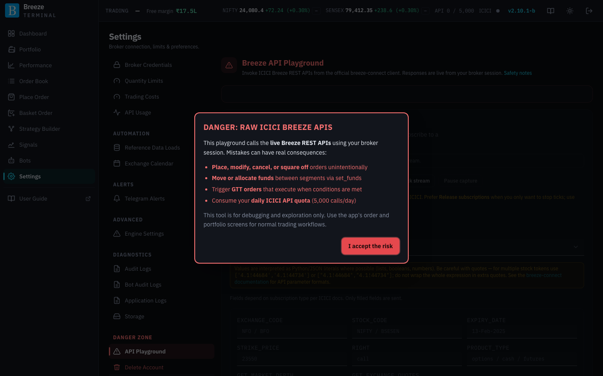
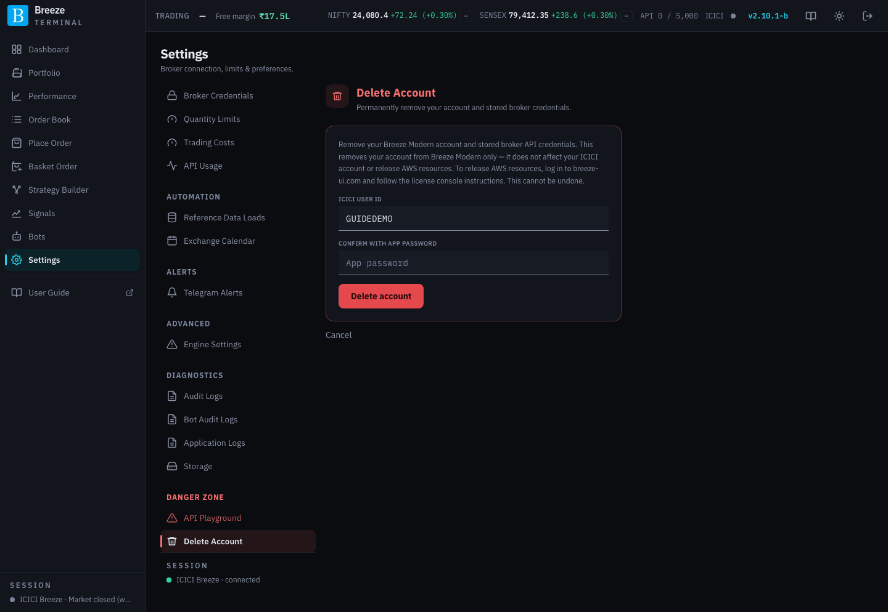

# Settings: danger zone

The two screens here can do real, irreversible things. They are shown in red in the Settings menu.

## API Playground

The **Breeze API Playground** calls ICICI's raw Breeze API directly, using your live ICICI session. It exists for diagnosing broker-side problems, for example to see exactly what ICICI returns for a call that is misbehaving in the app. It is not for everyday trading.

> [!CAUTION]
> The first time you open it, a **Danger: raw ICICI Breeze APIs** warning explains the risks: you can **place, modify, cancel or square off orders** by mistake, **move funds** between segments, trigger **GTT orders**, and use up your **daily ICICI API allowance** of 5,000 calls. Click **I accept the risk** only if you understand them. The app's normal pages have safety checks; this screen does not.

### Calling an API

| Control | What it does |
|---|---|
| Method picker | Choose an ICICI API method from the catalogue. Methods that can change orders, funds or GTT triggers are marked with a warning. |
| **Parameters** | A field for each parameter the method takes. Values are read as JSON where possible (lists, numbers, true/false). |
| **Additional parameters (JSON)** | Optional extra keys not in the catalogue. The fields above win if both set the same key. |
| **Fire API** | Sends the call to ICICI. |
| **Response** | ICICI's raw reply, with a copy button. |

### WebSocket (market hours)

Tests ICICI's live quote stream for an F&O contract. Ticks only arrive during market hours.

| Control | What it does |
|---|---|
| **Connect** | Opens the connection to ICICI's stream. |
| Subscription fields and **Subscribe** | Choose the contract and subscription type, then subscribe. Only filled-in fields are sent. |
| **Start tick stream** | Shows the ticks arriving. **Pause capture** / **Resume capture** freezes the display. |
| **Release subscriptions** | Stops the ticks but keeps the connection open. Prefer this to disconnecting. |
| **Disconnect socket** | Closes the connection. ICICI may treat frequent connect and disconnect cycles as abuse, so use it sparingly. |
| **ICICI command log** and **Latest operation** | Every command and ICICI's reply, with copy buttons. |

## Delete Account

Permanently removes your Breeze Modern account and the ICICI credentials stored for it.

| Field | What to enter |
|---|---|
| **ICICI User ID** | Your user id (filled in for you). |
| **Confirm with app password** | Your Breeze Modern app password. |
| **Delete account** | Deletes the account. You are signed out and returned to the login page. |

What deleting does and does not do:

- It removes your account **from Breeze Modern only**. Your ICICI Direct account is not affected.
- It **does not** stop your server or release AWS resources, and it does not end your license. To release AWS resources, sign in at [breeze-ui.com](https://breeze-ui.com) and follow the instructions in the license console.
- It **cannot be undone**. You can register again afterwards as a new account.
