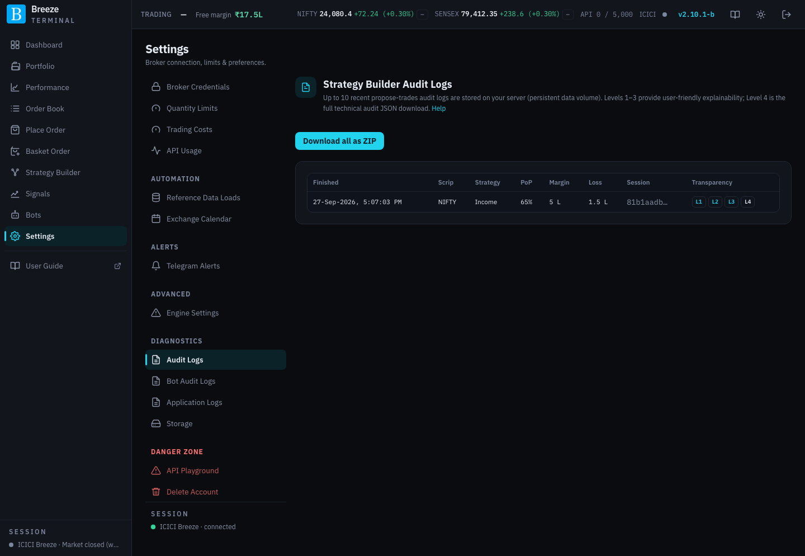
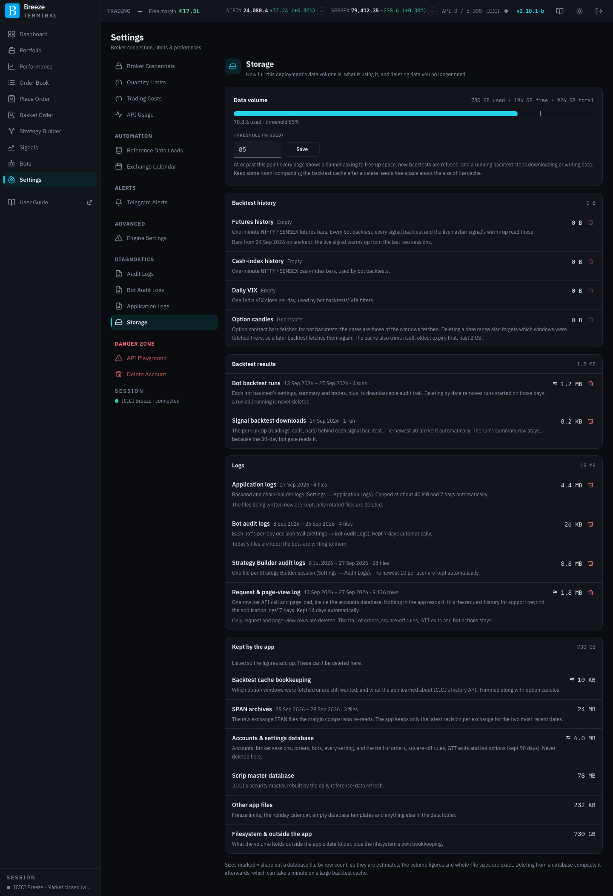

# Settings: diagnostics

These screens are for looking back at what happened and keeping your server tidy: records of how strategies were chosen, what the bots decided, the app's own logs, and disk space.

## Audit Logs

**Strategy Builder Audit Logs** keeps the most recent Strategy Builder searches on your server, so you can see later why a trade was proposed or rejected.

| Column or control | What it shows or does |
|---|---|
| **Finished**, **Scrip**, **Strategy**, **PoP**, **Margin**, **Loss** | When the search finished, the underlying, and the top strategy's figures. |
| **Session** | The search's identifier. |
| **Transparency** | Four levels of explanation: **Level 1: Executive summary**, **Level 2: Why this / Why not**, **Level 3: What if?**, and **Level 4**, a download of the full technical record. They match the **How were these trades chosen?** panel on [Strategy Builder](strategy-builder.md#how-were-these-trades-chosen). |
| **Download all as ZIP** | Downloads every stored log. |

Only the latest searches are kept; older ones are removed automatically.

## Bot Audit Logs

Every decision the scalping bots made (Long Scalper and Intraday Iron Fly), one file per bot per trading day, recorded on every pass while the bot is armed and its window is open. Files are kept for a limited number of days, shown on the screen.

| Column or control | What it shows or does |
|---|---|
| **Trading day**, **Bot**, **Records**, **Size** | Which day and bot, how many decisions were recorded, and the file size. |
| **Download** | Downloads that day's file. |
| **Download all as ZIP** | Downloads every file. |

## Application Logs

The app's own technical logs, for investigating a problem or sending to support.

| Control | What it does |
|---|---|
| **Period** | The time range to include. |
| **Download .zip** | Downloads the logs for that period. |

> [!WARNING]
> The logs cover the whole deployment, not just your activity, and contain account identifiers and client IP addresses. Treat them as sensitive when sharing.

If the screen says log recording is disabled, your deployment is not keeping logs.

## Storage

How full your server's data disk is, what is using it, and deleting data you no longer need. Backtest history grows quickly, so check this now and then.

| Part | What it shows or does |
|---|---|
| **Data volume** | A bar showing how much of the disk is used. It turns amber past your threshold. |
| **Threshold (% used)** and **Save** | When usage reaches this, every page shows a **Storage is N% full** banner, new backtests are refused, and a running backtest stops downloading or writing data. Keep some room spare: tidying up the backtest cache after a delete needs free space about the size of the cache. |
| Groups | What occupies the disk, each item with its size and the dates it covers: **Backtest history** (downloaded market data), **Backtest results**, **Logs**, and **Kept by the app** (listed so the figures add up; these cannot be deleted here). |
| **Delete …** | On each deletable item: pick a **From** and **To** date and click **Delete**. The app deletes the data for that range and then compacts the file to reclaim the space, showing progress as it goes. |

Records of your orders, square-offs and bot events are never deletable here.
