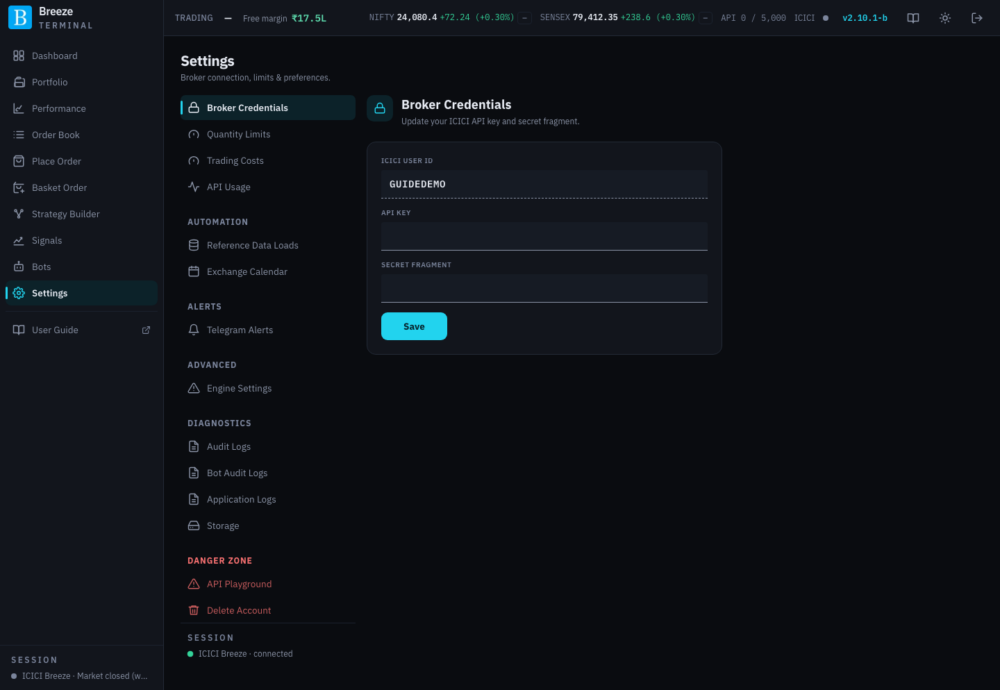
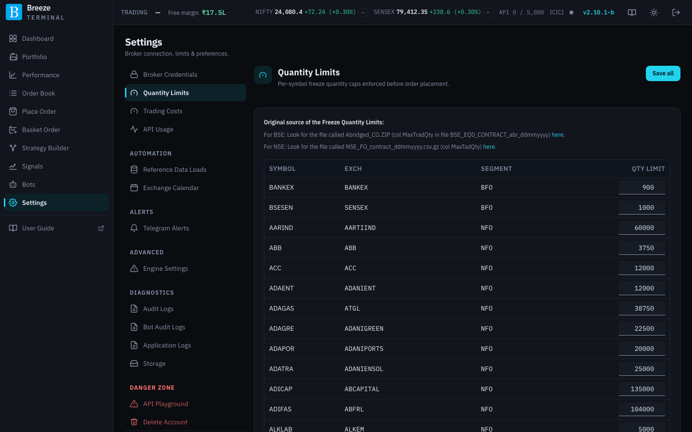
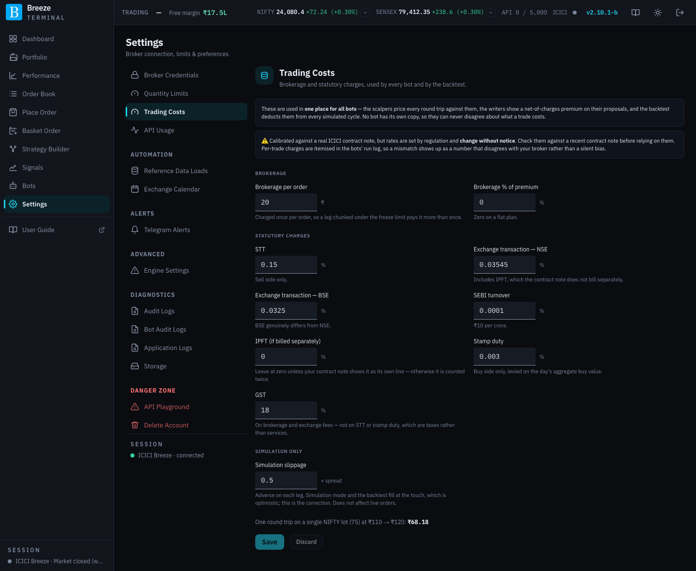
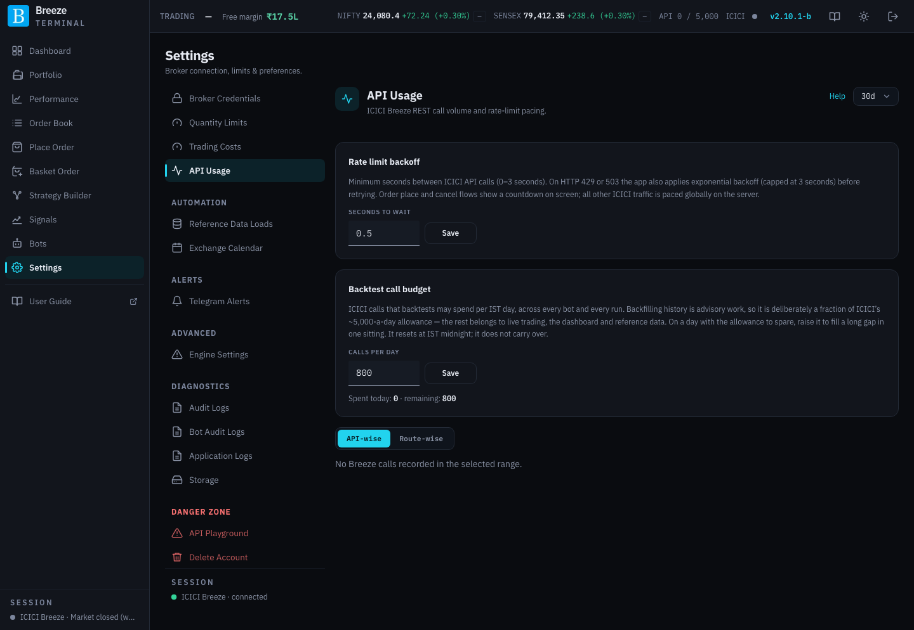

# Settings: trading setup

**Settings** holds everything you configure once and then rarely touch. Its left-hand menu is grouped:

| Group | Screens | Where in this guide |
|---|---|---|
| (top) | Broker Credentials, Quantity Limits, Trading Costs, API Usage | This page |
| **Automation** | Reference Data Loads, Exchange Calendar | [Settings: automation and alerts](settings-automation.md) |
| **Alerts** | Telegram Alerts | [Settings: automation and alerts](settings-automation.md#telegram-alerts) |
| **Advanced** | Engine Settings | [Settings: automation and alerts](settings-automation.md#engine-settings) |
| **Diagnostics** | Audit Logs, Bot Audit Logs, Application Logs, Storage | [Settings: diagnostics](settings-diagnostics.md) |
| **Danger zone** | API Playground, Delete Account | [Settings: danger zone](settings-danger-zone.md) |

At the bottom of the menu, **Session** shows whether your ICICI connection is live. On a phone the menu becomes a list you tap into.

> [!TIP]
> For a new deployment, work through these in order: **Broker Credentials**, **Quantity Limits**, **Trading Costs**, **Reference Data Loads**, **Exchange Calendar**, then **Telegram Alerts**.

## Broker Credentials

Replaces the ICICI API credentials stored for your account, for example after you regenerate your Secret Key on ICICI's portal.

| Field | What to enter |
|---|---|
| **ICICI User ID** | Shown for reference; it cannot be changed here. |
| **API Key** | The API Key from ICICI's API portal. |
| **Secret Fragment** | Your Secret Key **without its last 2 to 4 characters**. The characters you leave out are what you type at each sign-in. See [Splitting your Secret Key](registering.md#splitting-your-secret-key). |
| **Save** | Stores them, encrypted, on your server. |

Wrong credentials make ICICI reject the sign-in and every broker call. If you cannot sign in to reach this screen, use **Update credentials** on the login page instead ([Passwords and credentials](account-recovery.md#your-icici-api-key-or-secret-changed)).

## Quantity Limits

The largest quantity the exchanges accept in a single order for each underlying (the **freeze limit**). Orders above it are split into chunks; see [Order chunking](place-order.md#order-chunking).

| Column or control | What it does |
|---|---|
| **Symbol**, **Exch**, **Segment** | The underlying, exchange and segment. |
| **Qty limit** | The freeze quantity in units. Edit it if the exchange changes it. |
| **Save all** | Saves every edited row. |

The screen also says where the official figures come from: NSE's daily `NSE_FO_contract_ddmmyyyy.csv.gz` file (column MaxTadQty) and BSE's `Abridged_CO.ZIP` (column MaxTradQty), with links. The defaults match those files; update a row when the exchange publishes a new limit. A wrong value causes unexpected chunking or exchange rejections.

## Trading Costs

The brokerage and statutory charges the app uses to work out net P&L for every bot, simulation and backtest. They do not change what ICICI actually charges you; set them to match your contract notes so the app's figures match reality.

| Group | Field | Notes |
|---|---|---|
| **Brokerage** | **Brokerage per order** (₹) | Charged once per order, so a leg split into chunks pays it more than once. |
| | **Brokerage % of premium** | Zero on a flat-fee plan. |
| **Statutory charges** | **STT** % | Sell side only. |
| | **Exchange transaction — NSE** % and **— BSE** % | The two exchanges genuinely differ. The NSE figure includes IPFT. |
| | **SEBI turnover** % | ₹10 per crore. |
| | **IPFT (if billed separately)** % | Leave at zero unless your contract note shows it as its own line, or it is counted twice. |
| | **Stamp duty** % | Buy side only. |
| | **GST** % | On brokerage and exchange fees, not on STT or stamp duty. |
| **Simulation only** | **Simulation slippage** (× spread) | How far past the quoted price simulated fills are assumed to happen, as a fraction of the bid-ask spread. Simulations and backtests would otherwise fill at the quote, which is optimistic. Does not affect live orders. |

Click **Save** to keep your changes, or **Discard** to undo them.

## API Usage

How many ICICI API calls your account makes, and two settings that control how the app spends them. See [ICICI API limits](api-limits.md) for the background.

| Section | What it shows or does |
|---|---|
| Period (top right) | How many days of history to show. |
| **Rate limit backoff** | **Seconds to wait**: the minimum gap between ICICI calls, 0 to 3 seconds. When ICICI replies "too many requests", the app also backs off automatically before retrying; order placement and cancellation show a countdown while it waits. |
| **Backtest call budget** | **Calls per day** that backtests may spend, across every bot and every run. It is deliberately a fraction of ICICI's 5,000-a-day allowance, which also has to cover live trading, the dashboard and reference data. Raise it on a quiet day to fill a long gap in one go. It resets at midnight IST. **Spent today** and **remaining** are shown underneath. |
| **Calls by category** | Calls per day, split into **Order placement**, **Market quotes**, **Portfolio calls** and **Other**. **API-wise** breaks it down by ICICI method, **Route-wise** by the app feature that made the calls. |

The header bar's **API** counter shows today's total on every page.
