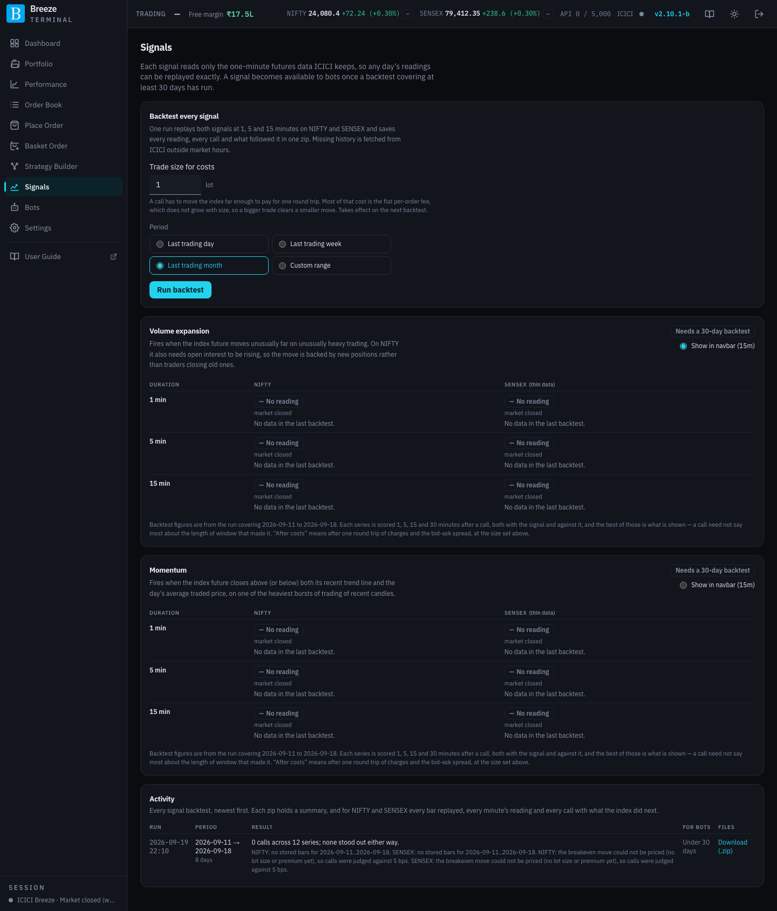

# Signals

A **signal** is a short-lived reading of where NIFTY or SENSEX is heading over the next few minutes. The Signals page shows every reading live, lets you backtest them all against history, and decides which ones bots may use.

## What a signal is, and what it is not

A signal is an opinion about the **next few minutes** of index direction. It is not a forecast for the day, and it is not a recommendation to buy or sell any particular option.

Each reading is in one of four states:

| State | Meaning |
|---|---|
| **Bullish** | By its rules, the reading points up. |
| **Bearish** | By its rules, it points down. |
| **Quiet** | The reading is working normally and sees nothing unusual. |
| **No reading** | The reading cannot form an opinion right now: the market is closed, it is outside 09:15–15:15, it is still warming up, or the data has a gap. |

**No reading is never treated as Quiet.** A bot that needs a quiet market will not assume the market is quiet just because the signal cannot see, and a bot that needs a direction never trades on No reading.

## The rules every signal follows

- **It reads index futures, not the index or options.** The indices themselves have no traded volume, and volume matters to both signals, so they read the near-month futures: NIFTY futures on NSE and SENSEX futures on BSE.
- **It uses only what history can replay.** Every signal is calculated purely from one-minute price bars, traded volume and open interest, exactly what ICICI serves as history. That is what makes every reading testable: any past day's readings can be recreated exactly as they would have appeared live.
- **It works only during continuous trading, 09:15 to 15:15.** After 15:15 the cash market moves into the closing auction, where the index shows an indicative value rather than traded prices. Outside these hours every reading is No reading.
- **It never reads the overnight gap as a move.** A gap-up open is not a breakout.
- **Nothing about a live reading is stored.** Only the current reading is kept. To see what a signal did on a past day, backtest that day after the close.
- **SENSEX is marked "thin data".** SENSEX futures trade lightly, often with no trade at all in a minute, and ICICI provides no open interest for BSE contracts. SENSEX readings work with less information, and the page says so.

## The two mechanisms

### Volume expansion

A move that is both **unusually large** and **unusually heavily traded** suggests real money is behind it.

1. Over the chosen window (1, 5 or 15 minutes), measure how far the futures price moved and how many contracts traded.
2. Rank that move and that volume against the last 120 windows of the same length. It is a ranking, not a fixed threshold, so it adjusts automatically to busy and quiet parts of the day.
3. Both must be in the **top fifth**. A big move on thin volume, or heavy volume with no move, is not a call.
4. **NIFTY only:** over at least 15 minutes, check whether positions are being built or closed:

| Price | Open interest | What it means | Call |
|---|---|---|---|
| Up | Rising | New long positions | **Bullish** |
| Down | Rising | New short positions | **Bearish** |
| Up | Falling | Short covering | **Quiet** |
| Down | Falling | Long liquidation | **Quiet** |

SENSEX skips step 4 because it has no open interest. A spike measured from a minute with no trade is ignored, and NIFTY's reading stands down on futures rollover days, when open interest moves for mechanical reasons.

### Momentum

A price trading above its short-term trend **and** above the day's average traded price, on heavy volume, is in an up-move that buyers are paying up for.

When each candle (1, 5 or 15 minutes, aligned to 09:15) completes, the reading checks three things:

- **Trend:** did it close above its 9-candle exponential moving average?
- **Value:** did it close above the day's VWAP (volume-weighted average price)?
- **Participation:** is its volume in the top fifth of the last 20 candles?

All three up is **Bullish**, all three down is **Bearish**, anything mixed is **Quiet**. VWAP starts fresh each day.

Momentum runs in **three versions side by side**. Each is a fixed definition. The older two are kept so the newest can be compared with them, and they will be retired once it has been judged.

| | v1 | v2 | v3 (newest) |
|---|---|---|---|
| **Trend line** | Rebuilt each morning, so nothing until nine of today's candles have closed (11:30 for the 15-minute reading) | Carried over from the previous day, adjusted for the overnight gap, so it reads from the first candle | As v2 |
| **Participation** | Top fifth of the last 20 candles | As v1 | **1 minute:** more volume than each of the session's last three candles. **5 and 15 minutes:** top fifth of the same time of day over the last ten sessions |
| **Minimum move** | None | None | The close must be at least half an ATR (average true range, a measure of how far prices typically move per candle) beyond the trend line |
| **SENSEX** | Runs | Runs | **Not run** |

Why v3 changes these:

- **Time of day.** Index futures trade heavily at the open and close and lightly in the middle of the day. Comparing a candle with the last 20 candles meant the open was compared with yesterday's quieter afternoon, and a busy late morning with an even busier first hour. Comparing with the same time on previous days takes that pattern out.
- **A clear move.** Under v1 and v2, a close a few paise above the line counts the same as a 50-point break. v3 needs a move that is large for the current market.
- **SENSEX.** SENSEX futures go untraded in about half of all minutes, so after a quiet spell a single trade would pass the volume test. v3 does not run on SENSEX, and the Signals page says so in place of a reading.

### Durations and the readings

Each mechanism (and each Momentum version) runs at **1, 5 and 15 minutes**, for both indices. That is 21 readings while Momentum runs three versions: twelve on NIFTY and nine on SENSEX. The duration is both the window a reading looks at and how long a call stands. A call extends if the next window fires the same way. Shorter durations fire more often and are noisier.

The grid is fixed. You cannot adjust a signal, because a signal that can be tweaked until it looks good on past data proves nothing. What you choose is which reading a bot uses (mechanism, version and duration), and whether it **follows** the call or **fades** it (trades against it).

## The page

### Backtest every signal

| Control | What it does |
|---|---|
| **Trade size for costs** | How many lots you typically trade. A call only counts as useful if the index moved far enough to pay for one round trip. Most of that cost is a flat fee per order, so a bigger trade clears a smaller move. Takes effect on the next backtest. |
| **Period** | **Last trading day**, **Last trading week**, **Last trading month** or **Custom range**. |
| **Run backtest** | Replays every reading, every version, over the period. While it runs, a progress line shows what it is doing, and **Stop** ends it early. Only one backtest (signal or bot) runs at a time. |

History that is not already stored on your server is downloaded from ICICI, **outside market hours only**. See [Backtests](backtests.md).

### One section per version

**Volume expansion**, **Momentum v3**, **Momentum v2** and **Momentum v1** each have their own section. The older Momentum versions are marked **Kept for comparison**.

| Part | What it shows or does |
|---|---|
| Description | What this version watches, in one paragraph. |
| **Available to bots** / **Needs a 30-day backtest** | Whether bots may use this version. Each version earns this on its own. See [The 30-day gate](#the-30-day-gate). Hover to see the period covered. |
| **Show in navbar (15m)** | On the newest version of each mechanism only. Choose which mechanism's 15-minute reading appears after NIFTY and SENSEX in the header bar. For Momentum, the header shows the newest version bots may use: v2 until v3 has passed the 30-day gate (the note beside the choice says so), then v3. SENSEX, where v3 does not run, stays on v2. |
| Table | One row per **Duration** (1, 5, 15 min) and one column per index. Each cell shows the live state (**Bullish**, **Bearish**, **Quiet**, **No reading**) with the reason for No reading, and one sentence summarising the most recent backtest of that version. On Momentum v3, the SENSEX column explains why it is not run. |

The backtest sentence has one of a few shapes. For example:

- **240 calls over 21 sessions. Best was trading against it, held 15 min rather than 5: +0.40 bps a call after costs, which stands out against the day-to-day swings.** The best way to use this reading paid for itself consistently.
- **… The best it managed was … — but that is inside the normal day-to-day swings, so it may be luck.** Positive, but not consistent enough to rely on.
- **…; nothing paid for its costs, either with the signal or against it.** No way of trading this reading covered its costs.
- **…; too few sessions to say anything yet.** Fewer than 20 sessions of data.

The second line in each cell breaks the best horizon down direction by direction (**with** and **against**) and shows the cost bar in bps at your trade size. A line under the table says which backtest run the figures come from.

### Activity

Every signal backtest, newest first:

| Column | What it shows |
|---|---|
| **Run** | When it ran. |
| **Period** | The dates it covered. |
| **Result** | How many calls it found across all the readings and how many stood out, following or fading, with any notes about missing data. |
| **For bots** | Whether the run covered enough days to open the 30-day gate. |
| **Files** | **Download (.zip)**: a summary plus, for each index, every bar replayed, every minute's reading and every call with what the index did next. Any number on the page can be checked from it. |

## The 30-day gate

A signal becomes **available to bots** only once a completed signal backtest has covered **at least 30 calendar days** on that version. Momentum v1, v2 and v3 each earn this separately: one backtest replays all three, so in practice one run of 30 days or more opens them together.

- The gate is about **coverage, not merit**. It makes sure you have seen a month of evidence before you let a bot trade on a signal. It does not judge whether that evidence is good; the backtest sentence is there for you to judge.
- It applies to practice (paper or simulation) and live bots alike.
- An improved formula is a new version. It starts closed until a 30-day backtest has replayed it, while bots on the older version carry on. A bot uses the version picked in its settings, and never moves to a new one by itself.
- Backtests themselves are never gated.

## How a signal is judged

A signal backtest asks one question of every call: **did the index then move the called way by enough to pay for a trade?**

- **Both directions are scored.** A signal that is reliably wrong carries as much information as one that is reliably right; you would simply trade against it. Every reading is scored as **follow** (with the call) and **fade** (against it).
- **Every horizon is scored.** Each call is checked 1, 5, 15 and 30 minutes later, not only at the end of its own duration.
- **Money, not hit rate.** The headline is the average move in the traded direction **after costs**, in basis points (1 bps = 0.01%). A 60% hit rate with small wins and big losses still loses money.
- **The cost bar reflects your size** (the **Trade size for costs** setting) and includes the bid-ask spread.
- **Consistency across days, not one lucky week.** A reading only "stands out" if its net result is positive, consistent from day to day, and based on at least 20 sessions.

Bots that trade a direction have a **trade against the signal** switch in their settings, which fades the call instead of following it. See [Bots](bots.md).
