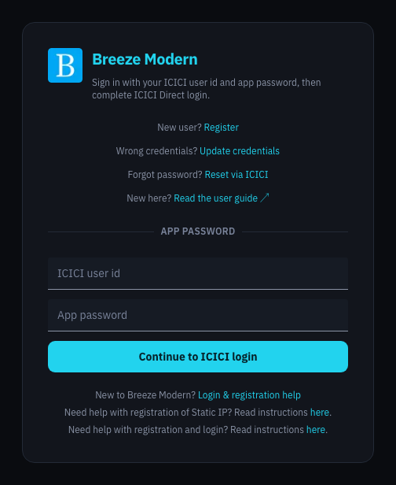
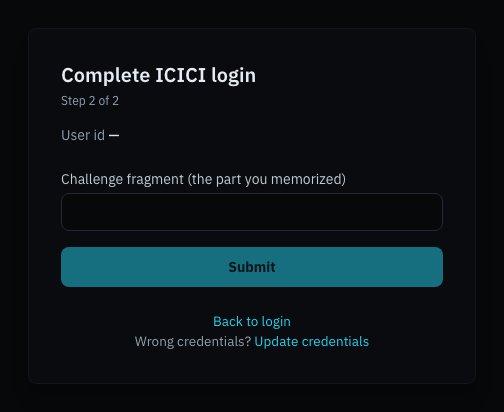
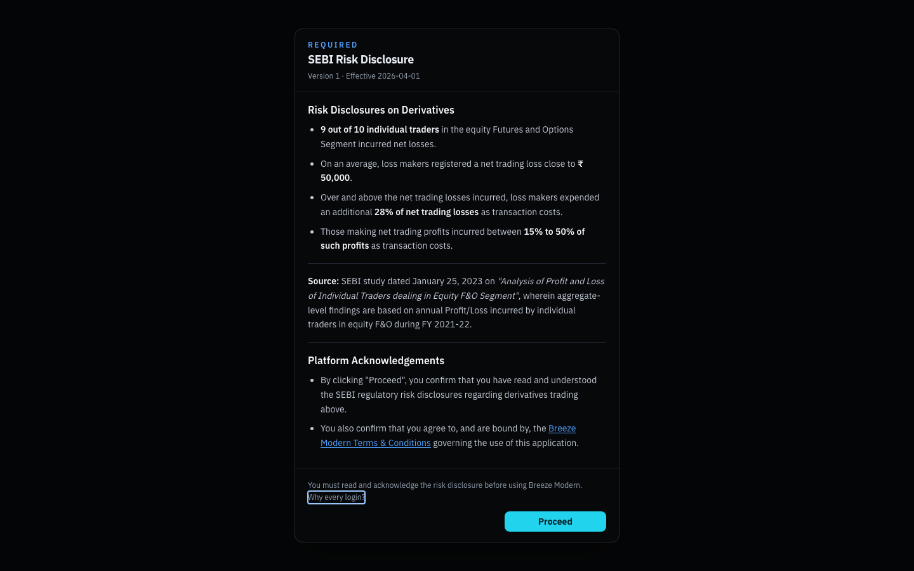
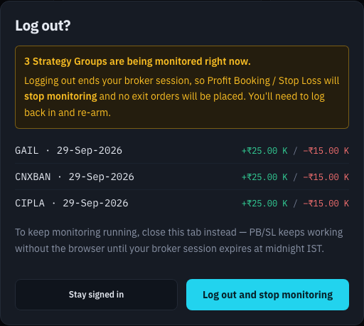

# Signing in

Signing in has two halves: your **Breeze Modern** login, then your **ICICI** login. You need both each trading day, because ICICI ends every API session at **midnight IST**.

## Step 1: sign in to Breeze Modern

| Control | What it does |
|---|---|
| **ICICI user id** | Your ICICI user id, the same one you registered with. |
| **App password** | The Breeze Modern password you chose at registration (not your ICICI password). |
| **Continue to ICICI login** | Checks your app password, then sends you to ICICI's login page. |
| **New user? Register** | Opens the registration form. See [Registering your account](registering.md). |
| **Wrong credentials? Update credentials** | Replace the API Key or Secret Key stored for your account. See [Passwords and credentials](account-recovery.md#your-icici-api-key-or-secret-changed). |
| **Forgot password? Reset via ICICI** | Reset your app password by proving who you are through ICICI. See [Passwords and credentials](account-recovery.md#you-forgot-your-app-password). |
| **New here? Read the user guide** | Opens this guide in a new tab. |
| Help links under the button | **Login & registration help**, and step-by-step guides for registering your static IP and your account (they open on breeze-ui.com with your server's details filled in). |
| Version number (top right) | Opens the changelog: what changed in each release. |
| Sun / moon icon (top right) | Switches between the dark and light look. |

A coloured message above the form tells you why you are on the login page when you did not come here yourself:

| Message | Meaning |
|---|---|
| **Registration complete. Continue to sign in.** | Your account was just created. |
| **Credentials updated. Please sign in again.** | You just replaced your API Key or Secret. |
| **App password updated. Please sign in.** | You just reset your app password. |
| **Account removed. You can register again.** | Your account was deleted. |
| **No account found. Register first.** | That ICICI user id is not registered on this server. |
| **No broker credentials on file. Register or update settings.** | Your account exists but has no API credentials stored. |
| **Sign-in bootstrap invalid or expired. Try again.** | The ICICI hand-off took too long or was interrupted. Start again. |
| **Please sign in again. Your session ended…** | Your Breeze Modern session expired while you were away. |

## Step 2: log in to ICICI

After **Continue to ICICI login**, you are on **ICICI's own website**. Log in there exactly as you would to ICICI Direct, including the OTP. Breeze Modern never sees your ICICI password or OTP.

When you finish, ICICI sends you back to your server's **redirect URL**, and Breeze Modern takes over.

## Step 3: complete ICICI login

This page asks for the **last few characters of your Secret Key**, the part you memorised when you registered (see [Splitting your Secret Key](registering.md#splitting-your-secret-key)).

| Control | What it does |
|---|---|
| **User id** | Shows which account is signing in. |
| **Challenge fragment (the part you memorized)** | Type the characters you left out of the stored part of your Secret Key. |
| **Submit** | Joins the two parts, opens your ICICI API session and takes you to the Dashboard. |
| **Back to login** | Abandons this sign-in. |
| **Wrong credentials? Update credentials** | Replace your stored API Key or Secret if ICICI keeps rejecting them. |

If you see **Missing session token in URL**, the page was opened directly rather than by ICICI's redirect. Go back to the login page and start again.

## Step 4: the risk disclosure

After every ICICI login, Breeze Modern shows SEBI's derivatives risk disclosure and the Breeze Modern Terms & Conditions. **Proceed** stays disabled until you scroll to the bottom of the message. Read it and click **Proceed**; trading features stay locked until you do. It appears once per sign-in, not on every page.

## If this is your first sign-in on a new deployment

A new deployment activates its license on your first successful ICICI login. Until then, a banner reads **Complete ICICI Direct login on this instance to start your 14-day trial** and trading stays read-only. It clears by itself once activation succeeds. See [Read-only mode and your license](read-only-mode.md).

## How long you stay signed in

- **Your ICICI session lasts until midnight IST.** After that, anything that needs ICICI (quotes, positions, orders, bots) stops until you sign in again the next day.
- **Your Breeze Modern session** refreshes itself while the app is open. If it lapses (for example a laptop left asleep overnight), you land on the login page with **Please sign in again**.
- **Closing the browser tab does not sign you out of ICICI.** Your server keeps the day's ICICI session, so armed Profit Booking / Stop Loss rules and bots keep working without the browser until midnight.

## Signing out

Click the **log out** icon at the far right of the header bar. A confirmation dialog opens.

> [!WARNING]
> **Logging out stops your automated exits.** Logging out ends your ICICI session on the server, so Profit Booking / Stop Loss rules can no longer place exit orders. If any rules are armed, the dialog lists them and the button reads **Log out and stop monitoring**. To keep them working, **close the tab instead** of logging out.

Click **Stay signed in** to back out. If you log out and have linked Telegram, you get a message confirming that monitoring has stopped.
