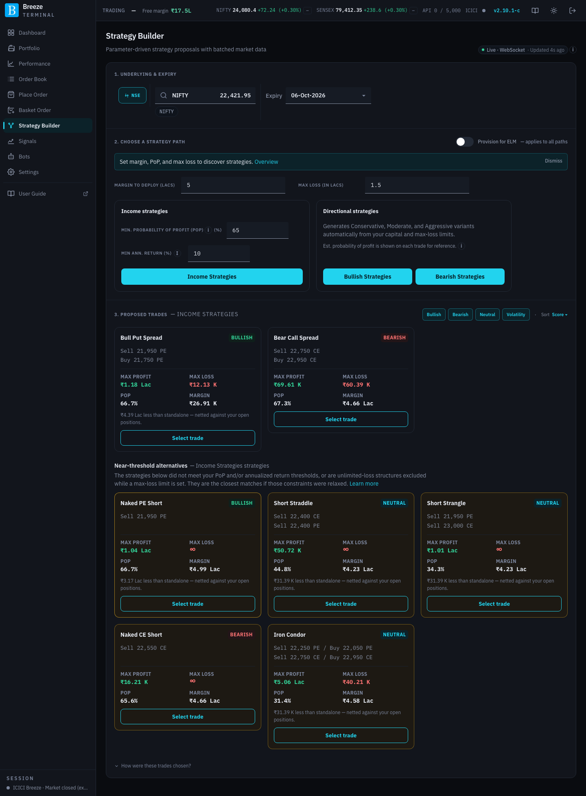

# Strategy Builder

Strategy Builder proposes option strategies for one underlying and expiry. You tell it how much margin to use, how much you are prepared to lose and what kind of trade you want; it searches the option chain and returns priced trades, each with its maximum profit and loss, probability of profit, margin and payoff. You pick one, adjust the legs if you like, and execute it.

The page works top to bottom in four numbered sections. Each unlocks once the one above is complete.

## 1. Underlying & Expiry

| Control | What it does |
|---|---|
| **NSE** / **BSE** | The exchange. |
| **Select underlying** | Search for the underlying. Recently traded ones are offered as quick picks. |
| **Expiry** | The expiry to trade. |

The option chain loads once you pick an expiry. A badge at the top right of the page shows where its prices come from; click it to reload.

## 2. Choose a strategy path

| Control | What it does |
|---|---|
| **Provision for ELM** | When on, the extreme loss margin buffer is counted as part of each trade's margin, for every path, so proposals are sized more conservatively. When off, they are sized on SPAN margin alone. See [Margins](margins.md). |
| **Margin to deploy (Lacs)** | The margin budget for the trade, in lakh. Proposals are sized to fit it. |
| **Max loss (in lacs)** | The most you are willing to lose, in lakh. It sets the width of the wings on defined-risk strategies and their size. Leave it empty (**∞ Unlimited**) to allow strategies with unlimited loss, such as naked short options. |

Then choose one of two paths.

### Income strategies

Premium-selling strategies (for example short strangles, iron condors and credit spreads) filtered by two thresholds:

| Control | What it does |
|---|---|
| **Min. probability of profit (PoP) (%)** | Only trades at least this likely to be profitable at expiry are returned. A higher minimum pushes the short strikes further out of the money. Between 1 and 99.9. See [PoP in the glossary](glossary.md#pop-probability-of-profit). |
| **Min ann. return (%)** | The minimum annualised return on SPAN margin a trade must offer. Between 0 and 100. |
| **Income Strategies** | Generates the proposals. |

### Directional strategies

Trades that profit from a move: **Bullish Strategies** or **Bearish Strategies**. For each, the builder produces **Conservative**, **Moderate** and **Aggressive** variants from your margin and max loss, chosen by how strongly they lean on the move (their delta), their cost and their liquidity. The estimated probability of profit is shown on each trade for reference but does not filter them.

Generating takes a few seconds to a minute; a progress bar shows how far it has got. If you change any input afterwards, the section heading shows **Inputs changed — click Regenerate** and the button reads **Regenerate …**.

> [!NOTE]
> If you already hold positions in the same underlying, each proposal's margin is shown as the **extra** margin it would need on top of what you hold, because hedges between old and new positions reduce the total. A trade that would actually reduce your margin is marked **Margin releasing**. If the app cannot net against your positions, a note says the figures are standalone.

## 3. Proposed Trades

Each proposal is a card:

| Part | What it shows |
|---|---|
| Name and outlook tag | The strategy, and whether it suits a **Bullish**, **Bearish**, **Neutral** or **Volatility** view. |
| Legs | The strikes to buy and sell, for example **Sell 23700 PE / Buy 23500 PE**. |
| **Max profit** / **Max loss** | The best and worst case at expiry, for the proposed size. |
| **POP** | Estimated probability of profit. |
| **Margin** | Margin needed, netted against your positions where possible. A line underneath such as **₹32.29 K less than standalone — netted against your open positions** shows how much the netting saves. |
| **Select trade** | Loads the trade's legs into section 4. The chosen card reads **Selected trade**. |

Above the cards:

| Control | What it does |
|---|---|
| Outlook filters | Show only trades with the outlooks you tick. |
| **Sort** | Order the cards by **Score (high → low)**, **Server order**, **Probability of profit (high → low)**, **Net Premium (high → low)** or **Max Loss (low → high)**. |

While the market is open, proposals are also sized to the live order book. A strike whose book cannot take even one lot near its LTP is never proposed. If the book holds less than the margin would allow, the proposal is cut down to what the thinnest leg can absorb and marked **Capped by order book**. The check is the same one behind the [liquidity warnings](place-order.md#liquidity-warnings).

**Near-threshold alternatives**, below the main cards, are trades that just missed your PoP or return thresholds, or unlimited-loss structures left out because you set a max loss. They are the closest matches if you relax your constraints.

Selecting a strategy with unlimited loss opens **Risk warning — unlimited loss**. Click **I understand — select** to go ahead, or **Cancel**.

### How were these trades chosen?

This expandable panel explains the search:

- **Executive summary**: your inputs (capital, category, max loss, minimum return) and the chosen trade's net credit, annual return and margin, plus how many strategies were **Evaluated**, **Matched** and **Skipped**.
- **Why this strategy? / Why not?**: why the top trades were picked and why others were rejected.
- **What if?**: how the results would change if you loosened or tightened each constraint.
- **Technical audit**: a download of the full record of this search, for troubleshooting. The same records are kept in [Audit Logs](settings-diagnostics.md#audit-logs).

### When nothing comes back

**No strategies match** usually means the constraints are too tight together. Try, in order:

1. Lower **Min. probability of profit** or **Min ann. return**.
2. Raise **Margin to deploy** or **Max loss**.
3. Look at **Near-threshold alternatives**.
4. Check that today's reference data has loaded (**Settings → Reference Data Loads**). Old SPAN or bhavcopy files affect both margins and prices.

## 4. Legs

The selected trade's legs, which you can adjust before executing. The table works like [Basket Order's](basket-order.md#2-legs): strike, type, position, quantity, price (with the **lightning bolt** for [aggressive orders](place-order.md#aggressive-orders)), premium, [delta](glossary.md#delta) (**Δ**) and per-leg margin. **Add leg** adds another leg. A **⚠** beside a quantity is a [liquidity warning](place-order.md#liquidity-warnings).

| Item | What it shows or does |
|---|---|
| **Net premium** | Premium received (+) or paid (−) across the legs. A leg with no market price shows **No quote** and is left out, with a note saying so. |
| **Net Δ** | The legs' deltas added up: the units of the underlying the whole strategy behaves like. |
| **Net SPAN margin** | Margin for all the legs as one position. |
| **Margin benefit** | The saving from hedging, compared with the legs on their own. |
| **Basket ELM** | The extreme loss margin buffer on top. |
| **Calculate Margins** | Recalculates the figures after you change legs. |
| **Execute strategy · N legs** | Opens the [order confirmation](place-order.md#confirming-an-order) for all legs with a quantity above zero. |

Under the legs, the payoff chart shows the strategy's P&L at expiry and today, with **Greeks** (delta, gamma, vega, theta) available on demand. They follow the what-if controls; with those reset, the delta equals **Net Δ** under the legs. Max profit, max loss, breakevens and probability of profit are summarised beneath it.

## Margins shown here

Strategy Builder takes its margins from the exchange's SPAN file plus ICICI's add-on, or from ICICI's own margin calculator, depending on the **Strategy Builder** switch in **Settings → Reference Data Loads**. Either way, ICICI's risk system may ask for a slightly different figure when you actually place the order. See [Margins](margins.md).
